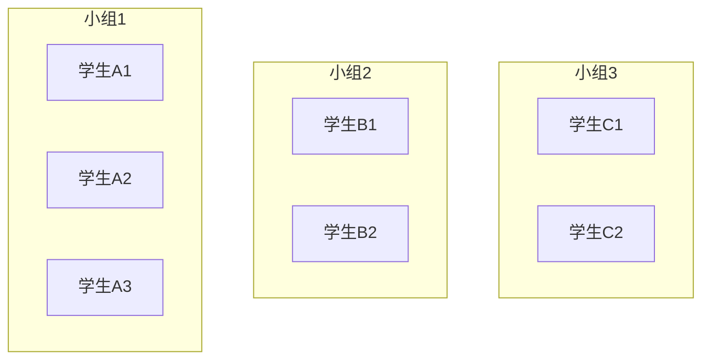
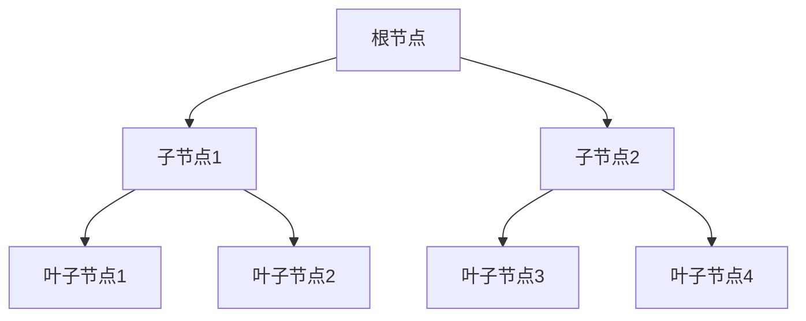
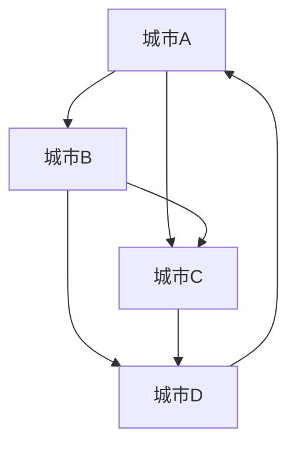

# 第 1 章 绪论

- [第 1 章 绪论](#第-1-章-绪论)
  - [1.1 数据结构的定义](#11-数据结构的定义)
    - [1.1.1 数据的逻辑结构](#111-数据的逻辑结构)
      - [逻辑结构](#逻辑结构)
      - [关系操作](#关系操作)
      - [抽象数据类型 ADT](#抽象数据类型-adt)
    - [1.1.2 数据的存储结构](#112-数据的存储结构)
    - [1.1.3 基本操作的实现](#113-基本操作的实现)
    - [1.1.4 典型应用](#114-典型应用)
  - [1.2 算法及算法分析](#12-算法及算法分析)
    - [1.2.1 算法及其要求](#121-算法及其要求)
    - [1.2.2 时间复杂度的度量](#122-时间复杂度的度量)
      - [示例](#示例)
    - [1.2.3 空间复杂度的度量](#123-空间复杂度的度量)
      - [示例](#示例-1)
  - [1.3 数据结构的 C++语言实现](#13-数据结构的-c语言实现)
    - [1.3.1 面向对象](#131-面向对象)
      - [示例](#示例-2)
    - [1.3.2 泛型机制](#132-泛型机制)
      - [示例](#示例-3)
    - [1.3.3 `const`机制](#133-const机制)
      - [示例](#示例-4)
    - [1.3.4 异常处理](#134-异常处理)
      - [示例](#示例-5)
  - [1.4 小结](#14-小结)
  - [1.5 习题](#15-习题)
    - [书本](#书本)
      - [问题 1](#问题-1)
      - [问题 2](#问题-2)
      - [问题 3](#问题-3)
      - [问题 4](#问题-4)
      - [问题 5](#问题-5)
      - [问题 6](#问题-6)
      - [问题 7](#问题-7)
      - [问题 8](#问题-8)
      - [问题 9](#问题-9)
      - [问题 10](#问题-10)
      - [问题 11](#问题-11)
      - [问题 12](#问题-12)

## 1.1 数据结构的定义

**数据结构**是指有限个类型相同且相互之间具有一定关系的数据元素组成的集合。在程序设计中选择适当的数据结构可以显著提升程序性能。

### 1.1.1 数据的逻辑结构

#### 逻辑结构

**数据的逻辑结构**是指类型相同的一组元素和元素间的关系，通常分为以下几类：

1. **集合结构**：元素间松散关系，班级中同学间关系



2. **线性结构**：元素间你先我后，存在一对一的关系，例如一条队伍[第二章](./Chapter2.md)。


3. **树形结构**：元素间存在一对多的关系，例如树[第四章](./Chapter4.md)。



4. **图状结构**：元素间存在多对多的关系，例如城市间飞机航线[第五章](./Chapter5.md)。



#### 关系操作

**关系操作**是具有某种关系的数据在生活实践中表现出的几种功能相对独立的数据处理（操作）。和数据的逻辑结构紧密相关。基本操作可以分为五大类：

- **构造类**：在内存中建立这种数据结构。如一个队列，有存储空间，无或有若干元素。
- **属性类**：对元素及元素之间关系的各类查询。属于东瞧瞧、西看看，不影响元素值及元素关系。如在线性结构中查询值为 X 的元素是否存在，队列中队首是谁。
- **数据操纵类**：对元素或元素关系有改变的操作。如插入或删除某个元素，一般修改可以视作在同一位置上先删除一个旧元素后再插入一个新元素，因此不再讨论修改。
- **遍历类**：对结构中的每个元素访问且只访问一遍。因其重要且有时又较复杂，常常是其他操作的基础，如遍历树结构、图结构中的元素，所以特意把遍历操作从属性类中单独拿出来研究。
- **典型应用类**：每种结构独特的应用。不同结构其典型应用各不相同，如线性结构可以解决队列问题、图结构可以解决两个城市间最短路径问题。

#### 抽象数据类型 ADT

**抽象数据类型**(Abstract Data Type, ADT): 由数据的逻辑结构和基本操作一起组成。

### 1.1.2 数据的存储结构

存储结构是数据在计算机中存储的实际方式，也是指数据结构在内存中的表示，它影响了关系操作的具体实现方式。常见的有以下两种：

1. **顺序存储**：数据元素存储在连续的存储空间中，如数组。
2. **链式存储**：数据元素通过指针链接在一起，如链表。

> 下面是我的补充内容：

3. **索引存储**：为快速访问建立附加索引表，如数据库中的索引。
4. **散列存储**：利用散列函数将关键字映射到存储地址，如哈希表。

不同的存储方式到底究竟如何影响关系操作的实现让我们留到第二章正式学习线性表的时候再展开讨论吧。

### 1.1.3 基本操作的实现

同一种操作虽然在顺序结构和链式结构中具体实现方法不同，但目标都要符合 ADT 对基本操作定义的条件和结果。

如果某种存储方式下，基本操作不易实现，说明存储方式不好，可以考虑放弃这种存储方法。

### 1.1.4 典型应用

每一种数据结构都是对某一类现实问题的抽象，自然它们各自对应一些适合解决的问题。

从长远角度来看，计算机很多方面的基础就是我们将要学习的各类数据结构：

- 线性表：用于任务调度、操作系统进程管理等。
- 栈：用于表达式求值、递归调用。
- 队列：用于任务队列、广度优先搜索。
- 树和图：用于文件系统、路径规划。

从近一点角度看，我们在课上学习的简单化的数据结构也可以解决一些有意义的问题：

- 线性表：用于存储学生成绩、管理联系人列表。
- 栈：用于括号匹配、实现浏览器的前进后退功能。
- 队列：用于打印任务的调度、模拟银行排队系统。
- 树和图：用于组织目录结构、模拟城市交通网络。

通过这些例子可以看出，数据结构不仅是理论知识，更是解决实际问题的重要工具。掌握好它们，将为我们应对更复杂的工程和技术挑战打下坚实的基础。

---

## 1.2 算法及算法分析

### 1.2.1 算法及其要求

算法是为解决问题而设计的一系列明确的指令。一个优秀的算法应该满足以下要求：

- **有穷性**：在有限步骤内完成。
- **确定性**：每一步操作是明确的。
- **可行性**：能在有限时间内完成运算。
- **输入输出**：有零个或多个输入，至少一个输出。

### 1.2.2 时间复杂度的度量

时间复杂度衡量算法运行时间的增长率，用大 O 表示法描述：

- 常见时间复杂度：O(1)、O(log n)、O(n)、O(n²) 等。
- 最坏情况、最好情况和平均情况分析。

#### 示例

使用冒泡排序分析时间复杂度。

### 1.2.3 空间复杂度的度量

空间复杂度衡量算法运行所需的额外内存空间：

- 包括程序本身占用的固定空间和动态申请的额外空间。
- 常见空间复杂度：O(1)、O(n)、O(n²) 等。

#### 示例

使用递归求解 Fibonacci 数列的空间复杂度分析。

---

## 1.3 数据结构的 C++语言实现

### 1.3.1 面向对象

- **类和对象**：数据结构通常使用类进行封装。
- **继承和多态**：可以实现通用接口，扩展特定功能。

#### 示例

定义一个基于类的链表，展示封装后的基本操作。

### 1.3.2 泛型机制

- 使用 C++ 模板编写通用的数据结构。
- 例如：`template<typename T> class SeqList`。

#### 示例

实现一个支持整型和浮点型的顺序表。

### 1.3.3 `const`机制

- 使用 `const` 限定不可修改的数据，提高程序的安全性和可读性。
- 例如：`const` 成员函数和指针的使用。

#### 示例

展示如何定义只读函数和保护内部数据。

### 1.3.4 异常处理

- 在数据结构实现中处理边界条件、空指针、数组越界等异常。
- 使用 `try-catch` 捕获异常，定义自定义异常类。

#### 示例

实现一个链表的异常处理，如 `OutOfBoundException`。

---

## 1.4 小结

- 数据元素及元素间关系称作数据结构。
- 数据结构研究具有某种制约关系的一组元素及元素间关系在内存中如何存储、在各种存储方式下基本操作如何实现，以及各种数据结构的典型应用。
- 具体研究分逻辑结构及基本操作、物理结构、基本操作实现、典型应用四个方面。
- 在分析逻辑结构和基本操作时，要完全脱离计算机而仅仅依赖现实生活中的元素特征来分析元素、元素关系及基本操作，最后给出用伪代码描述的抽象数据类型。
- 在物理结构分析阶段，讨论元素及元素关系在内存中如何存储。存储可以分顺序存储和链式存储，顺序存储使用一块连续的空间存储元素和元素之间的关系；链式存储使用各自独立的空间存储每个元素，并在每个独立的空间中附加字段以存储元素之间关系。
- 在基本操作实现分析阶段，研究在各种存储方式下基本操作的实现方法和步骤即算法。对于算法提出了时间复杂度和空间复杂度的概念及计算方法，并以此为依据，对不同算法进行性能比较。
- 在典型应用阶段，给出所研究的数据结构最适合的实际应用问题。

---

## 1.5 习题

### 书本

#### 问题 1

什么是数据结构？有几种典型的数据结构？

<details>
  <summary>答案</summary>

</details>

#### 问题 2

数据结构的研究对象是什么？

#### 问题 3

什么是逻辑结构和物理结构？

#### 问题 4

什么是抽象数据类型？可以用何种语言描述抽象数据类型？

#### 问题 5

数据基本操作的实现和逻辑结构、物理结构的关系是什么？

#### 问题 6

人们在现实生活中解决问题的方法和步骤都能称为算法吗？

#### 问题 7

继“程序设计”课程之后，学习数据结构对解决实际问题有什么帮助？

#### 问题 8

根据以下时间频度函数，分别给出相应的时间复杂度。

1. `6x^2 + 3x + 5`
2. `2nlog2n + x^3`
3. `3 + 7n^2`
4. `16`

#### 问题 9

设`n`是描述问题规模的非负整数，请分别给出下列程序片段的时间复杂度。

1. ```cpp
   sum = 0;
   for(i = 0; i < n; i++)
     for(j = 0; j < n; j++)
       sum = sum + i * j;
   ```

````

2. ```cpp
   sum = 0;
   for(i = 1; i < n; i = 2 * i)
     for(j = 0; j < n; j++)
       sum = sum + i * j;
   ```
3. ```cpp
   x = 1;
   while(x < n / 2)
     x = 2 * x;
   ```

#### 问题 10

用递归方法计算`n!`，并计算其时间频度函数和时间复杂度。

#### 问题 11

编程计算`S=1-2+3-4+5-6+...+N, N>0`，要求分别用`O(n)`, `O(1)`时间复杂度来实现。

#### 问题 12

已知一个整数序列，求其和最大的连续子序列。如整数序列`{-3, 7, -1, 5, -6, 4}`的和最大子序列为`{7, -1, 5}`。要求：

1. 设计算法，要求算法的时间复杂度最多为`O(n^2)`;
2. 优化设计的算法，要求算法的时间复杂度为`O(n)`;
````
