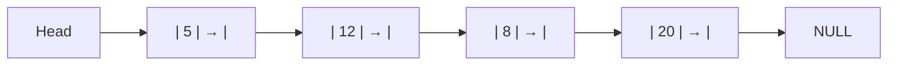

# 第 2 章 线性表

- [第 2 章 线性表](#第-2-章-线性表)
  - [2.1 线性表的定义及 ADT](#21-线性表的定义及-adt)
  - [2.2 线性表的顺序存储结构](#22-线性表的顺序存储结构)
    - [2.2.1 顺序表](#221-顺序表)
    - [2.2.2 顺序表基本操作的实现](#222-顺序表基本操作的实现)
  - [2.3 线性表的链式存储结构](#23-线性表的链式存储结构)
    - [2.3.1 单链表](#231-单链表)
    - [2.3.2 单链表基本操作的实现](#232-单链表基本操作的实现)
    - [2.3.3 单向循环链表](#233-单向循环链表)
    - [2.3.4 双链表、双向循环链表](#234-双链表双向循环链表)
  - [2.4 线性表的应用](#24-线性表的应用)
    - [2.4.1 一元多项式的加法](#241-一元多项式的加法)
    - [2.4.2 字符串的存储和实现](#242-字符串的存储和实现)
    - [2.4.3 稀疏矩阵](#243-稀疏矩阵)
  - [2.5 小结](#25-小结)
  - [2.6 习题](#26-习题)
    - [书本习题](#书本习题)
      - [问题 1](#问题-1)
      - [问题 2](#问题-2)
      - [问题 3](#问题-3)
      - [问题 4](#问题-4)
      - [问题 5](#问题-5)
      - [问题 6](#问题-6)
      - [问题 7](#问题-7)
      - [问题 8](#问题-8)
      - [问题 9](#问题-9)
      - [问题 10](#问题-10)
      - [问题 11](#问题-11)
      - [问题 12](#问题-12)
      - [问题 13](#问题-13)
      - [问题 14](#问题-14)
      - [问题 15](#问题-15)
      - [问题 16](#问题-16)
      - [问题 17 `*`](#问题-17-)
      - [问题 18](#问题-18)
      - [问题 19](#问题-19)
      - [问题 20 `*`](#问题-20-)
      - [问题 21 `**`](#问题-21-)
    - [PPT](#ppt)
    - [ACM-OJ](#acm-oj)
      - [2416 - 链表操作](#2416---链表操作)
      - [2417 - 数字统计](#2417---数字统计)
      - [11005](#11005)

## 2.1 线性表的定义及 ADT

线性表是具有相同数据类型的 n 个数据元素的有限序列。其中：

- 线性表的规模或长度是指表中元素的个数
- 空表是指长度为 0 的线性表
- 线性表中的位置是从 1 开始计数的

抽象数据类型（ADT）是一个数学模型，它包含了数据对象、数据对象之间的关系以及对数据的基本操作。线性表的 ADT 定义了一组基本操作，这些操作与具体的存储结构实现无关（无论是顺序存储还是链式存储）。

基本操作可以分为 5 类：

1. 构造类：initialize - 初始化线性表
2. 属性类：isEmpty, length, isFull, get, find - 获取线性表的基本信息
3. 数据操纵类：insert, remove, clear - 修改线性表的内容
4. 遍历类：遍历线性表中的所有元素
5. 典型应用类：针对特定应用场景的操作

## 2.2 线性表的顺序存储结构

数据结构在内存中的存储通常有两种方式：顺序存储和链式存储。顺序存储是指数据元素存储在地址连续的存储单元中，使得逻辑上相邻的元素在物理位置上也相邻。

### 2.2.1 顺序表

顺序表是线性表的顺序存储实现，基于数组实现。在我们的实现中：

- 数组下标 0（`elem[0]`）用作特殊用途，不存放顺序表的元素
- 从下标 1 开始连续存储元素，即`elem[n]`存储顺序表的第 n 个元素
- maxSize 表示存储空间的大小（最多能存储的元素数）
- len 表示当前实际存储的元素个数
- initSize 表示初始分配的存储空间大小

### 2.2.2 顺序表基本操作的实现

1. 查找操作

- `elem[0]`用作哨兵单元，从尾向头反向查找
- 时间复杂度：O(n)
- 使用哨兵可以简化边界条件的判断

```cpp
template <class elemType>
int SeqList<elemType>::count(const elemType &e) const {
    int count = 0;
    for (int i = 1; i <= len; i++) {
        if (elem[i] == e) count++;
    }
    return count;
}
```

2. 插入操作 insert

- 时间复杂度：平均 O(n)
- 当空间不足时，需要调用 doubleSpace()扩展空间
- doubleSpace()的实现：
  1. 分配一个大小为原来两倍的新数组
  2. 将原数组的元素复制到新数组
  3. 释放原数组空间
  4. 更新 maxSize
- 插入时需要注意移动元素的顺序：从后向前移动，避免覆盖

3. 删除操作 remove

- 时间复杂度：平均 O(n)
- 删除时需要注意移动元素的顺序：从前向后移动
- 删除最后一个元素后直接 len--，无需其他操作

## 2.3 线性表的链式存储结构

分析顺序表的主要弊端：

- 插入/删除需要移动大量元素
- 需要预先分配存储空间
- 空间可能浪费或不足

链表通过链式存储解决这些问题：

- 每个元素放在独立的存储单元（节点）中
- 节点间通过指针连接，表示逻辑关系
- 动态分配内存，按需扩展

节点的组成：

- 数据域：存储元素值
- 指针域：存储下一个节点的地址

链表的特点：

- 首节点：第一个存放数据的节点
- 头节点：在首节点之前的特殊节点，不存储数据
- 头指针（head）：指向头节点

头节点的作用：

- 统一操作：使得在首节点位置的插入/删除操作与其他位置保持一致
- 简化边界处理：避免对空表的特殊处理

示例：头节点的好处

1. 没有头节点的情况：

```cpp
// 在链表头部插入节点
Node* newNode = new Node('Z');
newNode->next = head;
head = newNode;  // 需要更新头指针

// 在其他位置插入节点
Node* p = head;
while (p != NULL && p->data != 'B') {
    p = p->next;
}
Node* newNode = new Node('X');
newNode->next = p->next;
p->next = newNode;
```

2. 有头节点的情况：

```cpp
// 在链表头部插入节点
Node* newNode = new Node('Z');
newNode->next = head->next;
head->next = newNode;  // 操作统一

// 在其他位置插入节点
Node* p = head;
while (p->next != NULL && p->next->data != 'B') {
    p = p->next;
}
Node* newNode = new Node('X');
newNode->next = p->next;
p->next = newNode;
```

链表的分类：

1. 单链表：每个节点一个 next 指针
2. 循环链表：最后一个节点的 next 指向头节点
3. 双链表：每个节点有 prior 和 next 两个指针
4. 双向循环链表：结合了循环链表和双链表的特点

### 2.3.1 单链表

单链表的基本结构：

```cpp
template <class elemType>
class Node {
    friend class LinkList<elemType>;
private:
    elemType data;
    Node* next;
public:
    Node() : next(nullptr) {}
    Node(const elemType& e, Node* n = nullptr) : data(e), next(n) {}
};
```

### 2.3.2 单链表基本操作的实现

1. 插入操作：

- 基本原则：先设置新节点的 next，再修改前驱节点的 next
- 时间复杂度：O(n)，但在表头插入为 O(1)

2. 删除操作：

- 基本原则：先保存待删除节点的 next，再释放节点
- 注意内存管理：使用 delete 释放节点

顺序表 vs 单链表 操作时间复杂度对比：

| 操作       | 顺序表（平均） | 单链表（平均） |
| ---------- | -------------- | -------------- |
| 按索引查找 | O(1)           | O(n)           |
| 按值查找   | O(n)           | O(n)           |
| 插入       | O(n)           | O(n)           |
| 删除       | O(n)           | O(n)           |
| 头部插入   | O(n)           | O(1)           |
| 头部删除   | O(n)           | O(1)           |

### 2.3.3 单向循环链表

单向循环链表的特点：

- 最后一个节点的 next 指向头节点
- 适用于需要循环处理的场景，如约瑟夫环问题

约瑟夫环问题实现：

```cpp
void josephus(int n, int m) {
    if (n <= 0 || m <= 0) return;

    // 建立循环链表
    Node* head = new Node(1);
    Node* tail = head;
    for (int i = 2; i <= n; i++) {
        tail->next = new Node(i);
        tail = tail->next;
    }
    tail->next = head;  // 形成环

    // 模拟报数过程
    Node* current = tail;  // 指向当前节点的前一个节点
    while (current->next != current) {
        // 找到第m个节点的前一个节点
        for (int i = 1; i < m; i++) {
            current = current->next;
        }
        // 删除第m个节点
        Node* temp = current->next;
        current->next = temp->next;
        cout << temp->data << " ";
        delete temp;
    }
    cout << current->data << endl;
    delete current;
}
```

### 2.3.4 双链表、双向循环链表

双链表节点结构：

```cpp
template <class elemType>
class DNode {
    elemType data;
    DNode* prior;
    DNode* next;
public:
    DNode() : prior(nullptr), next(nullptr) {}
    DNode(const elemType& e, DNode* p = nullptr, DNode* n = nullptr)
        : data(e), prior(p), next(n) {}
};
```

双向循环链表特点：

- 头节点的 prior 指向尾节点
- 尾节点的 next 指向头节点
- 便于双向遍历和删除操作

## 2.4 线性表的应用

### 2.4.1 一元多项式的加法

多项式可以用线性表存储，每一项包含系数和指数。实现多项式加法的关键是按指数大小有序存储，便于对应项相加。

### 2.4.2 字符串的存储和实现

字符串的基本概念：

- 空串：长度为 0 的字符串
- 空格串：只包含空格的字符串
- 子串：字符串中任意连续的字符序列
- 主串：包含子串的字符串
- 串的长度：字符个数（不计入结束符）

存储结构选择：

- 顺序存储更适合字符串：单个字符 1 字节，指针 4 字节
- 支持静态存储和动态存储

C++ 字符串处理方式对比：

| 特性     | \<cstring\>    | \<string\>     |
| -------- | -------------- | -------------- |
| 数据类型 | C 风格字符数组 | std::string    |
| 内存管理 | 手动           | 自动           |
| 安全性   | 低             | 高             |
| 功能性   | 基础函数       | 丰富的成员函数 |
| 使用场景 | 底层操作       | 现代 C++开发   |

模式匹配算法：

1. BF（Brute-Force）算法：

   - 简单直观但效率较低
   - 时间复杂度：O(mn)，m 为主串长度，n 为模式串长度

2. KMP 算法：
   - 避免不必要的比较
   - 时间复杂度：O(m+n)
   - 核心是 next 数组的构建

### 2.4.3 稀疏矩阵

稀疏矩阵的特点：

- 非零元素远少于总元素
- 使用三元组存储可以节省空间：

```cpp
struct Triple {
    int row, col;  // 行号、列号
    int value;     // 元素值
};
```

压缩存储的优势：

- 节省存储空间
- 只对非零元素进行运算
- 适合大规模稀疏矩阵运算

## 2.5 小结

线性表是最基本的数据结构之一，主要有两种实现方式：

1. 顺序表：

   - 随机访问快
   - 插入删除需要移动元素
   - 需要预分配空间

2. 链表：
   - 动态分配空间
   - 插入删除只需修改指针
   - 不支持随机访问

选择合适的实现方式需要考虑：

- 数据规模
- 访问模式
- 插入删除频率
- 空间限制

## 2.6 习题

### 书本习题

#### 问题 1

描述一个顺序存储结构需要哪些元素？为什么需要当前元素个数这一要素？

<details>
  <summary>答案</summary>

lorem ipsum

</details>

#### 问题 2

描述一个链式存储结构需要哪些元素？为什么通常不需要当前元素个数这一要素？

#### 问题 3

顺序结构已经能很好地存储和处理线性关系，为什么还要用更复杂及费空间的链式结构？

#### 问题 4

试描述链式结构中的头指针、头结点、首结点、末结点、尾结点、尾指针，它们各自的类型是什么？在内存中的存储结构是怎样的？

#### 问题 5

己知表头元素为 c 的单链表在内存中的存储状态如下表所示。

| 内存地址 | 元素数据 | 链接地址 |
| -------- | -------- | -------- |
| 1000H    | a        | 1010H    |
| 1004H    | b        | 10CH     |
| 1008H    | c        | 1000H    |
| 100CH    | d        | NULL     |
| 1010H    | e        | 1004H    |
| 1014H    |          |          |

现将 f 存放于 1014H 处并插入到单链表中，若 f 在逻辑上位于 a 和 e 之间，则 a, e, f 的“链接地址“依次是什么？

#### 问题 6

顺序表中如果每个结点除了存储元素的值，还要存储下一个元素的地址。那么这个地址可以是怎样的？是否有必要存在？

#### 问题 7

建立一个工程文件。创建 `seqList.h` 文件，在其中定义 `seqList` 类，并实现各个基本操作成员函数；创建一个 `main.cpp` 文件，定义一个 `main` 函数，设计使用 `seqList` 对象并测试 `segList.h` 中声明的所有基本操作，验证其正确性。

<details>
  <summary>答案</summary>

头文件请参考[SeqList.h](../include/SeqList.h)。示例程序请参考[main.cpp](../src/examples/Chapter2/2-3/main.cpp)。测试程序请参考[test_seqlist.cpp](../test/test_seqlist.cpp)。

</details>

#### 问题 8

改造习题 7 中的 `find` 函数，使函数返回待查数据 `x` 在线性表中出现的次数。

#### 问题 9

如习题 7，设计、测试 `linkList` 类及基本操作函数。

#### 问题 10

分别分析顺序结构和链式结构下所有基本操作的时间复杂度。

#### 问题 11

设计一个不带头结点的单链表，分析其插入、删除操作和在带头结点的单链表中进行插入、删除操作有什么不同？

#### 问题 12

完整地写出双链表相关定义及实现。

#### 问题 13

n 个人围成一个圈，从 1、2、3 开始报数。当报到 m 时，第 m 个人出列，并从原来的第 m+1 人重新开始 1、2、3 报数。如此循环，直到圈中只剩下一个人。这个圈称作约瑟夫环。试用单向循环链表实现该游戏，并输出最后剩下的那人的姓名。

#### 问题 14

n 个元素存储在一个顺序表中，试用最小的空间代价实现就地逆置。如原来的顺序是`agrtuy`，逆置后的顺序为`yutrga`。

#### 问题 15

已知两个长度分别为 `m` 和 `n` 的升序链表，将它们合并一个长度为 `m+n` 的降序链表。

#### 问题 16

利用链式结构分别实现集合运算$C=A\cup B$, $C=A-B$并分析其时间复杂度。要求运算结束后在内存中的 A、B 两个集合中元素不变。

#### 问题 17 `*`

受数据类型限制，计算机存储整数的范围是有限的。在实际应用中，如果需要用到很大或很小的整数，可以采用以下方法解决：建立一个单链表，每个结点存储一个 0~9 的数字字符，头结点中存储 0、1 分别表示正数和负数。由于单链表中结点是逐个动态申消的，因此原则上该单链表可以存储任意大小的醛数。如+357 可在单链表中作如下表示：



试编写完成两个大整数加法的程序。

#### 问题 18

完成两个一元多项式的乘法并在 main 函数中加以测试。

#### 问题 19

利用`2.4.3`节方法在内存中存储稀疏矩阵，试编写算法实现稀疏矩阵的逆置运算。

#### 问题 20 `*`

利用与 19 题同样的方法存储稀疏矩阵，试编写算法实现两个稀疏矩阵的乘法运算。

#### 问题 21 `**`

讨论如何改进 KMP 算法中求失配函数 next 的算法，对该方法进行编程实现并讨论其
时间复杂度。

### PPT

1. 线性表若采用链式存储结构保存，则要求内存中可用存储单元的地址（D）

   - A. 必须是连续的
   - B. 部分地址必须是连续的
   - C. 一定是不连续的
   - D. 连续或不连续都可以

2. 顺序表和链表特性对比：
   顺序表特性：

   - 逻辑相邻元素物理位置相邻
   - 支持随机存取
   - 支持顺序存取

   链表特性：

   - 不必事先估计存储空间
   - 空间与元素个数成正比
   - 插入删除不需要移动元素
   - 支持顺序存取

3. 查找单链表中间节点的方法：

   - 已知长度 len：返回第⌈len/2⌉个节点
   - 未知长度：
     1. 遍历得到长度后计算
     2. 快慢指针法：快指针每次走两步，慢指针每次走一步

4. 有序单链表操作：

   ```cpp
   // 统计大于x的不同数的个数
   int countGreater(const LinkList<int>& list, int x) {
       int count = 0;
       int last = x;  // 记录上一个计数的数
       Node* p = list.head->next;
       while (p != nullptr) {
           if (p->data > x && p->data != last) {
               count++;
               last = p->data;
           }
           p = p->next;
       }
       return count;
   }

   // 将小于x的数按递减序重排
   void rearrangeLesser(LinkList<int>& list, int x) {
       Node* p = list.head->next;
       Node* smaller = nullptr;  // 小于x的节点链表
       Node* rest = nullptr;     // 大于等于x的节点链表

       while (p != nullptr) {
           Node* next = p->next;
           if (p->data < x) {
               p->next = smaller;
               smaller = p;
           } else {
               p->next = rest;
               rest = p;
           }
           p = next;
       }

       // 重新连接链表
       p = smaller;
       while (p != nullptr && p->next != nullptr) {
           Node* max = p;
           Node* q = p->next;
           while (q != nullptr) {
               if (q->data > max->data) max = q;
               q = q->next;
           }
           // 交换数据
           int temp = p->data;
           p->data = max->data;
           max->data = temp;
           p = p->next;
       }

       // 连接两部分
       list.head->next = smaller;
       while (smaller != nullptr && smaller->next != nullptr)
           smaller = smaller->next;
       if (smaller != nullptr)
           smaller->next = rest;
       else
           list.head->next = rest;
   }
   ```

5. 删除重复元素的实现：

   ```cpp
   // 顺序表实现
   template <class elemType>
   void SeqList<elemType>::removeDuplicates() {
       if (len <= 1) return;
       int newLen = 1;
       for (int i = 2; i <= len; i++) {
           bool isDuplicate = false;
           for (int j = 1; j <= newLen; j++) {
               if (elem[i] == elem[j]) {
                   isDuplicate = true;
                   break;
               }
           }
           if (!isDuplicate) {
               newLen++;
               elem[newLen] = elem[i];
           }
       }
       len = newLen;
   }

   // 链表实现
   template <class elemType>
   void LinkList<elemType>::removeDuplicates() {
       if (head->next == nullptr) return;
       Node<elemType>* p = head->next;
       while (p != nullptr) {
           Node<elemType>* q = p;
           while (q->next != nullptr) {
               if (q->next->data == p->data) {
                   Node<elemType>* temp = q->next;
                   q->next = q->next->next;
                   delete temp;
               } else {
                   q = q->next;
               }
           }
           p = p->next;
       }
   }
   ```

### ACM-OJ

#### 2416 - 链表操作

实现一个简单的链表，支持插入、删除和查询操作。

#### 2417 - 数字统计

使用本章所学的`LinkList`类的做题思路也很清晰，请参考[2417 题解](../src/homework/2417/main.cpp)文件。

当然也可以使用哈希表统计数字出现的最大频率：

```cpp
#include <iostream>
#include <unordered_map>

int main() {
    int n;
    std::cin >> n;

    std::unordered_map<long long, int> freqMap;
    int maxFreq = 0;

    for (int i = 0; i < n; i++) {
        long long num;
        std::cin >> num;
        freqMap[num]++;
        maxFreq = std::max(maxFreq, freqMap[num]);
    }

    std::cout << maxFreq << std::endl;
    return 0;
}
```

#### 11005

二维数组分别按照数独的规则对行、列、`3*3`九宫格进行检查，[11005 题解](../src/homework/11005/main.cpp)
