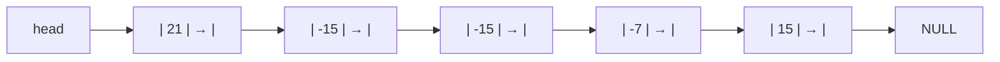
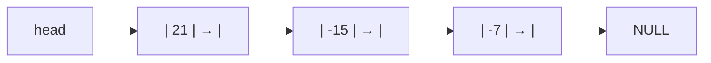

# 第 3 章 栈和队列

本章要学习的栈和队列是时间有序表，由元素到达和离开线性结构的时间决定元素之间的关系。

栈和队列可以看作是插入和删除操作位置受限的线性表，其中：

1. 栈是限定仅在表尾进行插入和删除操作的线性表；
2. 队列是只允许在一端进行插入操作、另一段进行删除操作的线性表。

- [第 3 章 栈和队列](#第-3-章-栈和队列)
  - [3.1 栈](#31-栈)
    - [3.1.1 栈的定义和抽象数据类型](#311-栈的定义和抽象数据类型)
    - [3.1.2 栈的顺序存储及实现](#312-栈的顺序存储及实现)
    - [共享栈](#共享栈)
      - [共享栈的特点](#共享栈的特点)
      - [多栈共享空间的实现](#多栈共享空间的实现)
      - [双向栈（两栈共享空间）](#双向栈两栈共享空间)
      - [优缺点](#优缺点)
      - [应用场景](#应用场景)
      - [时间复杂度分析](#时间复杂度分析)
    - [3.1.3 栈的链式存储及实现](#313-栈的链式存储及实现)
  - [3.2 栈的应用](#32-栈的应用)
    - [3.2.1 括号配对检查](#321-括号配对检查)
      - [算法思路](#算法思路)
      - [示例分析](#示例分析)
    - [3.2.2 表达式计算](#322-表达式计算)
      - [后缀表达式（逆波兰表达式）](#后缀表达式逆波兰表达式)
      - [后缀表达式的计算过程](#后缀表达式的计算过程)
      - [中缀表达式转后缀表达式](#中缀表达式转后缀表达式)
    - [3.2.3 递归](#323-递归)
      - [为什么使用栈实现递归？](#为什么使用栈实现递归)
      - [小结](#小结)
  - [3.3 队列](#33-队列)
    - [3.3.1 队列的定义及 ADT](#331-队列的定义及-adt)
    - [3.3.2 队列的顺序存储及实现](#332-队列的顺序存储及实现)
      - [队列为空的判断](#队列为空的判断)
      - [循环队列](#循环队列)
      - [判满条件](#判满条件)
    - [3.3.3 队列的链式存储及实现](#333-队列的链式存储及实现)
    - [3.3.4 优先队列](#334-优先队列)
      - [应用场景](#应用场景-1)
      - [实现方式](#实现方式)
      - [基本操作的时间复杂度](#基本操作的时间复杂度)
  - [3.4 队列的应用](#34-队列的应用)
    - [银行业务模拟系统](#银行业务模拟系统)
      - [单窗口模型](#单窗口模型)
      - [多窗口模型](#多窗口模型)
  - [3.5 小结](#35-小结)
  - [3.6 习题](#36-习题)
    - [书本](#书本)
      - [问题 1](#问题-1)
      - [问题 2](#问题-2)
      - [问题 3](#问题-3)
      - [问题 4](#问题-4)
      - [问题 5](#问题-5)
      - [问题 6](#问题-6)
      - [问题 7](#问题-7)
      - [问题 8](#问题-8)
      - [问题 9](#问题-9)
      - [问题 10](#问题-10)
      - [问题 11](#问题-11)
      - [问题 12 `*`](#问题-12-)
      - [问题 13 `**`](#问题-13-)
    - [ACM-OJ](#acm-oj)
      - [1080](#1080)
      - [14151](#14151)
      - [2422](#2422)

## 3.1 栈

栈（`Stack`）是限定仅在表尾进行插入和删除操作的线性表。

栈又称为后进先出（`Last In First Out`，`LIFO`）的线性表，当然你也可以说它是先进后出（`First In Last Out`，`FILO`）。

### 3.1.1 栈的定义和抽象数据类型

栈顶（`top`）：允许插入和删除操作的一端；

栈底（`bottom`）：线性表的另一端；

空栈：不含任何数据元素的栈。

栈的基本操作：

- 插入操作：进栈（`push`）、压栈、入栈
- 删除操作：出栈（`pop`）、弹栈

栈的 ADT 操作分类：

- 构造类：`initialize`、`destroy`（析构函数）
- 属性操纵类：`isEmpty`、`isFull`、`top`
- 数据操纵类：`push`、`pop`

具体实现请参考：[SeqStack.h](../include/SeqStack.h) 和 [LinkStack.h](../include/LinkStack.h)

### 3.1.2 栈的顺序存储及实现

简单分析一下 top 和 bottom 该怎么设置。bottom 肯定一直是 0，也就是栈底的位置。top 如果是栈顶元素的下标，那么初始化的时候就是-1(也就是栈空的标志)。当 top=maxSize-1 的时候表示栈满。

另一种方案是 top 表示下一个元素进栈的位置。那么栈空就是 top=bottom, 栈满就是 top=maxSize, 这种方法更适合在同一个数组中存放两个或者更多的栈。

下面的实现(在一个数组中存放一个栈的时候)用第一种方法。

### 共享栈

共享栈是指多个栈共享同一块连续的内存空间，每个栈拥有一段独立的连续小空间。这种设计主要用于提高空间利用率，避免某些栈满而其他栈空间未用的情况。

#### 共享栈的特点

1. **动态性**：每个栈的大小可以根据实际的进栈和出栈动态变化
2. **高效性**：通过共享空间减少内存浪费，提高空间使用率
3. **灵活性**：栈的数量和分配方式可以灵活调整

#### 多栈共享空间的实现

假设有 $m$ 个栈，栈的编号为 $0, 1, ..., m-1$：

1. 第 $i$ 个栈空的条件：

   ```cpp
   top[i] = bottom[i]
   ```

2. 第 $i$ 个栈栈满的条件：
   - 当 $i < m-1$ 时：
     ```cpp
     top[i] = bottom[i+1]
     ```
   - 当 $i = m-1$ 时：
     ```cpp
     top[i] = maxSize
     ```

#### 双向栈（两栈共享空间）

这是最常见的共享栈实现方式：

1. **栈底设置**：

   - 栈 0 的栈底在共享空间起始位置
   - 栈 1 的栈底在共享空间末尾

2. **增长方向**：

   - 栈 0 的栈顶从左向右增长
   - 栈 1 的栈顶从右向左增长

3. **状态判断**：
   - 栈空条件：`top[i] = bottom[i]` (i = 0 或 1)
   - 栈满条件：`top[0] = top[1]`

示例图：

```
初始状态：
[ | | | | | | ]
 ↑           ↑
 s0          s1

入栈后：
[a|b| | | |z]
     ↑   ↑
     s0  s1
```

#### 优缺点

优点：

1. 提高空间利用率
2. 灵活性高，可动态调整栈大小

缺点：

1. 实现相对复杂
2. 当空间仅剩一个单元时无法使用

#### 应用场景

1. 表达式求值、分区处理等多栈操作
2. 多线程或多任务共享内存资源的栈管理

具体实现可参考：[src/examples/Chapter3/3-2/main.cpp](../src/examples/Chapter3/3-2/main.cpp)

#### 时间复杂度分析

所有基本操作的时间复杂度都是 $O(1)$。如果需要动态扩容，`push` 操作的时间复杂度是 $O(n)$，但分摊到每次操作仍然是 $O(1)$。

时间复杂度分析：都是 $O(1)$, `push` 如果需要扩大空间那么就是$O(n)$ , 但是分摊到每次插入操作那么仍然是$O(1)$.

### 3.1.3 栈的链式存储及实现

栈顶指针 top 就是单链表的首节点。

## 3.2 栈的应用

### 3.2.1 括号配对检查

括号配对检查是栈的一个典型应用。以检查程序代码中的括号匹配为例，需要处理三种括号：小括号`()`、中括号`[]`和大括号`{}`。

#### 算法思路

1. **创建栈**：用于存储遇到的左括号
2. **遍历字符串**：从左到右处理每个字符
3. **处理规则**：
   - 遇到左括号：入栈
   - 遇到右括号：
     - 如果栈空：缺少左括号，返回 false
     - 如果栈不空：出栈并检查是否匹配
4. **结束检查**：
   - 如果栈不为空：有未匹配的左括号
   - 如果栈为空：括号完全匹配

#### 示例分析

以字符串 `"[{()}]"` 为例：

```
字符 [  →  栈：[
字符 {  →  栈：[{
字符 (  →  栈：[{(
字符 )  →  栈：[{    # 检查(和)匹配
字符 }  →  栈：[     # 检查{和}匹配
字符 ]  →  栈：空    # 检查[和]匹配
结束    →  栈空，括号匹配
```

具体实现可参考：[src/examples/Chapter3/3-5/main.cpp](../src/examples/Chapter3/3-5/main.cpp)

### 3.2.2 表达式计算

本节讨论如何使用栈来计算数学表达式。为简化问题，我们做如下假设：

- 操作数是一位整数（0-9）
- 运算符仅包含加减乘除（`+`、`-`、`*`、`/`）
- 括号仅有小括号（`()`）
- 输入的表达式保证合法

以表达式 `(3 + 4) * 5 - 6` 为例来说明栈在表达式计算中的应用。

#### 后缀表达式（逆波兰表达式）

后缀表达式是一种将运算符放在操作数后面的表达式形式：

- 中缀表达式：`(3 + 4) * 5 - 6`
- 后缀表达式：`3 4 + 5 * 6 -`

后缀表达式的优点是不需要括号表示运算优先级，计算机可以直接从左到右扫描进行计算。

#### 后缀表达式的计算过程

使用栈计算后缀表达式 `3 4 + 5 * 6 -` 的过程：

```
读取 3：    栈：[3]
读取 4：    栈：[3,4]
读取 +：    栈：[7]         # 弹出4,3 计算4+3=7 压入栈
读取 5：    栈：[7,5]
读取 *：    栈：[35]        # 弹出5,7 计算7*5=35 压入栈
读取 6：    栈：[35,6]
读取 -：    栈：[29]        # 弹出6,35 计算35-6=29 压入栈
```

最终栈顶元素 29 就是表达式的计算结果。

#### 中缀表达式转后缀表达式

由于人们习惯书写中缀表达式，需要将其转换为后缀表达式。转换算法使用一个运算符栈，从左到右扫描中缀表达式：

1. 遇到操作数直接输出
2. 遇到运算符：
   - 如果栈空或栈顶为左括号，直接入栈
   - 否则与栈顶运算符比较优先级：
     - 如果当前运算符优先级高，入栈
     - 否则栈顶运算符出栈并输出，重复此步骤
3. 遇到左括号直接入栈
4. 遇到右括号，将栈顶运算符出栈并输出，直到遇到左括号（左括号出栈但不输出）
5. 扫描完后，将栈中剩余运算符依次出栈并输出

示例：将 `(3 + 4) * 5 - 6` 转换为后缀表达式

```
输入      运算符栈    输出序列
(         (
3         (          3
+         (+         3
4         (+         3 4
)         空          3 4 +
*         *          3 4 +
5         *          3 4 + 5
-         -          3 4 + 5 *
6         -          3 4 + 5 * 6
结束      空          3 4 + 5 * 6 -
```

具体实现可参考：[src/examples/Chapter3/3-4/main.cpp](../src/examples/Chapter3/3-4/main.cpp)

### 3.2.3 递归

这个是我自己补充的一点点内容。

递归调用与栈的关系

递归是一种函数调用自身的编程技巧。虽然看起来递归是直接调用自己，但在计算机内部，递归是通过 栈 来实现的。

当一个函数调用自身时，每一次调用都会将当前函数的状态（包括参数值、局部变量、返回地址等）压入栈中，以便在递归结束后能够回到上一次的调用点继续执行。这种机制叫做 调用栈。

举个例子：阶乘的递归计算

阶乘的数学定义：

$n! = \begin{cases} 
1 & \text{if } n = 0 \text{ or } n = 1 \\
n \times (n-1)! & \text{if } n > 1
\end{cases}$

递归实现：

```cpp
int factorial(int n) {
    if (n <= 1) return 1;     // 基本情况，递归终止
    return n * factorial(n-1); // 递归调用自身
}
```

当计算 `factorial(5)` 时，调用栈的变化过程：

```
// 递归调用过程（栈底→栈顶）
main()
└── factorial(5)
    └── factorial(4)
        └── factorial(3)
            └── factorial(2)
                └── factorial(1) → 返回1

// 返回过程（栈顶→栈底）
factorial(1) = 1
factorial(2) = 2 * 1 = 2
factorial(3) = 3 * 2 = 6
factorial(4) = 4 * 6 = 24
factorial(5) = 5 * 24 = 120
```

每个函数调用都会在栈中保存：

1. 参数值（n）
2. 返回地址
3. 局部变量
4. 上一层调用的乘数

这种栈式调用机制使得：

- 最后调用的函数（`factorial(1)`）最先完成
- 结果可以层层返回给调用者
- 每层函数都能恢复到调用前的状态

当 factorial(1) 返回 1 时，计算从栈顶开始回溯，逐层返回最终结果。

#### 为什么使用栈实现递归？

栈的特点与递归的执行过程完美匹配：

1. **后进先出（LIFO）特性**

   - 最后调用的函数最先返回
   - 与递归的"深入-回溯"过程一致

2. **状态保存与恢复**

   - 每个函数调用的状态被压入栈
   - 函数返回时自动恢复上一层状态

3. **自然的嵌套结构**
   - 栈的层次结构反映了函数调用的嵌套关系
   - 每层函数调用都有独立的栈帧

#### 小结

1. 递归本质上依赖栈来：

   - 保存每层调用的上下文信息
   - 维护函数调用的嵌套关系
   - 实现状态的自动保存和恢复

2. 理解递归与栈的关系有助于：
   - 掌握递归的工作原理
   - 理解函数调用机制
   - 分析递归的空间复杂度

具体实现可参考：[src/examples/Chapter3/3-7/factorial.cpp](../src/examples/Chapter3/3-7/factorial.cpp)

## 3.3 队列

队列(`Queue`)是只允许在一端进行插入操作、另一段进行删除操作的线性表。

队列又称为先进先出(`First In First Out`)的线性表.

### 3.3.1 队列的定义及 ADT

队尾(`rear`): 允许插入的一端；

队首(`front`): 允许删除的一端；

入队(`enQueue`): 在队尾处插入新的元素；

出队(`deQueue`): 从队首处取出第一个元素；

### 3.3.2 队列的顺序存储及实现

队列的顺序存储实现主要涉及如何利用队首指针 `front_p` 和队尾指针 `rear_p` 的关系来判断队列的状态（空/满）。

#### 队列为空的判断

最直观的想法是让 `front_p` 和 `rear_p` 分别指向实际的队首和队尾元素：

```cpp
// 初始状态（空队列）
front_p = rear_p = -1;

// 入队一个元素后
front_p = rear_p = 0;
```

但这样会导致无法区分队列为空和只有一个元素的情况。有以下几种解决方案：

1. **方案一**（推荐）：

   - `front_p` 指向队首元素
   - `rear_p` 指向队尾元素的下一个位置
   - 队列为空条件：`front_p == rear_p`

   ```cpp
   // 初始状态
   front_p = rear_p = 0;

   // 入队后
   front_p = 0;
   rear_p = 1;
   ```

2. **方案二**：

   - `front_p` 指向队首元素的前一个位置
   - `rear_p` 指向队尾元素
   - 队列为空条件：`front_p == rear_p`

3. **方案三**：
   - 额外使用一个布尔变量 `isEmpty` 标记
   - 不推荐，引入额外变量增加维护成本

#### 循环队列

考虑以下情况，一个大小为 5 的队列：

```
初始：[ 1 2 3 4 5 ]
      ↑         ↑
   front_p   rear_p

出队3个元素后：
      [ _ _ _ 4 5 ]
              ↑ ↑
           f_p r_p

再入队时：
      [ 6 7 _ 4 5 ]
          ↑   ↑
         r_p f_p
```

为了解决假溢出问题，引入循环队列技术：

```cpp
// 入队时rear_p向后移动
rear_p = (rear_p + 1) % maxSize;

// 出队时front_p向后移动
front_p = (front_p + 1) % maxSize;
```

#### 判满条件

对于循环队列，有两种判满方案：

1. **牺牲一个存储单元**：

   ```cpp
   // 队满条件
   (rear_p + 1) % maxSize == front_p
   ```

2. **使用计数器**：
   ```cpp
   // 额外维护size变量
   isFull() { return size == maxSize; }
   ```

具体实现可参考：[SeqQueue.h](../include/SeqQueue.h)

### 3.3.3 队列的链式存储及实现

这个实现就很简单，考虑到不会在中间位置进行插入/删除操作，我们不需要设置头节点。front_p 和 rear_p 分别指向实际的队首和队尾节点。当 front_p=rear_p=nullptr 的时候表明队列为空。

### 3.3.4 优先队列

优先队列（`PriorityQueue`）是一种特殊的队列，其中每个元素都有一个优先级。在出队时，总是优先级最高的元素先出队，而不是先进先出。

#### 应用场景

1. **操作系统进程调度**

   - 高优先级的系统进程（如中断处理）优先执行
   - 低优先级的后台任务在系统空闲时执行

2. **医院急诊分诊系统**

   - 危重病人（优先级 1）立即就医
   - 急症病人（优先级 2）优先处理
   - 普通门诊（优先级 3）按序就医

3. **任务规划系统**
   - 紧急任务优先处理
   - 重要但不紧急的任务次之
   - 普通任务最后处理

#### 实现方式

1. **顺序存储实现**

   ```cpp
   template <typename T>
   class PriorityQueue {
       T* elements;      // 存储元素的数组
       int* priorities;  // 存储对应的优先级
       int size;
   };
   ```

2. **链式存储实现**
   ```cpp
   template <typename T>
   struct Node {
       T data;
       int priority;
       Node* next;
   };
   ```

#### 基本操作的时间复杂度

| 操作 | 顺序存储 | 链式存储 |
| ---- | -------- | -------- |
| 入队 | O(1)     | O(n)     |
| 出队 | O(n)     | O(1)     |

说明：

- 顺序存储：入队直接放到队尾 O(1)，出队需要遍历找到最高优先级元素 O(n)
- 链式存储：入队时需要找到合适位置以保持优先级顺序 O(n)，出队直接取队首 O(1)

具体实现可参考：[PriorityQueue.h](../include/PriorityQueue.h)

注：后续章节将介绍使用堆（二叉树）实现优先队列，可以将入队和出队的时间复杂度都优化到 O(log₂n)。

## 3.4 队列的应用

### 银行业务模拟系统

#### 单窗口模型

最简单的情况是银行只有一个服务窗口：

- 使用一个普通队列存储等待的客户
- 遵循先来先服务（FIFO）原则
- 具体实现请参考：[src/examples/Chapter3/banking/main.cpp](../src/examples/Chapter3/banking/main.cpp)

#### 多窗口模型

实际银行通常有多个服务窗口，这时需要两个队列配合工作：

1. **等待队列**（普通队列）

   - 存储所有等待服务的客户
   - 按到达顺序排队（FIFO）
   - 当有窗口空闲时，队首客户进入服务

2. **服务队列**（优先队列）
   - 存储正在各窗口接受服务的客户
   - 按服务完成时间排序
   - 服务完成时间最早的客户优先级最高

工作流程：

```
新客户到达 → 进入等待队列
                ↓
窗口空闲 → 等待队列队首客户 → 进入服务队列（计算预计完成时间）
                                ↓
                            服务完成 → 客户离开
                                ↓
                            继续服务下一位
```

具体实现可参考：[src/examples/Chapter3/banking/multi_window.cpp](../src/examples/Chapter3/banking/multi_window.cpp)

## 3.5 小结

- 栈虽然只是在线性表操作基础上限制了插入、删除的位置，使得插入、删除操作只能在表的同一个端点进行，可以看作是一种操作受限的线性表。
- 栈在计算机系统中是一种非常重要的数据结构。除了介绍的符号匹配、表达式计算，系统在函数调用、递归中都是以栈结构为基础。
- 栈有着非常独特的一组常见操作：进栈、出栈、求栈顶元素、判栈空、判栈满等。
- 在物理实现上虽然可以有顺序和链式两种存储方式，鉴于其操作都在一端进行，**顺序存储是栈最常使用的存储方式**。
- 队列可看作是限制了插入、删除操作位置的另外一种线性表，元素的插入、删除分别在表的两端进行。
- 除了日常生活中看到的实际队列可以用它来实现，计算机操作系统中许多对象的管理都利用了队列，如打印队列、进程队列等，因此它也是一种重要的数据结构。
- 队列的常见操作对照生活经验是最容易想到的：进队、出队、求队首元素、判空、判满等。
- 队列的顺序循环存储和链式存储的时间复杂度都是`O(1)`，考虑到链式存储每个结点额外的空间开销，**顺序循环队列是最常用的存储结构**。
- 优先队列不再按照先进先出的原则，优先级高者先出队。无论顺序还是链式优先队列，其进队、出队操作的时间复杂度为`O(1)`、`O(n)`或者`O(n)`、`O(1)`。
- 后面章节讨论过二叉树后，用二叉树作为工具存储优先队列时，时间复杂度能降到`O(log_2⁡n)`。

## 3.6 习题

### 书本

#### 问题 1

写出算数表达式`((3+5)*2^3+8-7)/5`的波兰式和逆波兰式。

<details>
  <summary>答案</summary>

1. 首先将表达式分解为操作数和运算符：

   - 操作数：3, 5, 2, 3, 8, 7, 5
   - 运算符：+, \*, ^, +, -, /

2. 波兰式（前缀表达式）：

   ```
   / * + 3 5 ^ 2 3 - + 8 7 5
   ```

   分析：

   - 最外层是除法：`(...)/5`
   - 第二层是乘法：`(...)*(...)`
   - 第三层是加法和幂运算：`(3+5)` 和 `2^3`
   - 最后是加减：`+8-7`

3. 逆波兰式（后缀表达式）：
   ```
   3 5 + 2 3 ^ * 8 7 - + 5 /
   ```
   计算过程：
   1. `3 5 +` → `8`
   2. `2 3 ^` → `8`
   3. `8 8 *` → `64`
   4. `64 8 7 - +` → `64 1 +` → `65`
   5. `65 5 /` → `13`

</details>

#### 问题 2

如果一个字母序列的入栈站顺序为 `abcd` ，且假设在进栈的过程中，任何时候只要栈内有字母都可以选择出栈。则以下序列哪些不可能是出栈序列，为什么？

1. `dcba`
2. `badc`
3. `dbca`
4. `cabd`
5. `bacd`
6. `abcd`

<details>
  <summary>答案</summary>

1. 可行
2. 可行
3. 不可行
4. 不可行
5. 可行
6. 可行

小技巧：若入栈的是一串数字例如 12345，则 21435 是一个合法的出栈顺序，每一个元素 i 后比 i 小的都是降序排列（因为入栈的数字代表了进栈先后），24153 是不合法的。

</details>

#### 问题 3

一个栈的入栈序列为`1,2,3,...,n`，其出栈序列是`p1, p2, p3, ..., pn`。若`p2=3`，则`p3`可能取值的个数是多少。

<details>
  <summary>答案</summary>

`n-1`个。`p3`除了不可能是`3`以外，其他取值都有可能。

</details>

#### 问题 4

从空栈开始依次将 1,2,3,4,5 入栈，判断 2,4,5,3,1 是不是一个合法的出栈序列？如果是，给出对应的 push/pop 操作顺序；如果不是，给出理由。

<details>
  <summary>答案</summary>

这是一个合法的出栈序列。下面是具体的操作过程：

```
操作          栈内容     输出序列
push(1)      [1]
push(2)      [1,2]
pop(2)       [1]        2
push(3)      [1,3]      2
push(4)      [1,3,4]    2
pop(4)       [1,3]      2,4
push(5)      [1,3,5]    2,4
pop(5)       [1,3]      2,4,5
pop(3)       [1]        2,4,5,3
pop(1)       []         2,4,5,3,1
```

验证合法性的关键点：

1. 每个数字必须先入栈才能出栈
2. 一旦某个数字入栈，它之前入栈且还未出栈的数字必须在它之后出栈
3. 对于序列 2,4,5,3,1：
   - 2 出栈时，1 必须还在栈中
   - 4 出栈时，1,3 必须还在栈中
   - 5 出栈时，1,3 必须还在栈中
   - 3 出栈时，1 必须还在栈中
   - 1 最后出栈

</details>

#### 问题 5

一个车站，入口和出口都只有一条车道，车站各站台间有 n 条轨道。列车的行进方向均为从左至右，且可驶入任意一条轨道。现有编号为 1 ～ 8 的 8 列列车，驶入的次序依次是 2,5,8,4,6,3,1,7。若期望驶出的次序依次为 1 ～ 8，则 n 至少是多少？

<details>
  <summary>答案</summary>

`n`至少是 4.下面是 1 号列车进站的情形作为示例：

```plaintext
1号轨道: 8 5 2
2号轨道: 6 4
3号轨道: 3
4号轨道: 1
```

</details>

#### 问题 6

已知程序如下：

```cpp

int p(int n) {
  if(n<=0)
    return 1;
  return n*p(n-1);
}

void main() {
  p(1);
}
```

程序运行时使用栈来保存调用过程的信息，自栈底到栈顶保存的信息依次对应的是：
A. `main() -> p(1) -> p(0)`
B. `p(0) -> p(1) -> main()`
C. `main() -> p(0) -> p(1)`
D. `p(1) -> p(0) -> main()`

<details>
  <summary>答案</summary>

A

所有的 C++程序都应该从主函数`main`开始运行。在主函数中调用`p(1)`，接着递归调用`p(0)`。

</details>

#### 问题 7

用单链表保存 m 个整数，结点含有两个字段：data 和 link，且$|data| \leq n$（n 为正整数）。现要求对于链表中 data 的绝对值相等的结点，仅保留第一次出现的结点而删除其余结点，如下图所示。



想要修改成下面这个样子：



请设计一个时间尽可能高效的算法，并分析所设计算法的时间复杂度和空间复杂度。

<details>
  <summary>答案</summary>

TODO

</details>

#### 问题 8

利用顺序存储设计并实现一个共享栈，该共享栈为两个栈共享一段连续的存储空间

<details>
  <summary>答案</summary>

核心思想：使用数组 `visited` 来标记每个绝对值是否已经出现过，避免重复节点。

具体操作过程：从头到尾遍历链表。

- 对每个节点的 `|data|` 检查数组 `visited`：
- 如果 `visited[|data|]` 为 `false`，则保留该节点，并将 `visited[|data|]` 设为 `true`。
- 如果 `visited[|data|]` 为 `true`，则跳过当前节点，将前一个节点的 `link` 指向当前节点的下一个节点（删除当前节点）。

时间复杂度：$O(m)$

空间复杂度：$O(n)$

</details>

#### 问题 9

写出求$n!$的非递归和递归算法。要求：

非递归算法中设计一个栈，不断压入整数 n, n-1, ... 1，当遇到 0 时，不断弹出并得到最终结果。

<details>
  <summary>答案</summary>

1. **递归算法**：

```cpp
int factorial_recursive(int n) {
    if (n <= 1) return 1;
    return n * factorial_recursive(n - 1);
}
```

2. **非递归算法**（使用栈）：

```cpp
int factorial_non_recursive(int n) {
    stack<int> s;

    // 压入n到1的所有数
    for (int i = n; i >= 0; i--) {
        s.push(i);
    }

    int result = 1;

    // 遇到0时开始计算
    while (!s.empty()) {
        int top = s.top();
        s.pop();

        if (top == 0) break;
        result *= top;
    }

    return result;
}
```

算法分析：

1. 时间复杂度：两种算法都是$O(n)$
2. 空间复杂度：
   - 递归：$O(n)$，递归调用栈的深度
   - 非递归：$O(n)$，显式栈的大小

示例：计算 $5!$

```plaintext
递归版本的调用过程：
5 * factorial(4)
5 * (4 * factorial(3))
5 * (4 * (3 * factorial(2)))
5 * (4 * (3 * (2 * factorial(1))))
5 * (4 * (3 * (2 * 1)))
5 * (4 * (3 * 2))
5 * (4 * 6)
5 * 24
120

非递归版本的栈操作：
入栈：[5,4,3,2,1,0]
出栈并计算：
result = 1
遇到0，开始相乘：
1 * 1 = 1
1 * 2 = 2
2 * 3 = 6
6 * 4 = 24
24 * 5 = 120
```

</details>

#### 问题 10

分别写出程序来实现用顺序结构存储和链式结构存储的优先队列。

<details>
  <summary>答案</summary>

1. **顺序存储实现**：

```cpp
template <typename T>
class PriorityQueue {
private:
    struct Element {
        T data;
        int priority;
    };

    Element* elements;  // 数组存储元素
    int capacity;      // 队列容量
    int size;         // 当前元素个数

public:
    PriorityQueue(int cap) : capacity(cap), size(0) {
        elements = new Element[capacity];
    }

    ~PriorityQueue() {
        delete[] elements;
    }

    // 入队：直接放到队尾 O(1)
    bool enQueue(T data, int priority) {
        if (size >= capacity) return false;

        elements[size].data = data;
        elements[size].priority = priority;
        size++;
        return true;
    }

    // 出队：找到优先级最高的元素 O(n)
    bool deQueue(T& data) {
        if (size == 0) return false;

        // 找到优先级最高的元素
        int maxPriorityIndex = 0;
        for (int i = 1; i < size; i++) {
            if (elements[i].priority > elements[maxPriorityIndex].priority) {
                maxPriorityIndex = i;
            }
        }

        // 取出该元素
        data = elements[maxPriorityIndex].data;

        // 用最后一个元素填补空缺
        elements[maxPriorityIndex] = elements[size - 1];
        size--;

        return true;
    }
};
```

2. **链式存储实现**：

```cpp
template <class elemType>
class PriorityQueue {
private:
    struct Node {
        elemType data;
        int priority;
        Node* next;

        Node(elemType d, int p) : data(d), priority(p), next(nullptr) {}
    };

    Node* front;  // 队首指针

public:
    PriorityQueue() : front(nullptr) {}

    ~PriorityQueue() {
        while (front) {
            Node* temp = front;
            front = front->next;
            delete temp;
        }
    }

    // 入队：按优先级顺序插入 O(n)
    void enQueue(elemType data, int priority) {
        Node* newNode = new Node(data, priority);

        // 空队列或新节点优先级高于队首
        if (!front || priority > front->priority) {
            newNode->next = front;
            front = newNode;
            return;
        }

        // 找到合适的插入位置
        Node* current = front;
        while (current->next && current->next->priority >= priority) {
            current = current->next;
        }

        newNode->next = current->next;
        current->next = newNode;
    }

    // 出队：直接取队首元素 O(1)
    bool deQueue(elemType& data) {
        if (!front) return false;

        Node* temp = front;
        data = temp->data;
        front = front->next;
        delete temp;

        return true;
    }
};
```

时间复杂度比较：

| 操作 | 顺序存储 | 链式存储 |
| ---- | -------- | -------- |
| 入队 | $O(1)$   | $O(n)$   |
| 出队 | $O(n)$   | $O(1)$   |

空间复杂度：

- 顺序存储：$O(n)$，需要预先分配固定大小的数组
- 链式存储：$O(n)$，随元素个数动态增长

</details>

#### 问题 11

一个源程序代码段中可能含有各类括号：小括号`()`、方括`[]`、大括号`{}`，试写出程序判断该代码段中括号是否匹配。

<details>
  <summary>答案</summary>

```cpp
// 检查括号匹配的逻辑
bool checkBrackets(const std::string &expression, std::string &errorMsg, std::string &errorTrace)
{
    datastructures::LinkStack<std::pair<char, int>> s;
    char ctemp;
    for (int i = 0; i < expression.length(); ++i) {
        ctemp = expression[i];
        if (ctemp == '(' || ctemp == '[' || ctemp == '{') {
            s.push({ctemp, i});
        } else if (ctemp == ')' || ctemp == ']' || ctemp == '}') {
            if (s.isEmpty()) {
                errorMsg = "Unexpected closing bracket '" + std::string(1, ctemp) +
                           "' at position " + std::to_string(i);
                errorTrace = std::string(i, ' ') + "^";  // 标记位置
                return false;
            }
            auto [topChar, topPos] = s.top();
            s.pop();

            // 检查匹配
            if ((topChar == '(' && ctemp != ')') || (topChar == '[' && ctemp != ']') ||
                (topChar == '{' && ctemp != '}')) {
                errorMsg = "Mismatched brackets: '" + std::string(1, topChar) + "' at position " +
                           std::to_string(topPos) + " and '" + std::string(1, ctemp) +
                           "' at position " + std::to_string(i);
                errorTrace =
                    std::string(topPos, ' ') + "^" + std::string(i - topPos - 1, ' ') + "^";
                return false;
            }
        }
    }

    // 检查未匹配的左括号
    if (!s.isEmpty()) {
        auto [topChar, topPos] = s.top();
        errorMsg = "Unclosed opening bracket '" + std::string(1, topChar) + "' at position " +
                   std::to_string(topPos);
        errorTrace = std::string(topPos, ' ') + "^";  // 标记位置
        return false;
    }

    return true;
}
```

算法分析：

1. 时间复杂度：$O(n)$，其中`n`是代码字符串的长度
2. 空间复杂度：$O(n)$，最坏情况下所有字符都是左括号

测试用例：

```cpp
string code1 = "int main() { int a[10]; }";     // true
string code2 = "if (a[i] > 0) { return; }";     // true
string code3 = "while (true) { [ }";            // false
string code4 = "for (i=0;i<n;i++) }";          // false
```

具体实现可参考：[src/examples/Chapter3/check-brackets/main.cpp](../src/examples/Chapter3/check-brackets/main.cpp)

</details>

#### 问题 12 `*`

在一个栈中，输入序列为`1,2,3,4,...n`，输出序列为`p1, p2, p3, p4, ... pn`。试证明在输出序列中不可能出现当`i<j<k`时，有`pk<pi<pj`情况存在。

<details>
  <summary>答案</summary>

**证明思路**：采用反证法。

1. **假设**：存在`i<j<k`使得`pk<pi<pj`

2. **分析**：

   - 由于输入序列是`1,2,3,...,n`，较小的数先入栈
   - 在输出序列中，`pi`、`pj`、`pk`分别在位置`i`、`j`、`k`处
   - 由于`i<j<k`，说明`pi`先于`pj`出栈，`pj`先于`pk`出栈

3. **关键性质**：

   - 当一个元素在栈中时，比它先入栈且还未出栈的元素一定在它下面
   - 当一个元素出栈时，所有比它大且已入栈的元素必须已经出栈

4. **矛盾推导**：

   - 当`pj`出栈时，由于`pk<pi<pj`：
     - `pk`比`pj`小，所以`pk`已经入栈
     - `pi`比`pj`小，所以`pi`已经入栈
   - 根据栈的 LIFO 特性：
     - 如果`pk`在`pi`下面，则`pk`必须在`pi`之后出栈
     - 如果`pi`在`pk`下面，则`pi`必须在`pk`之后出栈
   - 但是根据假设：
     - `pi`在位置`i`出栈
     - `pk`在位置`k`出栈
     - 且`i<k`
   - 这与栈的 LIFO 特性矛盾

5. **结论**：
   - 原命题成立，即不可能存在`i<j<k`使得`pk<pi<pj`

**举例说明**：

```
输入序列：1,2,3,4,5
某个合法的出栈序列：2,3,1,5,4

分析该序列：
- 对任意i<j<k，都不存在pk<pi<pj
- 例如取i=1,j=2,k=3：
  p1=2, p2=3, p3=1
  不满足p3<p1<p2
```

</details>

#### 问题 13 `**`

背包问题。有 n 个物件（重量分别为`g1, g2, ... gn`）及一个书包（能容物体的总重量为`g`），请分别设计递归和非递归算法判断是否能从这 n 个物件中选取若干个装满一个书包。

<details>
  <summary>答案</summary>

1. **递归算法**：

```cpp
bool knapsackRecursive(int weights[], int n, int target, int index = 0) {
    // 基本情况
    if (target == 0) return true;  // 找到一个解
    if (index >= n || target < 0) return false;  // 无解

    // 递归情况：
    // 1. 不选当前物品
    bool without = knapsackRecursive(weights, n, target, index + 1);
    if (without) return true;

    // 2. 选当前物品
    bool with = knapsackRecursive(weights, n, target - weights[index], index + 1);
    return with;
}
```

2. **非递归算法**（使用栈）：

```cpp
struct State {
    int index;     // 当前考虑的物品索引
    int remaining; // 剩余需要装填的重量
    bool tried;    // 是否已尝试过选择当前物品

    State(int i, int r, bool t = false)
        : index(i), remaining(r), tried(t) {}
};

bool knapsackNonRecursive(int weights[], int n, int target) {
    stack<State> s;
    s.push(State(0, target));  // 初始状态

    while (!s.empty()) {
        State current = s.top();
        s.pop();

        // 找到解
        if (current.remaining == 0) return true;

        // 无解的情况
        if (current.index >= n || current.remaining < 0) continue;

        if (!current.tried) {
            // 先压入选择当前物品的状态
            s.push(State(current.index, current.remaining, true));
            s.push(State(current.index + 1,
                        current.remaining - weights[current.index]));
        }

        // 压入不选当前物品的状态
        s.push(State(current.index + 1, current.remaining));
    }

    return false;
}
```

算法分析：

1. 时间复杂度：$O(2ⁿ)$，因为每个物品都有选或不选两种可能
2. 空间复杂度：
   - 递归：O(n)，递归调用栈的深度
   - 非递归：O(n)，显式栈的大小

示例：

```cpp
int weights[] = {2, 3, 5, 7};
int n = 4;
int target = 10;

// 递归版本
bool result1 = knapsackRecursive(weights, n, target);  // true
// 可以选择 3 和 7，或者 2、 3 和 5

// 非递归版本
bool result2 = knapsackNonRecursive(weights, n, target);  // true
```

优化建议：

1. 可以先对重量数组排序
2. 可以添加记忆化搜索避免重复计算
3. 可以使用动态规划优化时间复杂度

</details>

### ACM-OJ

#### 1080

#### 14151

解题思路

1. 数字 1 到 n 依次入栈（顺序入栈）。
2. 每次入栈后，不断检查栈顶元素是否等于当前出栈序列中的元素：
   - 如果相等，则将栈顶元素弹出，并移动出栈序列的指针。
   - 如果不相等，就继续入栈下一个数字。
3. 当所有元素都尝试入栈后，如果栈中的元素仍无法匹配出栈序列，说明该序列不合法。
4. 如果成功遍历完整个出栈序列，则为合法出栈序列。

#### 2422
