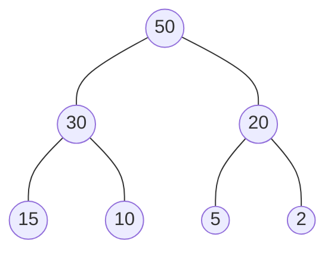
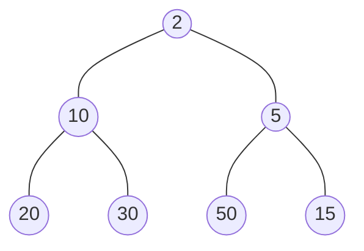
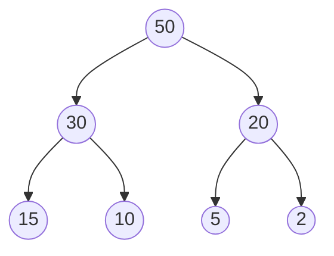
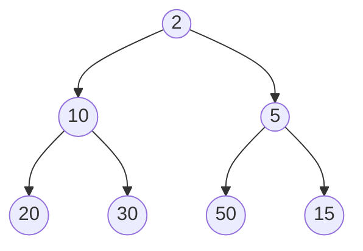
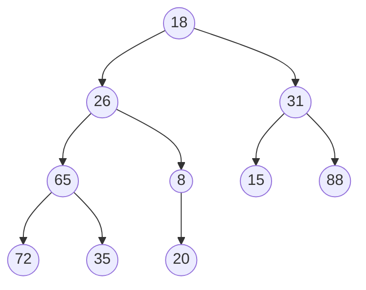
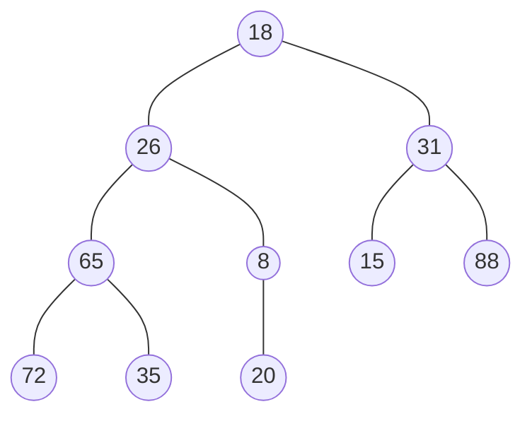

# 第 4 章 树和二叉树

## 4.1 树的定义、术语及结构

### 定义

PPT 上提出以下两种定义方式：

- 在一个元素集合中，如果元素呈上下层次关系。对一个结点而言，上层元素为其直接前驱且直接前驱唯一，下层元素为其直接后继且直接后继可以有多个，这样的结构就是树结构。

- (书本上的定义) 树是有限个(n>0)元素组成的集合。在这个集合中，有一个结点称为根；如果有其他的结点，这些结点又被分为若干个互不相交的非空子集，每个子集又是一棵树，称为根的子树；每个子树都有自己的根，子树的根称为树根结点的孩子结点。

> 《大话数据结构》上认为树存在空树(节点数为 0)，而课本上认为不存在。但是后面将要提到的二叉树确实可以是空的。

TODO：下面的三个小节的内容“节点的分类”“节点关系”“其他概念”需要用一个 mermaid 绘图可视化每个概念分别什么意思。

### 节点的分类

树的节点包含一个数据元素及若干指向其子树的分支。

节点的度(Degree): 节点拥有的子树数。

树的度：树内各节点的度的最大值。

叶节点(Leaf): 度为 0 的节点，也称为终端节点；度不为 0 的节点称为非终端节点或分支节点。

内部节点：除去根节点的分支节点。

### 节点关系

TODO：完善内容
节点的子树的根称为该节点的孩子(Child)。相应地，该节点称为孩子的父节点(Parent)。

祖父节点：父节点的父节点。

祖先节点：……

子孙节点：……

兄弟节点：……

堂兄弟节点：……

在树中，父结点可以看作是孩子结点的直接前驱、孩子结点可以看作是父结点的直接后继，直接前驱是唯一的、直接后继可以有多个。

> 《大话数据结构》将父节点称为“双亲”。

### 其他概念

TODO：完善内容
树中的节点具有层次关系。

层次 level

深度/高度 depth

有序树

无序树

森林

### 抽象数据类型

TODO：完善一下下面 ADT 的描述，调整格式
数据及关系:
有限(n>0)个相同类型的元素组成的集合。其中一个元素称为根；如果还有其余元素，则这些元素被分为若干个互不相交的非空子集，每个子集是一棵子树，每个子树有自己的根，子树的根是树根的孩子。

操作:
Constructor：前提：已知结点的数据元素值和结点间树形关系。
结果：创建一棵树。
GetRoot: 前提：已知一棵树。结果：得到树的根结点。

FirstChild：
前提：已知树中的某一结点 p。结果：得到结点 p 的第一个儿子结点。

NextChild：
前提：已知树中的某一结点 p 和它的一个儿子结点 u。
结果：得到结点 p 的、儿子结点 u 右侧的第一个儿子结点 v。

Search: 前提：已知关键字 key。结果：返回具有关键字 key 的结点。

InsertChild:
前提：已知某结点 p 及新结点的数据值 value。
结果：据 value 值创建一个新结点 q, 将其作为 p 的下一个儿子插入。

DeleteChild:
前提：已知某结点 p 及它的儿子结点的序号 k。
结果：删除结点 p 的第 k 个儿子结点。

Traverse
前提：一棵树
结果：访问树中每一结点，且每个结点只访问一次。

### 补充：如何存储

TODO：调整格式
PPT 上分析了顺序结构和链式结构的对比，如下：
顺序结构？顺序结构中元素值的存储容易，元素间的层次关系如何用顺序结构来存储？一个想法是在存储元素的分量中附加表明其父子关系的信息，即每个结点除了存储元素的值还存储父子关系的信息。由于树中每个结点的孩子个数都不一样，结点结构中设置几个字段来保存孩子结点的地址信息？预留多了浪费空间，预留少了无法增加孩子结点，用顺序结构不经济。

链式结构？因每个结点的地址不连续，更要通过设置附加的字段来指明父子关系，显然它也存在着结点中孩子指针个数不好预估的问题。

没有合适的物理存储做基础，树的基本操作就无从谈起。

TODO：下面的内容位置需要调整

大话数据结构则直接分析下面三种表示法，我记得课本上这三个都是对于二叉树的简化版本，课本上把这些内容放到“树和森林这一部分”。

双亲表示法

孩子表示法

孩子兄弟表示法

## 4.2 二叉树

TODO: 可以通过一个猜数字的例子关联后面的折半查找。1-100 随机选一个数，然后让另一个人猜测，根据猜大了/猜小了，进一步二分。补充一个 mermaid 图片展示二叉树如何对应。

### 4.2.1 二叉树的定义

二叉树 Binary Tree 是 n 个节点的有限集合，该集合或者为空集（称为空二叉树），或者由一个根节点和两棵互不相交的、分别称为根节点的左子树和右子树的二叉树组成。

TODO：下面的内容来自 PPT，大话数据结构并没有提到，需要结合课本分析：

- 二叉树和树是两种完全不同的结构，二叉树不是一棵特殊的树。
- 树是生活中实际存在的结构类型，二叉树更多地是作为一种工具。
- 二叉树中结点个数可以为 0，允许一棵空二叉树存在，这是作为工具能更方便地使用；而树中结点个数不能为 0，必须至少是 1。
- 二叉树中左右孩子要明确指出是左还是右，即便只有一个孩子，也要指明它是左子还是右子；有序树中孩子只是进行了排序，没有左右之分，当某个结点只有一个孩子时，只能说明它是大孩子，不需要确定其是左是右。

TODO 有待补充 mermaid 画图
二叉树的五种形态:

1. 空树
2. 只有一个根节点
3. 根节点+只有左子树
4. 根节点+只有右子树
5. 根节点+左子树+右子树

特殊的二叉树：定义大话数据结构和 PPT 略有不同，但并不影响
TODO：下面的需要稍微调整一些文字格式，不要改变内容。补充 mermaid 画图举例。

1. 斜树（大话数据结构上的）：所有的节点都只有左子树的二叉树叫做左斜树，所有的节点都只有右子树的二叉树叫做右斜树。两者统称为斜树。
2. 满二叉树：书本上这样定义：如果一棵 k 层二叉树中每一层的节点数量都达到了最大值，该二叉树称为满二叉树。大话数据结构提到：所有分支节点都存在左子树和右子树，并且所有叶子都在同一层上的二叉树。
3. 完全二叉树：k 层的二叉树，k-1 层都是满的，第 k 层缺少一些节点，但这些缺少的节点是自右向左的二叉树是完全二叉树。大话数据结构上这样说的：对一棵具有 n 个节点的二叉树按层序编号，如果编号为 i 的节点与同样深度的满二叉树中变好为 i 的节点在二叉树中位置完全相同，则这棵二叉树称为完全二叉树。

### 4.2.2 二叉树的性质

TODO：下面的五个性质需要统一格式，并且数学表达式用`$$`包裹 latex 格式。

#### 性质 1

性质 1： 一棵非空二叉树的第 i 层上最多有 2i-1 个结点（i≥1）。
证明： 可用数学归纳法证明。
当 i=1 时，二叉树在这一层要么为空，要么只有一个根结点，
即最多为 21-1=20 =1，命题成立。
假设 i=k 时命题成立，只需要让第 k 层的 2k-1 个结点每人各生两个孩子，第 k+1 层结点数就能达到最大：2\* 2k-1 ＝ 2k+1-1 个，即 i=k+1 时命题也成立。
性质 1 得证。

#### 性质 2

性质 2：一棵高度为 k 的二叉树，最多具有 2k-1 个结点。
证明： 要使高度为 k 的二叉树结点总数最多，每一层上结点个数须达到最多。据性质 1 得知，第 i 层的结点数最多为 2i-1，，故 k 层二叉树中结点总数 N 最多为：
N=∑1\_(𝑖=1)^𝑘▒2^(𝑖−1) =2^𝑘−1

#### 性质 3

性质 3： 对于一棵非空二叉树，如果叶子结点个数为 n0，
度数为 2 的结点个数为 n2，则有: n0 ＝ n2 ＋ 1。
证明：在一棵二叉树中，设结点总数为 n、度为 0 的结点有 n0 个、度为 1 的结点有 n1 个、度为 2 的结点有 n2 个，则有：n ＝ n0 ＋ n1 ＋ n2。
从下往上看，二叉树中除了根结点，每个结点向上都通过唯一的分支和父结点相连，所以二叉树中共有 n-1 条分支。（看前驱）
从上往下看，每个结点都通过向下的分支和孩子结点相连，度为 1 的结点向下发出 1 个分支，度为 2 的结点向下发出 2 个分支，故：n-1 ＝ 1*n1 ＋ 2*n2。（看后继）
两式结合得：n0 ＝ n2 ＋ 1

#### 性质 4

性质 4 ：具有 n 个结点的完全二叉树的高度 k = log2n + 1。
证明： 假设一棵完全二叉树的高度为 k，k 层完全二叉树前 k-1 层满，第 k 层最少有 1 个结点最多有 2k-1 个。又由性质 2，高度为 k 的二叉树最多有 2k-1 个结点、高度为 k-1 的二叉树最多有 2k-1-1 个结点。故结点总数应满足：
2k-1 ≤ n ≤ 2k – 1 即 2k-1≤n <2k
对上式各项取对数，得：k -1 ≤ log2n < k
因 k 是整数，故得 k-1 = log2n ，即 k = log2n+1。

#### 性质 5

性质 5：如果对一棵有 n 个结点的完全二叉树中的所有结点按层次自上而下、每一层自左而右依次对其编号。若根结点的编号为 1，则编号为 i 的结点（1≤i≤n)，有以下性质：
（1）如果 i ＝ 1，该结点是二叉树的根结点；如果 i>1，其父亲结点的编号为 i/2 。
（2）如果 2i > n，编号为 i 的结点无左儿子；否则，其左儿子的编号为 2i。
（3）如果 2i+1>n，编号为 i 的结点无右儿子；否则，其右儿子的编号为 2i+1。

证明：利用数学归纳法证明。
当 i=1，即为根结点时，根的左子编号为 2、右子编号为 3，结论显然成立。
设 i=k 时，其左子存在且编号为 2k、右子存在且编号为 2k+1，则编号为 k+1 的结点因 k+1≤2k 就一定存在。如果编号为 k+1 的结点有左子，左子一定紧挨着编号为 k 的结点的右子，下标即为 2k+1+1=2（k+1）；如果编号为 k+1 的结点又有右子则其编号为其左子编号加一，为 2(k+1)+1。在完全二叉树中，n 个结点是从 1 开始连续编号的，结点的编号最大为 n，当某个结点存在，其编号必 ≤n，如果计算出某结点编号大于 n,就说明该结点不存在。
结合以上讨论，根据数学归纳法，性质 5(2)、（3）成立。

下面补充一道题目，来自第一次限时作业：2498 乌萨奇想回家：

TODO: 调整格式

题目描述
乌萨奇生活在一棵二叉树上，他现在需要从树上的节点
a
a 到节点
b
b。他只能沿着二叉树的边移动，且每次只能移动一步。现给定一个二叉树以及节点
a
a 和
b
b，请你计算乌萨奇从
a
a 到
b
b 至少需要移动多少步。

保证该二叉树为满二叉树（即该二叉树上每一层节点的数量都达到了最大值）。

节点到自己的距离为 0。

输入格式
第一行，一个整数
n
n，表示二叉树的节点个数；

第二行，二叉树的层次遍历，由
n
n 个整数组成，用空格隔开，每个整数代表二叉树的一个节点的序号；

第三行，两个整数
a
a 和
b
b。

输出格式
一个整数，表示从
a
a 到
b
b 需要移动的最少步数。

样例
输入

7
10 2 3 4 50 60 7
50 60
输出

4
10
/ \
 2 3
/ \ / \
 4 50 60 7
解释：50->2->10->3->60

TODO：性质 5 可以结合第一次限时作业的某一道题目讲解。

我的程序：

```cpp
#include <iostream>

#include "LinkList.h"

using namespace datastructures;

class MinStepsBinaryTree
{
   private:
    int nodeCount;  // 节点总数

    // 获取节点的父节点编号
    int getParent(int node) { return node / 2; }

   public:
    MinStepsBinaryTree(int n) : nodeCount(n) {}

    // 计算两节点间最短距离
    int findMinSteps(int a, int b)
    {
        if (a == b) return 0;

        int steps = 0;
        int node1 = a;
        int node2 = b;

        // 同时向上移动直到找到公共祖先
        while (node1 != node2) {
            // 编号大的节点向上移动一层
            if (node1 > node2) {
                node1 = getParent(node1);
                steps++;
            } else {
                node2 = getParent(node2);
                steps++;
            }
        }

        return steps;
    }
};

int main()
{
    int n;
    std::cin >> n;  // 节点数量

    LinkList<int> nodeList;
    nodeList.insert(0, 0);  // 根节点

    // 读取层序遍历（由于是满二叉树且不需要构建树结构，可以直接跳过）
    for (int i = 1; i <= n; i++) {
        int value;
        std::cin >> value;
        nodeList.insert(i, value);
    }

    // 读取起点和终点
    int a, b;
    std::cin >> a >> b;

    int a_idx = nodeList.find(a);
    int b_idx = nodeList.find(b);

    MinStepsBinaryTree tree(n);
    std::cout << tree.findMinSteps(a_idx, b_idx) << std::endl;

    return 0;
}

```

TODO：这里不知道 PPT 上为什么突然有这么一页
构造类：在内存中创建一棵二叉树
属性类：判二叉树空、获取根结点、求以某结点为根的二叉树中的结点个数和高度。
数据操纵类：对二叉树的整体删除。对于二叉树结点的插入、删除操作，因不知其具体意义和要求，将它放到有实际插入、删除意义的后续章节中讲解。
遍历类：按前序、后序、中序、层次遍历二叉树的操作。遍历类操作非常重要，在下一节中详细讨论。

### 4.2.3 二叉树的存储和实现

顺序存储：

用一组连续的空间即数组来存储二叉树中的结点。

每个结点除了包括元素值，还包括表达二叉树父子关系的字段。可设置四个字段： data、left、right、parent，其中 left、right、parent 为其左、右孩子及父结点在数组中的下标。
当一个结点没有孩子结点时，结点的 left、right 字段设置为-1；当一个结点没有父结点时，结点的 parent 字段设置为-1。
结点在存储时，可以随意地按照任何顺序将它们存储在数组中，元素之间的关系全靠字段 left、right 和 parent 来维系。

## 4.3 二叉树的遍历

traversing binary tree 从根节点出发，按照某种次序一次访问二叉树中的所有节点，使得每个节点被访问并且仅被访问一次。

### 4.3.1 二叉树的遍历及实现

层次遍历

前序/中序/后序遍历的递归/非递归实现

以及还有个拓展就是“遍历序列确定二叉树/二叉树的重构”：

- 已知一棵完全二叉树的层次遍历，能唯一确定这个完全二叉树。
- 已知一棵满二叉树的前序、中序、后序遍历之一，能唯一确定这棵满二叉树。
- 已知一个一般二叉树的前序、中序、后序遍历之一，是不能唯一确定这棵二叉树的。

### 4.3.2 二叉线索树

TODO：补充之前的存储方法中会产生多少个空指针域的计算。
想法就是利用空指针域，该什么呢？可以解决二叉链表对于任意一个节点，我们不知道他的前驱/后继节点是谁。

如果结点的左指针域为空，就存储某种遍历序列中该结点的直接前驱结点地址。
如果结点的右指针域为空，就存储某种遍历序列中该结点的直接后继结点地址。

我们把这种指向前驱和后继的指针称为线索 thread，加上线索的二叉链表称为线索链表，相应的二叉树就称为线索二叉树 Threaded Binary Tree.

## 4.4 表达式树

### 4.4.1 基本概念

### 4.4.2 表达式树的建立

### 4.4.3 表达式树的计算

## 4.5 最优二叉树及其应用

下面借用《大话数据结构》上的一个例子来在讲解具体概念前简单分析我们为什么需要一个新的概念。

TODO：下面的数据调整成表格形式
分数 0~59 60~69 70~79 80 ~89 90~100

所占比例 5% 15% 40% 30% 10%

然后用两张 mermaid 图来比较普通的二叉树和最优二叉树的情况，这样就可以简单理解最有二叉树的提出是想要解决什么问题了。

### 4.5.1 基本概念

TODO：调整文字内容和格式，补充 WPL 全称，数学公式用 LATEX`$$`。

二叉树中任意两个结点间的路径长度为其路径上的分支总数。
二叉树的路径长度为根到树中各个结点的路径长度之和。求？
特别地：如果二叉树中叶子结点上带有权值，二叉树的加权路径长度特指从根结点到各个叶子结点路径上的分支数乘以该叶子的权值之和。记为：

𝑊𝑃𝐿=∑1*(𝑘=1)^𝑛▒〖𝑤*𝑘 𝐿_𝑘 〗

𝑾𝑷𝑳 表示加权路径长度、n 为叶子结点的个数、
𝑤*𝑘 为第 k 个叶子的权值、𝐿*𝑘 为根到第 k 个叶子的路径长度。

把能使 𝑊𝑃𝐿 达到最小的二叉树，称为最优二叉树。

策略： 权值越大，越靠近根

哈夫曼算法就是利用了权值越大，越靠近根的思想，逐步比较结点的权值，构造出了哈夫曼树，哈夫曼树是一棵最优二叉树。
哈夫曼算法的具体步骤为：
对于给定的一个带权结点集合 U
如果 U 中只有一个结点，操作结束，否则转向 2）。
在集合中选取两个权值最小的结点 x、y，构造一个新的结点 z。新结点 z 的权值为结点 x、y 的权值之和。在集合 U 中删除结点 x 和 y 并加入新结点 z，然后转向 1）。

哈夫曼算法的构造示例：

对一组带权结点 U={(A，3)，(B，8)，(C，10)，(D，12)，(E，50)，(F，4)}，
按照哈夫曼算法构造一棵最优二叉树。

TODO：上面的构造示例需要补充多张 mermaid 图片说明变化过程，或者 manim 动画演示代码。

然后最后计算 WPL：𝑊𝑃𝐿=3∗4+4∗4+8∗3+10∗3+12∗3+50∗1=168。

哈夫曼算法构造出的二叉树一定是一个最优二叉树吗？

TODO：补充证明过程，调整 LATEX 数学公式。

定理 4-1：设 T 为带权 w1≤w2≤…≤wt 的一组结点集合构成的最优二叉树，则

1. 带权 w1，w2 的叶子 w1，w2 是兄弟。
2. 以叶子 w1，w2 为儿子结点的内部结点，其路径长度最长。

定理 4-2：设 T 为带权 w1≤w2≤…≤wt 的一组结点集合构成的最优二叉树，若将以带权 w1 和 w2 的叶子为儿子的内部结点改为带权 w1+w2 的叶子，得到一棵新树 T1，则 T1 也是最优二叉树。

两个定理循环往复，正是哈夫曼算法正确性的说明。

### 4.5.2 哈夫曼算法的实现

具体代码请参考 `src/examples/Chapter4/4-17/main.cpp`文件，该代码和书本上一致。下面的代码是调整了命名以及注释的版本。

```cpp

// placeholder

```

### 4.5.3 哈夫曼编码

TODO: 需要更进一步的解释有关什么是哈夫曼编码等等相关知识，下面的解释需要调整优化。

一般来说，字符编码采用等长策略，即每个字符的二进制编码长度一样。在通讯业务中，希望传送的编码越短越好。尤其是对于高频传送的字符，希望其编码尽可能短，而低频字，因为不常用，可以比较长些。

前缀编码：在一个字符集中，字符的编码可以不等长，但任何一个字符的编码不得是另外一个编码的前缀。

如 a 编码 110，其前缀则 1、11 不得是任何字符编码，同样以 110 为前缀的编码也不得出现。哈夫曼编码是一种前缀编码。（保证了译码没有二义性）

TODO：下面这个例子比较了等长编码和不等长哈夫曼编码的优越性，需要调整文字表述

用等长编码，为表示 6 个元素，需要用三位编码。即如果待传输的短文中有 n 个字符，就需要 3n 位才能代表这篇短文。

使用了哈夫曼编码后，n 个字符所需要的总位数为：n*(4*3/87+4*4/87+3*8/87+3*10/87+3*12/87+1\*50/87)=168n/87，显然它连 2n 都不到，这样就大大减少了通讯中的传输量。

已经知道哈夫曼树了，怎么求相应地哈夫曼编码：

对哈夫曼树中任意一个叶子结点求其哈夫曼编码，将该叶子结点设为当前结点，顺着当前结点往上追溯到父亲结点。
如果当前结点是父亲的左子就输出一个 0，如果当前结点是父亲的右子就输出一个 1，之后设父亲为当前结点，反复进行以上操作，直到当前结点为根结点。

在这个过程中输出的 0、1 序列的逆序即其哈夫曼编码。
如图中 F 的编码为：0001

至此已经命比啊了什么是哈夫曼编码，那么怎么构造呢，算法实现：

函数的参数 BBTree 数组，保存了哈夫曼树的结构。
函数用了一个栈保存输出的 0、1 字符序列，对一个叶子，在其每一步向上追溯父结点的过程中，将输出的 0 或 1 进栈，当追溯工作因达到根结点而结束时，将栈中元素弹栈，即得到哈夫曼编码。
数组 HFCode 用来存储获得的所有哈夫曼编码，数组的每个分量指向了一个字符串，它是某个叶子结点的哈夫曼编码。
算法实现首先从数组尾部开始，逐步为每一个叶子求其哈夫曼编码，共有 n 个叶子。

具体代码请参考 `src/examples/Chapter4/4-18/main.cpp`文件，该代码和书本上一致。下面的代码是调整了命名以及注释的版本。

```cpp

// placeholder

```

求哈夫曼编码的算法时间复杂度分析：

该方法为对哈夫曼树自下而上访问。

算法包含了两重循环，外循环次数为叶子结点的个数 n，内循环串行地做了两件事：一个是从叶子逐步追溯到根获取哈夫曼编码的逆序，一个是逐步弹栈获取哈夫曼编码。

内循环的两个操作消耗的时间都最多是哈夫曼树的高度，而哈夫曼树的形态、高度取决于这组字符的频度分布。

最好时，哈夫曼可能达到的树高是 log_2⁡𝑛；
最差时，哈夫曼树的树高会达到 n，因此求哈夫曼编码算法的时间复杂度为 O(𝑛^2)。

如果对该哈夫曼树自上而下，即从 root（1 下标）开始利用遍历的方式进行访问，如可利用层次遍历（利用一个队列），为每一个访问的结点求取编码。

求取时，根编码为空串，后面每个结点被父结点带入队列时，左孩子由父结点编码尾部追加‘0’构成其编码，右孩子由父结点编码尾部追加‘0’构成其编码。

访问某结点时，如果是叶子结点，存储其编码即可。

层次遍历访问了 2n-1 个结点，时间效率为： O(n)。

对每个父结点字串追加‘0’或者‘1’的效率：
如果利用普通字符数组存储，时间效率为串的长度即树高。哈夫曼树高最好时是 log_2⁡𝑛；最差时是 n。算法总时间度仍为 O(𝑛^2)。

如果利用 string 类对象存储字符串，类中有 length 属性的支持，追加字符的效率为 O(1)。算法总时间复杂度为 O(n)。

## 4.6 等价类问题

### 4.6.1 等价关系及等价类

### 4.6.2 不相交集及其存储

### 4.6.3 不相交集的基本操作

## 4.7 树和森林

PPT 先开始讨论树和森林的存储方法：
双亲表示法：顺序存储
孩子兄弟法：二叉树存储
TODO：下面一句话需要研究：常用孩子兄弟表示法，二叉树基本操作都可以利用上。

### 4.7.1 孩子兄弟表示法

### 4.7.2 树、森林与二叉树的转换

### 4.7.3 树和森林的遍历

## 补充：优先级队列

无论是顺序存储还是链式存储，`进队`、`出队`操作中都会有一个操作的时间复杂度为 O(1)，另一个则为 O(n)。  
当我们将元素的值用其**优先级级别值**来标识（级别值越小，优先级越高），则可以通过一种特殊的二叉树结构——**堆（Heap）**来实现优先级队列。  
利用堆结构后，`进队`与`出队`的效率均可达到 **O(log₂ n)**。

TODO：mermaid 画图 线条样式有问题，需要修复





### 堆与优先级队列

堆分为**大顶堆**和**小顶堆**：

- **大顶堆**：完全二叉树中，每个节点的值均比其左右子节点值大。
- **小顶堆**：完全二叉树中，每个节点的值均比其左右子节点值小。

假设结点值越小，优先级越大，则可利用**小顶堆**来表示一个优先级队列。

#### 出队操作

1. 直接读取并取出堆顶元素（即二叉树的根），此操作为 O(1)。
2. 将尾部元素写入堆顶，从而形成一个"空洞"。然后对堆顶进行**向下调整**（`percolate down`），直到重新形成一个小顶堆。此步骤复杂度为 O(log₂ n)。

因此，出队的时间复杂度为 **O(log₂ n)**。

举例说明：当堆顶元素被取出后，堆顶位置"空洞"需要用尾部元素填入。假设填入的元素为 **88**，此时为了满足小顶堆特性，需要将"空洞"不断向下移动，和其较小的子节点交换，直到该元素的父节点都不大于 88 或该元素成为叶子节点为止。

#### 进队操作

1. 将新元素插入到序列尾部，作为最后的叶子结点。
2. 从底部向上检查其父结点，如果新结点值小于父结点，则交换两者，然后继续向上检查，直至不小于当前父结点或无父结点为止。

进队的时间复杂度同样为 **O(log₂ n)**。

### 使用堆实现优先级队列的构建

要建立一个小顶堆（即优先级队列），可直接将原始序列看作是一棵完全二叉树的顺序存储，然后**从下至上、从右到左**，对每一个非叶子节点进行**向下调整**，最终形成一个小顶堆。



调整后的小顶堆示例：



#### 调整示例

已知数据序列（存放于数组中）：`18、26、31、65、8、15、88、72、35、20`  
将之看作顺序存储的完全二叉树：



通过对各非叶子节点依次进行"向下调整"（`percolate down`），最终使之满足小顶堆的有序性。

**调整策略**：

- 保证结点的左子树和右子树都是小顶堆的前提下，将该结点向下调整，使它成为以自己为根的小顶堆。
- 从树的最底层非叶子结点开始，逐步向上执行此操作，直到根结点也调整完毕。

TODO：manim 动画演示进队/出队的过程。

那么如何建立优先级队列？ TODO：下面的文字格式需要调整。

优先级级别值最小的优先级最高，建立优先级队列即建立小顶堆。

将存于数组中的原始序列看作是一棵完全二叉树的顺序存储。

按照堆的概念调整之，使之成为一个小顶堆。

调整策略是：在一个结点的左子树和右子树都是小顶堆的基础上，调整该结点使之成为小顶点。

已知数据序列 18、26、31、65、8、15、88、72、35、20
TODO 补充 mermaid 图片。



将之看作顺序存储的完全二叉树（结构性）
进行调整，使之满足有序性

TODO：补充文字说明到底是怎么调整满足有序性。

TODO：补充 manim 动画演示调整过程。

建堆时间复杂度分析：TODO：调整 latex 格式数学公式

从形式上看时间复杂度是 O(nlog_2⁡𝑛),但实际可达 O(n)。

假设堆的高度为 h+1，总的元素个数为 n。
当堆是一个满二叉树时，有：
n=2^(ℎ+1)−1
观察此堆，从后往前逐个检查并调整各个非叶子结点时，比较并调整的最大次数为以该结点为根的堆的高度-1。

第一批非叶子结点在倒数第二层，倒数第二层总的结点个数为 2^(ℎ−1)个，各结点的比较调整最大次数为 1；
倒数第三层总的结点个数为 2^(ℎ−2)个，各结点的比较调整最大次数为 2；
根结点这层的结点个数为 2^(ℎ−ℎ)=2^0=1 个，结点比较调整最大次数为 h。

故总的比较调整次数最多为：
t=∑1\_(𝑖=ℎ−1)^0▒〖2^𝑖 (ℎ−𝑖) 〗
=h+2(h−1)+4(h−2)+…+2^(ℎ−2) (2)+2^(ℎ−1) (1)

2t=2h+4(h−1)+8(h−2)+…+2^(ℎ−1) (2)+2^ℎ (1)
=0+2h+4(h−1)+8(h−2)+…+2^(ℎ−1) (2)+2^ℎ (1)

t=2t−t
=−h+2+4+8+…+2^(ℎ−1)+2^ℎ
=−h−1+1+2+4+8+…+2^(ℎ−1)+2^ℎ
=−(h+1)+(1−2^(ℎ+1))/(1−2)
=−(h+1)+2^(ℎ+1)−1
=n−(h+1）
又 h 为 n 的对数阶，故建堆的时间复杂度为 O(n)。

#### Mermaid 图示示例（需修复线条样式）

以下是一个优先级队列示例，首先是未满足小顶堆性质的结构（值越小优先级越高）。注意，这里将线条样式统一为使用 `-->` 来指向子节点。


调整后的小顶堆示例：


### 建堆的时间复杂度分析

虽然从形式上看，建立堆的过程好像需要对 n 个元素进行 O(log n) 的操作，似乎为 O(n log n)，但实际分析可得出其时间复杂度为 O(n)。

**证明思路**：

设堆的高度为 h+1，总的元素个数为 n，当堆为满二叉树时有：

$$n = 2^{h+1} - 1$$

从后往前检查并调整各个非叶子结点时，对第 i 层结点（自底向上计数）而言，最大调整次数大约为该结点所处堆高的层级高度。

- 倒数第二层有 $$2^{h-1}$$ 个结点，每个结点最多比较调整 1 次。
- 倒数第三层有 $$2^{h-2}$$ 个结点，每个结点最多比较调整 2 次。
- …
- 直到根结点所在的最上层（层高为 h），只有 1 个结点，最多比较调整 h 次。

因此，总的比较调整次数 T 可表示为：

$$
T = 2^{h-1} \cdot 1 + 2^{h-2} \cdot 2 + 2^{h-3} \cdot 3 + \dots + 2^{1} \cdot (h-1) + 2^{0} \cdot h
$$

经过一系列代数变换与化简，可得 T 为 O(n)，故建堆的时间复杂度为 O(n)。

---

### 动画展示（Manim）

下面通过 Manim 动画来演示进队/出队过程和建堆过程（示例代码）。

**进队过程动画**：将新元素插入末尾并向上调整的过程  
**出队过程动画**：取出堆顶元素，并用尾部元素替换堆顶后向下调整的过程  
**建堆过程动画**：从下至上地向下调整，形成小顶堆的动态演示

---

### Manim 动画示例代码

下面的代码段为 Manim 的示例，分别演示进队和出队操作以及建堆过程的动画。请根据需要自行调整。

**进队动画示例代码：**

```python
from manim import *

class EnqueueAnimation(Scene):
    def construct(self):
        # 示例：在堆的最后插入一个元素，再向上调整
        # 请根据实际需求补充堆节点的绘制逻辑

        title = Text("优先级队列进队演示").to_edge(UP)
        self.play(Write(title))

        # 在此绘制堆节点……
        # 比如创建一些圆形表示节点的值
        heap_nodes = VGroup(
            Circle().set_fill(BLUE, opacity=0.5).set_stroke(WHITE),
            Circle().set_fill(BLUE, opacity=0.5).set_stroke(WHITE),
            # ...更多节点
        ).arrange(RIGHT, buff=1)

        self.play(FadeIn(heap_nodes))

        # 模拟进队操作：在末尾添加新节点
        new_node = Circle().set_fill(YELLOW, opacity=0.5).set_stroke(WHITE)
        new_node.move_to(heap_nodes[-1].get_right() + RIGHT*1.5)
        self.play(FadeIn(new_node))

        # 显示向上调整过程（伪动画演示）
        # 实际中需要根据堆的父子关系进行路径连线和交换动画
        self.play(new_node.animate.shift(UP*2))

        self.wait(2)
```

**出队动画示例代码：**

```python
from manim import *

class DequeueAnimation(Scene):
    def construct(self):
        title = Text("优先级队列出队演示").to_edge(UP)
        self.play(Write(title))

        # 在此绘制堆节点……
        heap_nodes = VGroup(
            Circle().set_fill(BLUE, opacity=0.5).set_stroke(WHITE),
            # ...更多节点
        ).arrange(RIGHT, buff=1)
        self.play(FadeIn(heap_nodes))

        # 模拟出队操作：取出堆顶
        top_node = heap_nodes[0]
        self.play(top_node.animate.shift(UP))
        self.play(FadeOut(top_node))

        # 将尾部元素移到顶端
        tail_node = heap_nodes[-1]
        self.play(tail_node.animate.move_to(heap_nodes[0].get_center()))

        # 显示向下调整过程（伪动画演示）
        self.play(tail_node.animate.shift(DOWN*2))

        self.wait(2)
```

**建堆过程动画示例代码：**

```python
from manim import *

class BuildHeapAnimation(Scene):
    def construct(self):
        title = Text("建堆过程演示").to_edge(UP)
        self.play(Write(title))

        # 假设有一组无序节点
        nodes = [18, 26, 31, 65, 8, 15, 88, 72, 35, 20]
        heap_nodes = VGroup(
            *[Circle().set_fill(BLUE, opacity=0.5).set_stroke(WHITE).scale(0.5) for _ in nodes]
        ).arrange_in_grid(rows=2, buff=(1,1))

        self.play(FadeIn(heap_nodes))

        # 在此添加向下调整动画的步骤
        # （实际需根据父子关系动态更新堆的形态）

        # 仅作位置及颜色变化的简单演示
        for i, node in enumerate(heap_nodes):
            self.play(node.animate.set_fill(RED, opacity=0.5), run_time=0.5)
            self.play(node.animate.set_fill(BLUE, opacity=0.5), run_time=0.5)

        self.wait(2)
```

### 优先级队列的实际应用

TODO：关联后序优先队列的 ACM-OJ 题目。

TODO: 重新解决之前提到的银行多窗口排队问题。

## 4.8 小结

TODO：下面的内容直接从 PPT 拷贝，需要调整

树是讨论的第一种非线性结构。树中要求元素个数大于零，元素之间呈现出上下层之间一对多的层次关系。鉴于树物理存储上的一系列难题，转而讨论另外一种更简单的非线性结构：二叉树。
二叉树中元素个数大于等于零，每个结点最多有两个孩子，且每个孩子都有明确的左右子之分。从元素的个数限制上也可以看出，当元素个数为零时，仍可看作是一棵二叉树，但它不是树。另外二叉树中某个结点即便只有一个儿子，也一定要明确它是左儿子还是右儿子，而不是像有序树一样说它是第一个孩子。综上两个原因，不能简单地说二叉树就是一棵有序树，它们是二种不同的数据结构。

本章详细介绍了二叉树的概念、性质，提出了两种特别的二叉树：满二叉树和完全二叉树。从满二叉树和完全二叉树上，可以看到一些有趣的性质和一些特殊的处理手段。
在讨论二叉树的物理结构时，提出了最适合完全二叉树的顺序存储法以及适合普通二叉树的二叉链表存储法（标准形式）。
在基本操作的实现上，详细讨论了标准形式存储的二叉树的递归和非递归算法。鉴于二叉树结构的递归定义，递归算法对于二叉树中的某些基本操作而言，逻辑上最直观、简单、不容易出错。而非递归算法相对于递归算法而言，是把堆栈的使用从幕后推到了台前，避免了次数众多的递归函数调用，降低了由于函数调用产生的额外时间和空间的开销，提高了算法运行效率。

在众多二叉树的基本操作中，本章将遍历作为重点详细进行了算法设计讨论。事实上可以看出，遍历之外的绝大多数操作都可以在遍历算法的基础上实现。如这棵二叉树中有多少度为 2 的结点、某个结点在二叉树中的第几层、二叉树的高度是多少，等等。
事实上，在现实生活中，能直观对应到二叉树结构的数据是极少的。它更多地可看作是一种和现实生活中无物对应、虚构出来的数据结构。但以它为工具，却可以解决很多实际数据的存储和处理问题。如本章中树和森林的孩子兄弟表示法、哈夫曼编码、优先级队列、表达式树、不相交集等，以及后续章节的二叉查找树、堆排序等都可以利用二叉树来解决。

## 4.9 习题

### 书本

### PPT

OJ 上 2185：蚂蚁过河问题

分析：始发岸、荷叶、目的岸间的可达关系是一个等价关系
0 始发岸 1-n 所有的荷叶 n+1 目的岸
罗列不相交集合的树形存储结构图

### ACM-OJ

#### 2444 二叉树的堂姐妹堂兄弟

#### 2452 二叉搜索树的节点寻找

#### 14315(4315) 二叉树的镜像

#### 2464 森林中的可达节点

#### 2454 捕鱼达人

#### 12100(2100) 哈夫曼树

#### 2491 简单丑数

我们已经实现了优先队列，那么只需要维护一个已经见到过的元素的链表就可以了。

这里有个很搞笑的事情就是和初始化空间有关：

```cpp
class UglyNumberQueue
{
   private:
    PriorityQueue<long long> pq;  // 使用小顶堆优先队列
    LinkList<long long> seen;     // 使用链表存储已经出现的丑数
    const int primes[3] = {2, 3, 5};
}
```

这个就会有两个测试案例 TLE，但是如果像下面这样：

````cpp
class UglyNumberQueue
{
   private:
    PriorityQueue<long long> pq = PriorityQueue<long long>(1001);  // 使用小顶堆优先队列
    LinkList<long long> seen;                                      // 使用链表存储已经出现的丑数
    const int primes[3] = {2, 3, 5};
}
```

提前开一个比较大的空间，避免过程中不断地调用 `doubleSpace` 浪费时间。

#### 2470 热门帖子

#### 1310 会议室安排
````
