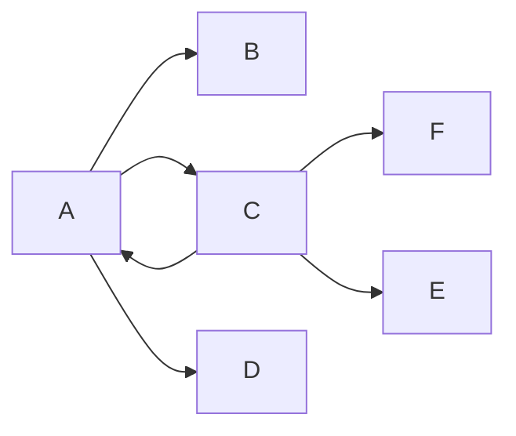
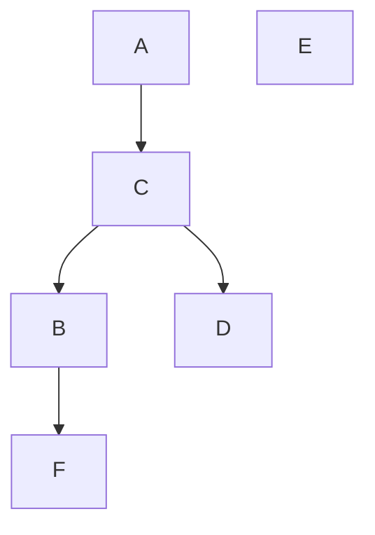
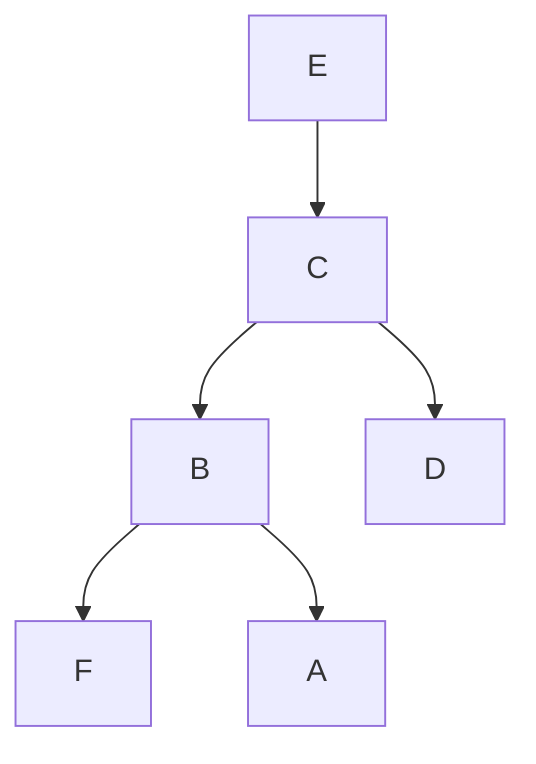

# 第 5 章 图

- [第 5 章 图](#第-5-章-图)
  - [5.1 图的基本概念](#51-图的基本概念)
    - [5.1.1 图的概念及术语](#511-图的概念及术语)
    - [5.1.2 图的抽象数据类型](#512-图的抽象数据类型)
  - [5.2 图的存储表示](#52-图的存储表示)
    - [5.2.1 邻接矩阵和加权邻接矩阵](#521-邻接矩阵和加权邻接矩阵)
    - [5.2.2 邻接表](#522-邻接表)
    - [5.2.3 邻接多重表](#523-邻接多重表)
    - [5.2.4 十字链表](#524-十字链表)
  - [5.3 图的遍历和连通性](#53-图的遍历和连通性)
    - [5.3.1 深度优先遍历](#531-深度优先遍历)
    - [5.3.2 广度优先遍历](#532-广度优先遍历)
    - [5.3.3 图的连通性](#533-图的连通性)
  - [5.4 最小代价生成树](#54-最小代价生成树)
    - [5.4.1 普里姆算法](#541-普里姆算法)
    - [5.4.2 克鲁斯卡尔算法](#542-克鲁斯卡尔算法)
  - [5.5 最短路径问题](#55-最短路径问题)
    - [5.5.1 单源最短路径](#551-单源最短路径)
    - [5.5.2 所有顶点对之间的最短路径](#552-所有顶点对之间的最短路径)
  - [5.6 AOV 网和 AOE 网](#56-aov-网和-aoe-网)
    - [5.6.1 拓扑排序](#561-拓扑排序)
    - [5.6.2 关键路径](#562-关键路径)
  - [5.7 小结](#57-小结)
  - [5.8 习题](#58-习题)
    - [书本](#书本)
    - [PPT](#ppt)
    - [ACM-OJ](#acm-oj)

## 5.1 图的基本概念

### 5.1.1 图的概念及术语

图：

有向边：

弧尾：

弧头：

无向边：

邻接关系：

出度：

入度：

度：无向图……

无向完全图

有向完全图

加权有向图

加权无向图

网络

路径

路径的长度

简单路径

简单回路/简单环

连通

连通图

连通分量

强连通图

强连通分量

弱连通图

生成树，极小连通子图

### 5.1.2 图的抽象数据类型

构造类

属性雷（查询顶点个数，边的条数，各顶点的度，某些边是否存在）

数据操纵类：顶点和边的插入，删除操作

便利类：访问途中每个顶点且只访问一遍

典型应用操作：最小生成树、拓扑排序、最短路径、关键路径

## 5.2 图的存储表示

### 5.2.1 邻接矩阵和加权邻接矩阵

TODO：调整文字格式,表述；添加示例,图解
顶点由一个一维数组存储，边由一个二维数组存储，这种存储方式称邻接矩阵表示法。

在有向图中，其邻接矩阵某一行中所有 1 的个数，就是相应行顶点的出度；而某一列中所有 1 的个数，就是相应列顶点的入度。
在无向图中，某一行中所有 1 的个数或者某一列中所有 1 的个数，就是相应顶点的度。
无向图中，同一条边在邻接矩阵中出现两次，无向图的邻接矩阵是以主对角线为轴对称的，主对角线全为零，因此在存储无向图时可以只存储它的上三角矩阵或下三角矩阵。（三角矩阵可特殊存储）
一般来说，边的总数即便远远小于 n2 ，也需 n2 个内存单元来存储边的信息，空间消耗大。

当图中边带有权值时，可以用加权邻接矩阵表示加权有向图或无向图。
如果顶点 i 至 j 有一条有向边且它的权值为 w，可令 A[i][j]=w；如果顶点 i 至 j 没有边相连，可令 A[i][j]=∞；主对角线上的元素依然有 A[i][i]=0。

另外一种观点，顶点到自身没有边，也应用 ∞ 表示。
都可以，本书采用第一种方案。

PPT 上的关键属性方法实现请参考

### 5.2.2 邻接表

TODO：调整文字格式,表述；添加示例,图解

对于无向图，邻接于同一个顶点的所有边形成一条单链表；对于有向图，自同一个顶点出发的所有边形成一条单链表。顶点信息可以用一个一维数组来存储，这个数组称为顶点表，保存边信息的单链表称为边表。一个图可以由顶点表和边表共同表示，这种方法称为邻接表表示法。

用邻接表表示图时，要想得到某个顶点的出度，要遍历该顶点连接的边表；要判断两个顶点见是否有边也需要遍历该顶点连接的边表；在这方面邻接表不如邻接矩阵。但是空间复杂度上邻接表 O(n+e)，邻接矩阵(On^2)，空间利用率提高。

邻接表计算入度很不放拜年，需要遍历所有的边表。于是提出逆邻接表，也就是保存该顶点的射入边形成的单链表首指针。那么自然逆邻接表不方便查询顶点的出度。后序我们学习十字链表兼顾二者。

无向图的边结点会重复，后序学习多重邻接表来解决这个问题

如果图是假全图，那么边结点存储 weight 字段即可。

顶点表也可以用单链表，而不是一维数组，相应地边结点 dest 字段存储需要修改。

### 5.2.3 邻接多重表

TODO：调整文字格式,表述；添加示例,图解

邻接表表示无向图时每条边用了两个边结点，同一条边被存储了两次。
这样做，1）空间浪费、2）在某些应用中，因重复而不方便。
多重邻接表中每条边仅使用一个结点来表示，即只存储一次，但这个边结点同时要在它邻接的两个顶点的边表中被链接。
为了方便两个边表同时链接，每个边结点不再像邻接表中那样只存储边的一个顶点，而是存储两个顶点。
每个边结点用 ver1、ver2 存储边的两个顶点，为了方便起见，不妨设`ver1<ver2`。

无向图用邻接多重表表示时，如果要计算某个顶点的度，只需要顺着这个顶点的 adj，然后一路观察其下标在 ver1 还是 ver2 中，如果在 ver1 中继续沿着 link1 数，如果在 ver2 中继续沿着 link2 数，直到遇到空指针结束。

### 5.2.4 十字链表

TODO：调整文字格式,表述；添加示例,图解

在用邻接表表示有向图时，可以很方便地得出某顶点所有射出的边；而用逆邻接表表示有向图时，可以很方便地得出某顶点所有射入的边。在同一种表示中两者无法兼顾，由此提出了十字链表结构。

十字链表将邻接表和逆邻接表结合在了一起。

在顶点表中 firstout 记录了该顶点第一条射出的边、firstin 记录了该顶点第一条射入的边。

TODO： 完成自行练习：输出结点 V1 邻接到的所有顶点。

## 5.3 图的遍历和连通性

- 对有向图和无向图进行遍历是按照某种方式逐个访问图中的所有顶点，并且每个顶点只能被访问一次。
- 依照前面存储方式的讨论，无论是邻接矩阵还是邻接表存储，顶点都用一个顶点表存储，因此最简单的方式是沿着顶点表循环访问一遍，就达到了遍历的目标。这种方式，完全没有借用边的信息。
- 另外有两种借助边信息实现遍历的算法：
  - 深度优先遍历
  - 广度优先遍历。

### 5.3.1 深度优先遍历

DFS depth first search

访问方式类似于二叉树的前序访问，访问方式如下：

1. 选中第一个未被访问过的顶点。
2. 访问、对顶点加已访问标志。
3. 依次从顶点的所有未被访问过的第一个、第二个、第三个…… 邻接顶点出发，依次进行深度优先搜索。即转向 2。
4. 如果还有顶点未被访问过，选中其中一个作为起始顶点，转向 2。
   如果所有的顶点都被访问到，结束。

同一个图的深度优先遍历结果并不唯一

- 图可能不连通，从一个顶点开始做深度优先遍历可能只能访问到部分顶点，此时需要重新选择尚未访问的顶点，从它开始再次开始深度优先遍历。
- 一个顶点可能和其他多个顶点邻接，故以它为起始顶点做深度优先遍历前需检查是否已经访问过。如果未访问过，遍历才能进行。

### 5.3.2 广度优先遍历

BFS breadth First Search

### 5.3.3 图的连通性

## 5.4 最小代价生成树

### 5.4.1 普里姆算法

### 5.4.2 克鲁斯卡尔算法

## 5.5 最短路径问题

### 5.5.1 单源最短路径

### 5.5.2 所有顶点对之间的最短路径

## 5.6 AOV 网和 AOE 网

### 5.6.1 拓扑排序

### 5.6.2 关键路径

## 5.7 小结

## 5.8 习题

### 书本

### PPT

### ACM-OJ
