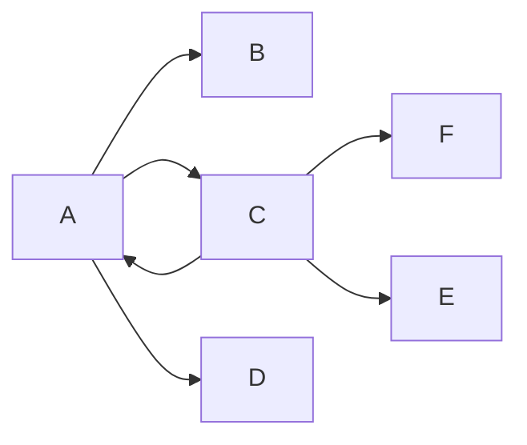
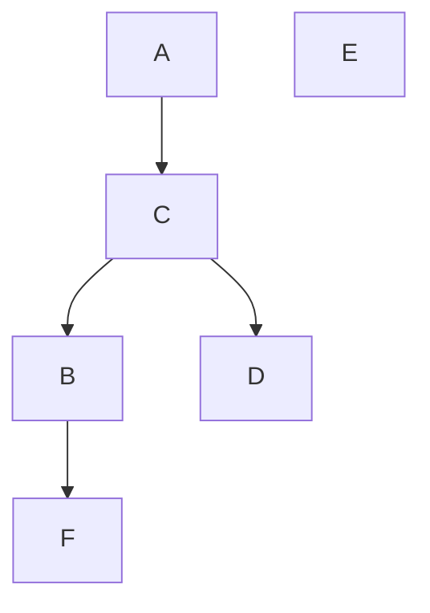
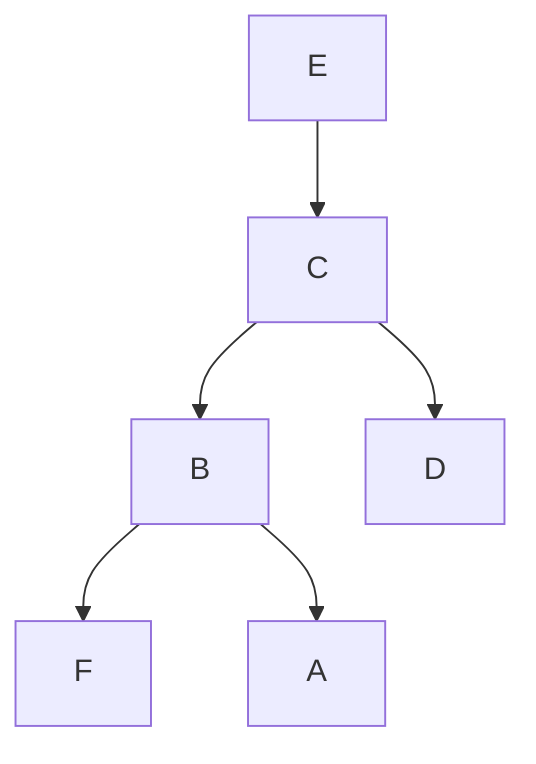
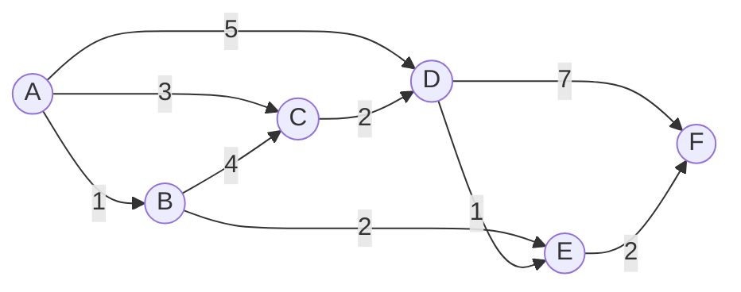
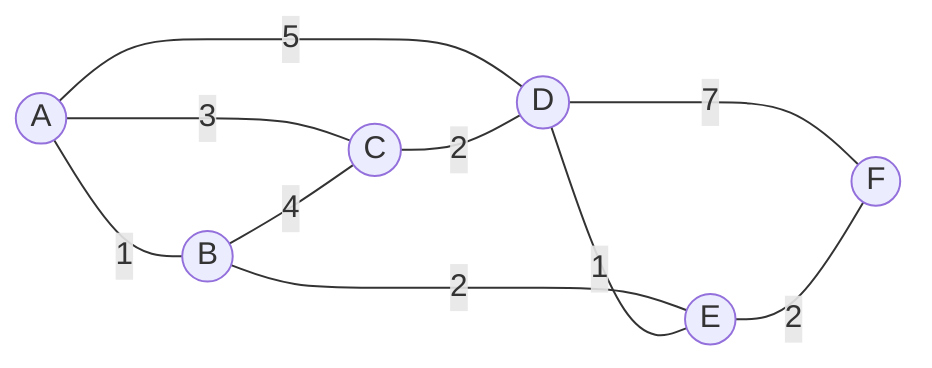
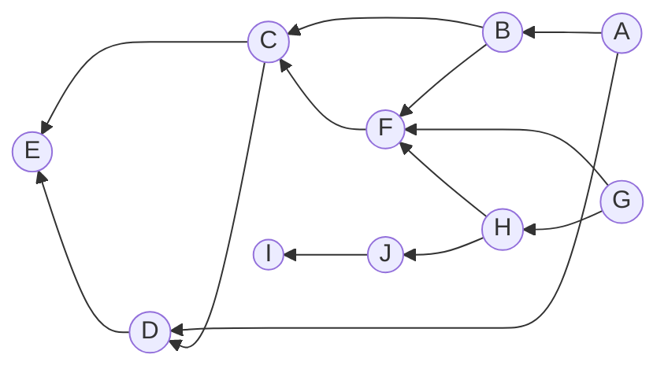

# 第 5 章 图

- [第 5 章 图](#第-5-章-图)
  - [5.1 图的基本概念](#51-图的基本概念)
    - [5.1.1 图的概念及术语](#511-图的概念及术语)
    - [5.1.2 图的抽象数据类型](#512-图的抽象数据类型)
  - [5.2 图的存储表示](#52-图的存储表示)
    - [5.2.1 邻接矩阵和加权邻接矩阵](#521-邻接矩阵和加权邻接矩阵)
    - [5.2.2 邻接表](#522-邻接表)
    - [5.2.3 邻接多重表](#523-邻接多重表)
    - [5.2.4 十字链表](#524-十字链表)
  - [5.3 图的遍历和连通性](#53-图的遍历和连通性)
    - [5.3.1 深度优先遍历](#531-深度优先遍历)
    - [5.3.2 广度优先遍历](#532-广度优先遍历)
    - [5.3.3 图的连通性](#533-图的连通性)
  - [5.4 最小代价生成树](#54-最小代价生成树)
    - [5.4.1 普里姆算法](#541-普里姆算法)
    - [5.4.2 克鲁斯卡尔算法](#542-克鲁斯卡尔算法)
  - [5.5 最短路径问题](#55-最短路径问题)
    - [5.5.1 单源最短路径](#551-单源最短路径)
    - [5.5.2 所有顶点对之间的最短路径](#552-所有顶点对之间的最短路径)
  - [5.6 AOV 网和 AOE 网](#56-aov-网和-aoe-网)
    - [5.6.1 拓扑排序](#561-拓扑排序)
    - [5.6.2 关键路径](#562-关键路径)
  - [5.7 小结](#57-小结)
  - [5.8 习题](#58-习题)
    - [书本](#书本)
      - [问题 1](#问题-1)
      - [问题 2](#问题-2)
      - [问题 3](#问题-3)
      - [问题 4](#问题-4)
      - [问题 5](#问题-5)
      - [问题 6](#问题-6)
      - [问题 7](#问题-7)
      - [问题 8](#问题-8)
      - [问题 9](#问题-9)
      - [问题 10](#问题-10)
      - [问题 11](#问题-11)
      - [问题 12](#问题-12)
      - [问题 13](#问题-13)
      - [问题 14](#问题-14)
      - [问题 15](#问题-15)
      - [问题 16 `**`](#问题-16-)
    - [PPT](#ppt)
    - [ACM-OJ](#acm-oj)

## 5.1 图的基本概念

### 5.1.1 图的概念及术语

图：由顶点集 V 和边集 E 组成的二元组 G=(V,E)，其中 V 是非空有限集合，E 是 V 中顶点之间的关系集合。

有向边：顶点对`<v,w>`，v 为始点，w 为终点，记为 v→w。

弧尾：有向边的始点。

弧头：有向边的终点。

无向边：顶点对(v,w)，表示 v 和 w 之间的关系，记为 v-w。

邻接关系：若存在边`<v,w>`，则称 v 邻接到 w，w 邻接自 v。

出度：顶点 v 的出度是以 v 为始点的有向边的数目。

入度：顶点 v 的入度是以 v 为终点的有向边的数目。

度：无向图中与顶点 v 相关联的边的数目，等于该顶点的出度与入度之和。

无向完全图：任意两个顶点之间都有边相连的无向图，n 个顶点的无向完全图有 n(n-1)/2 条边。

有向完全图：任意两个顶点之间都有两个方向的有向边的有向图，n 个顶点的有向完全图有 n(n-1)条边。

加权有向图：每条有向边都带有一个权值的有向图。

加权无向图：每条无向边都带有一个权值的无向图。

网络：带权的连通图。

路径：从顶点 v 到顶点 w 的路径是一个顶点序列，相邻顶点间有边相连。

路径的长度：路径上边的数目（无权图）或边权值之和（带权图）。

简单路径：路径中所有顶点都不重复出现。

简单回路/简单环：除首尾顶点相同外，其余顶点都不重复出现的回路。

连通：在无向图中，若从顶点 v 到顶点 w 有路径，则称 v 和 w 是连通的。

连通图：图中任意两个顶点都是连通的。

连通分量：无向图的最大连通子图。

强连通图：有向图中，任意两个顶点 v、w 之间都存在从 v 到 w 和从 w 到 v 的路径。

强连通分量：有向图的最大强连通子图。

弱连通图：将有向图中的所有有向边替换为无向边后，若图是连通的，则原图是弱连通的。

生成树：连通图的一个极小连通子图，包含图中所有顶点和尽可能少的边。

### 5.1.2 图的抽象数据类型

按照书本上来看，基本操作包括：

构造类：

- 创建一个图结构

属性类：

- 查询顶点个数
- 查询边的条数
- 查询各顶点的度
- 查询某些边是否存在

数据操纵类：

- 插入顶点
- 删除顶点
- 插入边
- 删除边

遍历类：

- 深度优先遍历
- 广度优先遍历

应用操作类：

- 最小生成树
- 拓扑排序
- 最短路径
- 关键路径

PPT 上的代码如下：

```cpp
#define DefaultNumVertex 20
class outOfBound
{
};
template <class verType, class edgeType>
class Graph
{
   private:                 // 7个属性
    int verts, edges;       // 图的实际顶点数和实际边数
    int maxVertex;          // 图顶点的最大可能数量
    verType *verList;       // 保存顶点数据的一维数组
    edgeType **edgeMatrix;  // 保存邻接矩阵内容的二维数组
    edgeType noEdge;        // 无边的标志，一般图为0， 网为无穷大MAXNUM
    bool directed;          // 有向图为1，无向图为0
   public:
    // 初始化图结构g，direct为是否有向图标志，e为无边数据
    Graph(bool direct, edgeType e);
    ~Graph();
    int numberOfVertex() const { return verts; };  // 返回图当前顶点数
    int numberOfEdge() const { return edges; };    // 返回图当前边数
    // 返回顶点为vertex值的元素在顶点表中的下标，无则-1。
    int getVertex(verType vertex) const;
    ;
    // 判断某两个顶点间是否有边
    bool existEdge(verType vertex1, verType vertex2) const;
    void insertVertex(verType vertex);                                 // 插入顶点
    void insertEdge(verType vertex1, verType vertex2, edgeType edge);  // 插入边
    void removeVertex(verType vertex);                                 // 删除顶点
    void removeEdge(verType vertex1, verType vertex2);                 // 删除边

    // 返回顶点vertex的第一个邻接点,如果无邻接点返回-1
    int getFirstNeighbor(verType vertex) const;
    // 返回顶点vertex1相对vertex2的下一个邻接点，如果无下一个邻接点返回-1
    int getNextNeighbor(verType vertex1, verType vertex2) const;
    void disp() const;  // 显示邻接矩阵的值
};
```

## 5.2 图的存储表示

### 5.2.1 邻接矩阵和加权邻接矩阵

TODO：添加示例,图解

**将顶点和边的存储独立开来**，**顶点**由一个一维数组存储，**边**由一个二维数组存储，这种存储方式称邻接矩阵表示法。

在有向图中，其邻接矩阵某一行中所有 1 的个数，就是相应行顶点的出度；而某一列中所有 1 的个数，就是相应列顶点的入度。

在无向图中，某一行中所有 1 的个数或者某一列中所有 1 的个数，就是相应顶点的度。

无向图中，同一条边在邻接矩阵中出现两次，无向图的邻接矩阵是以主对角线为轴对称的，主对角线全为零，因此在存储无向图时可以只存储它的上三角矩阵或下三角矩阵。（三角矩阵可特殊存储）

一般来说，边的总数即便远远小于$n^2$，也需$n^2$个内存单元来存储边的信息，空间消耗大。

当图中边带有权值时，可以用**加权邻接矩阵**表示加权有向图或无向图。

如果顶点$i$至$j$有一条有向边且它的权值为$w$，可令$A[i][j]=w$；如果顶点$i$至$j$没有边相连，可令$A[i][j]=\inf$；主对角线上的元素依然有$A[i][i]=0$。

而对于邻接矩阵的$A[i][i]$的取值有两种看法：一种认为是权值为$0$，另外一种观点认为顶点到自身没有边，用$\inf$表示。两种方法都可以，本书采用第一种方案。

```cpp
// 初始化图结构g，direct为是否有向图标志，e为无边数据
template <class verType, class edgeType>
Graph<verType, edgeType>::Graph(bool direct, edgeType e)
{
    int i, j;
    // 初始化属性
    directed = direct;
    noEdge = e;
    verts = 0;
    edges = 0;
    maxVertex = DefaultNumVertex;
    // 为存顶点的一维数组和存边的二维数组创建空间
    verList = new verType[maxVertex];
    edgeMatrix = new edgeType *[maxVertex];
    // 初始化图结构g，direct为是否有向图标志，e为无边数据
    for (i = 0; i < maxVertex; i++) edgeMatrix[i] = new edgeType[maxVertex];

    // 初始化二维数组，边的个数为0
    for (i = 0; i < maxVertex; i++)
        for (j = 0; j < maxVertex; j++)
            if (i == j)
                edgeMatrix[i][j] = 0;  // 对角线元素
            else
                edgeMatrix[i][j] = noEdge;  // 无边
}

template <class verType, class edgeType>
Graph<verType, edgeType>::~Graph()
{
    int i;
    delete[] verList;
    for (i = 0; i < maxVertex; i++) delete[] edgeMatrix[i];
    delete[] edgeMatrix;
}

// 返回顶点为vertex值的元素在顶点表中的下标
template <class verType, class edgeType>
int Graph<verType, edgeType>::getVertex(verType vertex) const
{
    int i;
    for (i = 0; i < verts; i++)
        if (verList[i] == vertex) return i;
    return -1;
}

// 判断某两个顶点是否有边
template <class verType, class edgeType>
bool Graph<verType, edgeType>::existEdge(verType vertex1, verType vertex2) const
{
    int i, j;
    // 找到vertex1和vertex2的下标
    i = getVertex(vertex1);
    j = getVertex(vertex2);

    // 无此顶点
    if ((i == -1) || (j == -1)) return false;
    if (i == j) return false;

    if (edgeMatrix[i][j] == noEdge) return false;
    return true;
}

// 删除顶点
template <class verType, class edgeType>
void Graph<verType, edgeType>::removeVertex(verType vertex)
// 删除顶点
{
    int i, j, k;
    // 找到该顶点在顶点表中的下标
    i = getVertex(vertex);
    // 无此顶点
    if (i == -1) return;

    // 在顶点表中删除顶点
    verList[i] = verList[verts - 1];

    // 计数删除顶点射出的边,边数减少
    for (j = 0; j < verts; j++)
        if ((j != i) && (edgeMatrix[i][j] != noEdge)) edges--;

    // 如果是有向图，计数删除顶点射入的边,边数减少
    if (directed) {
        for (k = 0; k < verts; k++)
            if (((k != i) && edgeMatrix[k][i] != noEdge)) edges--;
    }
    // 最后一行移到第i行
    for (k = 0; k < verts; k++) edgeMatrix[i][k] = edgeMatrix[verts - 1][k];

    // 最后一列移到第i列
    for (k = 0; k < verts; k++) edgeMatrix[k][i] = edgeMatrix[k][verts - 1];
    verts--;
}
```

完整的代码实现以及相应的测试代码请参考[程序 5-2](../src/examples/Chapter5/5-2/main.cpp)

### 5.2.2 邻接表

TODO：添加示例,图解

为了解决前面**邻接矩阵**对于边数较少的图存储时空间利用率低的问题，可以采用**邻接表**来存储。

顶点信息仍然可以用一个一维数组来存储，这个数组称为**顶点表**。边的信息的用单链表存储，称为**边表**。一个图可以由顶点表和边表共同表示，这种方法称为邻接表表示法。

边表里面具体是什么内容？对于无向图，邻接于同一个顶点的所有边形成一条单链表；对于有向图，自同一个顶点出发的所有边形成一条单链表。

用邻接表表示图时，要想得到某个顶点的出度，要遍历该顶点连接的边表；要判断两个顶点间是否有边也需要遍历该顶点连接的边表；在这方面邻接表不如邻接矩阵。但是空间复杂度上邻接表$O(n+e)$，邻接矩阵$O(n^2)$，空间利用率提高。

邻接表计算入度很不方便，需要遍历所有的边表，时间复杂度为$O(n+e)$。于是提出**逆邻接表**，也就是保存该顶点的入边形成的单链表首指针。那么自然逆邻接表在查询顶点的出度不方便。后序我们会学习**十字链表**兼顾二者。

无向图的边结点会重复，后序学习**多重邻接表**来解决这个问题

如果图是加权图，那么边结点存储`weight`字段即可。

顶点表也可以用单链表，而不是一维数组，相应地边结点`dest`字段存储需要修改。原本的顶点表采用一维数组实现，我们在边表结点的`dest`字段存储的是边终点（邻接表）或者边起点（逆邻接表）的顶点在顶点表中的下标。现在顶点表采用链表实现的话，`dest`字段就应该存储指向每个顶点的指针。

完整的代码实现以及相应的测试代码请参考[程序 5-3](../src/examples/Chapter5/5-3/main.cpp)

### 5.2.3 邻接多重表

TODO：调整文字格式,表述；添加示例,图解

邻接表表示无向图时每条边用了两个边结点，同一条边被存储了两次。
这样做，1）空间浪费、2）在某些应用中，因重复而不方便。
多重邻接表中每条边仅使用一个结点来表示，即只存储一次，但这个边结点同时要在它邻接的两个顶点的边表中被链接。
为了方便两个边表同时链接，每个边结点不再像邻接表中那样只存储边的一个顶点，而是存储两个顶点。
每个边结点用 ver1、ver2 存储边的两个顶点，为了方便起见，不妨设`ver1<ver2`。

无向图用邻接多重表表示时，如果要计算某个顶点的度，只需要顺着这个顶点的 adj，然后一路观察其下标在 ver1 还是 ver2 中，如果在 ver1 中继续沿着 link1 数，如果在 ver2 中继续沿着 link2 数，直到遇到空指针结束。

### 5.2.4 十字链表

TODO：调整文字格式,表述；添加示例,图解

在用邻接表表示有向图时，可以很方便地得出某顶点所有射出的边；而用逆邻接表表示有向图时，可以很方便地得出某顶点所有射入的边。在同一种表示中两者无法兼顾，由此提出了十字链表结构。

十字链表将邻接表和逆邻接表结合在了一起。

在顶点表中 firstout 记录了该顶点第一条射出的边、firstin 记录了该顶点第一条射入的边。

TODO： 完成自行练习：输出结点 V1 邻接到的所有顶点。

## 5.3 图的遍历和连通性

- 对有向图和无向图进行遍历是按照某种方式逐个访问图中的所有顶点，并且每个顶点只能被访问一次。
- 依照前面存储方式的讨论，无论是邻接矩阵还是邻接表存储，顶点都用一个顶点表存储，因此最简单的方式是沿着顶点表循环访问一遍，就达到了遍历的目标。这种方式，完全没有借用边的信息。
- 另外有两种借助边信息实现遍历的算法：
  - 深度优先遍历
  - 广度优先遍历。

### 5.3.1 深度优先遍历

DFS depth first search

访问方式类似于二叉树的前序访问，访问方式如下：

1. 选中第一个未被访问过的顶点。
2. 访问、对顶点加已访问标志。
3. 依次从顶点的所有未被访问过的第一个、第二个、第三个…… 邻接顶点出发，依次进行深度优先搜索。即转向 2。
4. 如果还有顶点未被访问过，选中其中一个作为起始顶点，转向 2。
   如果所有的顶点都被访问到，结束。

同一个图的深度优先遍历结果并不唯一







- 图可能不连通，从一个顶点开始做深度优先遍历可能只能访问到部分顶点，此时需要重新选择尚未访问的顶点，从它开始再次开始深度优先遍历。
- 一个顶点可能和其他多个顶点邻接，故以它为起始顶点做深度优先遍历前需检查是否已经访问过。如果未访问过，遍历才能进行。

### 5.3.2 广度优先遍历

- 基本思想：类似于二叉树的层次遍历
- 实现步骤：
  1. 访问起始顶点 v
  2. 访问 v 的所有未访问邻接点
  3. 依次访问这些邻接点的未访问邻接点
  4. 重复直到所有顶点被访问
- 需要借助队列存储待访问顶点
- 时间复杂度：O(|V|+|E|)

### 5.3.3 图的连通性

- 连通分量的识别：
  1. DFS 或 BFS 遍历可以找出一个连通分量
  2. 重复遍历直到所有顶点被访问
- 强连通分量的识别：
  1. Kosaraju 算法
  2. Tarjan 算法
- 应用：网络分析、社交网络社区发现

## 5.4 最小代价生成树

### 5.4.1 普里姆算法

- 基本思想：从单个顶点开始，逐步扩展
- 算法步骤：
  1. 选择起始顶点加入树
  2. 选择与树连接的最小权值边
  3. 将新顶点加入树
  4. 重复直到所有顶点加入
- 时间复杂度：O(|V|²)
- 适用：稠密图

### 5.4.2 克鲁斯卡尔算法

- 基本思想：按权值递增选择边
- 算法步骤：
  1. 边按权值排序
  2. 依次选择不构成环的边
  3. 直到选择 n-1 条边
- 时间复杂度：O(|E|log|E|)
- 适用：稀疏图

## 5.5 最短路径问题

### 5.5.1 单源最短路径

- Dijkstra 算法：
  1. 基本思想：贪心策略
  2. 适用条件：无负权边
  3. 时间复杂度：O(|V|²)
- Bellman-Ford 算法：
  1. 可处理负权边
  2. 可检测负权回路
  3. 时间复杂度：O(|V||E|)

### 5.5.2 所有顶点对之间的最短路径

- Floyd 算法：
  1. 动态规划思想
  2. 可处理负权边
  3. 时间复杂度：O(|V|³)
- 应用：路由选择、网络规划

## 5.6 AOV 网和 AOE 网

### 5.6.1 拓扑排序

- AOV 网：顶点表示活动的有向图
- 算法步骤：
  1. 选择入度为 0 的顶点
  2. 删除该顶点及其出边
  3. 重复直到所有顶点被删除
- 应用：任务调度、课程安排

### 5.6.2 关键路径

- AOE 网：边表示活动的有向图
- 关键概念：
  1. 最早开始时间
  2. 最迟开始时间
  3. 时间余量
- 关键活动：时间余量为 0 的活动
- 应用：工程进度管理

## 5.7 小结

- 图是一种复杂的非线性数据结构
- 存储方式选择：
  1. 邻接矩阵：稠密图
  2. 邻接表：稀疏图
  3. 十字链表：有向图
  4. 邻接多重表：无向图
- 图的遍历是其他算法的基础
- 最小生成树算法在网络设计中应用广泛
- 最短路径算法在导航系统中重要
- AOV 网和 AOE 网在工程管理中有重要应用

## 5.8 习题

### 书本

#### 问题 1

对下图`图5-35(a)`所示的有向图

1. 指出每个顶点的出度、入度。
2. 画出邻接矩阵存储图。
3. 画出邻接表存储图。
4. 画出逆邻接表存储图。
5. 画出十字链表存储图。
6. 指出强连通分量个数并画出所有强连通分量。
7. 写出一个深度优先遍历序列和对应的生成树或者森林。
8. 写出一个广度优先遍历序列和对应的生成树或者森林。
9. 写出所有可能的拓扑排序序列。
10. 指出起点为`A`终点为`F`的工程项目图中的关键活动和关键路径。
11. 指出从顶点`A`到图中其他每个顶点的最短路径和最短路径长度。



<details>
  <summary>答案</summary>

6. 4 个强连通分量，分别是`{B}`,`{C}`,`{D}`,`{E}`.

</details>

#### 问题 2

对下图`图5-35(b)`所示的无向图

1. 指出每个顶点的度。
2. 画出邻接矩阵存储图。
3. 画出邻接表存储图。
4. 画出多重邻接表存储图。
5. 指出连通分量个数并画出所有的连通分量。
6. 写出一个深度优先遍历序列和对应的生成树或者森林。
7. 写出一个广度优先遍历序列和对应的生成树或者森林。
8. 画出一个最小代价生成树。



> **注意**：如果上面的图中仍然是带有箭头的，这应该是`mermaid`渲染问题。

<details>
  <summary>答案</summary>

5. 1 个连通分量，就是图本身。

</details>
 
#### 问题 3

对上图`图5-35(b)`所示的无向图进行遍历，则下列选项中，不是广度优先遍历序列的是

A. A,B,C,D,E,F
B. C, B, A, D, E, F
C. E, B, D, F, A, C
D. B, A, C, D, E, F

<details>
  <summary>答案</summary>

Lorem Ipsum

</details>

#### 问题 4

对于一个用邻接表表示的有向图，写出算法构建一个逆邻接表。

<details>
  <summary>答案</summary>

Lorem Ipsum

</details>

#### 问题 5

设计一个算法判断图中两点是否存在路径，其中图用邻接表的形式存储。

<details>
  <summary>答案</summary>

Lorem Ipsum

</details>

#### 问题 6

如果有向图用邻接表表示，试写出算法判断图中是否存在回路。

<details>
  <summary>答案</summary>

Lorem Ipsum

</details>

#### 问题 7

假设无向图用邻接表表示，试写一个函数，找出每个连通分量所含的顶点集合。

<details>
  <summary>答案</summary>

Lorem Ipsum

</details>

#### 问题 8

假设有向图用邻接矩阵表示，试写一个函数找出每个强连通分量所含的顶点集合。

<details>
  <summary>答案</summary>

Lorem Ipsum

</details>

#### 问题 9

设有向图$G=<V,E>$，顶点集$V=\{v_0,v_1,v_2,v_3\}$，边集$E=\{<v_0,v_1>,<v_0,v_2>,<v_0,v_3>,<v_1,v_3>,\}$。若从顶点$v_0$开始对图进行深度优先遍历，则可能得到的不同遍历序列个数是多少？

<details>
  <summary>答案</summary>

Lorem Ipsum

</details>

#### 问题 10

假设图用邻接矩阵存储，实现深度优先和广度优先遍历算法，并分析其时间复杂度。

<details>
  <summary>答案</summary>

Lorem Ipsum

</details>

#### 问题 11

对于下图`图5-36`所示的有向图，给出其一条拓扑排序序列。



<details>
  <summary>答案</summary>

Lorem Ipsum

</details>

#### 问题 12

编程实现利用克鲁斯卡尔算法找出无向连通图的最小代价生成树，要求输出最小代价生成树的各条边及最小代价。

<details>
  <summary>答案</summary>

Lorem Ipsum

</details>

#### 问题 13

设计一个算法找出一个无向图的最大代价生成树。

<details>
  <summary>答案</summary>

Lorem Ipsum

</details>

#### 问题 14

假设一个 AOE 网用邻接表存储，编程实现函数求单源最短路径。

<details>
  <summary>答案</summary>

Lorem Ipsum

</details>

#### 问题 15

假设一个 AOE 网用邻接表存储，编程实现函数求关键路径。

<details>
  <summary>答案</summary>

Lorem Ipsum

</details>

#### 问题 16 `**`

设计算法，找出所有从指定顶点出发，长度为$K$的简单路径，并以邻接表为例，实现该算法。

<details>
  <summary>答案</summary>

Lorem Ipsum

</details>

### PPT

### ACM-OJ
