# 第 5 章 图

- [第 5 章 图](#第-5-章-图)
  - [5.1 图的基本概念](#51-图的基本概念)
    - [5.1.1 图的概念及术语](#511-图的概念及术语)
    - [5.1.2 图的抽象数据类型](#512-图的抽象数据类型)
  - [5.2 图的存储表示](#52-图的存储表示)
    - [5.2.1 邻接矩阵和加权邻接矩阵](#521-邻接矩阵和加权邻接矩阵)
    - [5.2.2 邻接表](#522-邻接表)
    - [5.2.3 邻接多重表](#523-邻接多重表)
    - [5.2.4 十字链表](#524-十字链表)
  - [5.3 图的遍历和连通性](#53-图的遍历和连通性)
    - [5.3.1 深度优先遍历](#531-深度优先遍历)
    - [5.3.2 广度优先遍历](#532-广度优先遍历)
    - [5.3.3 图的连通性](#533-图的连通性)
      - [无向图的连通性和连通分量](#无向图的连通性和连通分量)
      - [有向图的强连通分量](#有向图的强连通分量)
      - [欧拉回路](#欧拉回路)
      - [六度空间理论](#六度空间理论)
  - [5.4 最小代价生成树](#54-最小代价生成树)
    - [5.4.1 普里姆算法](#541-普里姆算法)
    - [5.4.2 克鲁斯卡尔算法](#542-克鲁斯卡尔算法)
  - [5.5 最短路径问题](#55-最短路径问题)
    - [5.5.1 单源最短路径](#551-单源最短路径)
    - [5.5.2 所有顶点对之间的最短路径](#552-所有顶点对之间的最短路径)
  - [5.6 AOV 网和 AOE 网](#56-aov-网和-aoe-网)
    - [5.6.1 拓扑排序](#561-拓扑排序)
      - [什么是拓扑排序？](#什么是拓扑排序)
      - [拓扑排序的作用](#拓扑排序的作用)
      - [拓扑排序的算法步骤](#拓扑排序的算法步骤)
      - [实际应用场景](#实际应用场景)
      - [示例](#示例)
    - [5.6.2 关键路径](#562-关键路径)
  - [5.7 小结](#57-小结)
  - [5.8 习题](#58-习题)
    - [书本](#书本)
      - [问题 1](#问题-1)
      - [问题 2](#问题-2)
      - [问题 3](#问题-3)
      - [问题 4](#问题-4)
      - [问题 5](#问题-5)
      - [问题 6](#问题-6)
      - [问题 7](#问题-7)
      - [问题 8](#问题-8)
      - [问题 9](#问题-9)
      - [问题 10](#问题-10)
      - [问题 11](#问题-11)
      - [问题 12](#问题-12)
      - [问题 13](#问题-13)
      - [问题 14](#问题-14)
      - [问题 15](#问题-15)
      - [问题 16 `**`](#问题-16-)
    - [PPT](#ppt)
    - [ACM-OJ](#acm-oj)

## 5.1 图的基本概念

### 5.1.1 图的概念及术语

图：由顶点集 V 和边集 E 组成的二元组 G=(V,E)，其中 V 是非空有限集合，E 是 V 中顶点之间的关系集合。

有向边：顶点对`<v,w>`，v 为始点，w 为终点，记为 v→w。

弧尾：有向边的始点。

弧头：有向边的终点。

无向边：顶点对(v,w)，表示 v 和 w 之间的关系，记为 v-w。

邻接关系：若存在边`<v,w>`，则称 v 邻接到 w，w 邻接自 v。

出度：顶点 v 的出度是以 v 为始点的有向边的数目。

入度：顶点 v 的入度是以 v 为终点的有向边的数目。

度：无向图中与顶点 v 相关联的边的数目，等于该顶点的出度与入度之和。

无向完全图：任意两个顶点之间都有边相连的无向图，n 个顶点的无向完全图有 n(n-1)/2 条边。

有向完全图：任意两个顶点之间都有两个方向的有向边的有向图，n 个顶点的有向完全图有 n(n-1)条边。

加权有向图：每条有向边都带有一个权值的有向图。

加权无向图：每条无向边都带有一个权值的无向图。

网络：带权的连通图。

路径：从顶点 v 到顶点 w 的路径是一个顶点序列，相邻顶点间有边相连。

路径的长度：路径上边的数目（无权图）或边权值之和（带权图）。

简单路径：路径中所有顶点都不重复出现。

简单回路/简单环：除首尾顶点相同外，其余顶点都不重复出现的回路。

连通：在无向图中，若从顶点 v 到顶点 w 有路径，则称 v 和 w 是连通的。

连通图：图中任意两个顶点都是连通的。

连通分量：无向图的最大连通子图。

强连通图：有向图中，任意两个顶点 v、w 之间都存在从 v 到 w 和从 w 到 v 的路径。

强连通分量：有向图的最大强连通子图。

弱连通图：将有向图中的所有有向边替换为无向边后，若图是连通的，则原图是弱连通的。

生成树：连通图的一个极小连通子图，包含图中所有顶点和尽可能少的边。

### 5.1.2 图的抽象数据类型

按照书本上来看，基本操作包括：

构造类：

- 创建一个图结构

属性类：

- 查询顶点个数
- 查询边的条数
- 查询各顶点的度
- 查询某些边是否存在

数据操纵类：

- 插入顶点
- 删除顶点
- 插入边
- 删除边

遍历类：

- 深度优先遍历
- 广度优先遍历

应用操作类：

- 最小生成树
- 拓扑排序
- 最短路径
- 关键路径

## 5.2 图的存储表示

### 5.2.1 邻接矩阵和加权邻接矩阵

TODO：添加示例,图解

**将顶点和边的存储独立开来**，**顶点**由一个一维数组存储，**边**由一个二维数组存储，这种存储方式称邻接矩阵表示法。

在有向图中，其邻接矩阵某一行中所有 1 的个数，就是相应行顶点的出度；而某一列中所有 1 的个数，就是相应列顶点的入度。

在无向图中，某一行中所有 1 的个数或者某一列中所有 1 的个数，就是相应顶点的度。

无向图中，同一条边在邻接矩阵中出现两次，无向图的邻接矩阵是以主对角线为轴对称的，主对角线全为零，因此在存储无向图时可以只存储它的上三角矩阵或下三角矩阵。（三角矩阵可特殊存储）

一般来说，边的总数即便远远小于$n^2$，也需$n^2$个内存单元来存储边的信息，空间消耗大。

当图中边带有权值时，可以用**加权邻接矩阵**表示加权有向图或无向图。

如果顶点$i$至$j$有一条有向边且它的权值为$w$，可令$A[i][j]=w$；如果顶点$i$至$j$没有边相连，可令$A[i][j]=\inf$；主对角线上的元素依然有$A[i][i]=0$。

而对于邻接矩阵的$A[i][i]$的取值有两种看法：一种认为是权值为$0$，另外一种观点认为顶点到自身没有边，用$\inf$表示。两种方法都可以，本书采用第一种方案。

用邻接矩阵的方式存储的图结构[代码实现](../src/examples/Chapter5/5-1/adjacency-matrix.cpp)，相应的测试代码请参考[程序 5-2](../src/examples/Chapter5/5-2/main.cpp)

### 5.2.2 邻接表

TODO：添加示例,图解

为了解决前面**邻接矩阵**对于边数较少的图存储时空间利用率低的问题，可以采用**邻接表**来存储。

顶点信息仍然可以用一个一维数组来存储，这个数组称为**顶点表**。边的信息的用单链表存储，称为**边表**。一个图可以由顶点表和边表共同表示，这种方法称为邻接表表示法。

边表里面具体是什么内容？对于无向图，邻接于同一个顶点的所有边形成一条单链表；对于有向图，自同一个顶点出发的所有边形成一条单链表。

用邻接表表示图时，要想得到某个顶点的出度，要遍历该顶点连接的边表；要判断两个顶点间是否有边也需要遍历该顶点连接的边表；在这方面邻接表不如邻接矩阵。但是空间复杂度上邻接表$O(n+e)$，邻接矩阵$O(n^2)$，空间利用率提高。

邻接表计算入度很不方便，需要遍历所有的边表，时间复杂度为$O(n+e)$。于是提出**逆邻接表**，也就是保存该顶点的入边形成的单链表首指针。那么自然逆邻接表在查询顶点的出度不方便。后序我们会学习**十字链表**兼顾二者。

无向图的边结点会重复，后序学习[**多重邻接表**](#523-邻接多重表)来解决这个问题

如果图是加权图，那么边结点存储`weight`字段即可。

顶点表也可以用单链表，而不是一维数组，相应地边结点`dest`字段存储需要修改。原本的顶点表采用一维数组实现，我们在边表结点的`dest`字段存储的是边终点（邻接表）或者边起点（逆邻接表）的顶点在顶点表中的下标。现在顶点表采用链表实现的话，`dest`字段就应该存储指向每个顶点的指针。

用邻接表的方式存储的图结构[代码实现](../src/examples/Chapter5/5-3/adjancency-list.cpp)。

### 5.2.3 邻接多重表

TODO：添加示例,图解

多重邻接表是一种改进的无向图表示结构，旨在解决传统邻接表中边存储重复和边遍历冗余的问题。在这种结构中，每条边只存储一次，但同时出现在其两个关联顶点的边表中。每个边结点包含两个顶点 `ver1` 和`ver2`（约定 `ver1` <`ver2`），并有两个指针`link1`和`link2`，分别指向与 `ver1` 和`ver2` 顶点相关的下一条边。这种设计使得在计算某个顶点的度时，只需沿着该顶点的 adj 指针开始，判断当前边的顶点在 `ver1` 还是`ver2` 中，并分别沿着`link1`或`link2`继续遍历，直到链表结束，累积计数即可得到该顶点的度。这种结构不仅减少了存储冗余，还使得图的遍历更加高效，特别适合在稠密图中进行复杂操作。

### 5.2.4 十字链表

TODO：调整文字格式,表述；添加示例,图解

在用邻接表表示有向图时，可以很方便地得出某顶点所有射出的边；而用逆邻接表表示有向图时，可以很方便地得出某顶点所有射入的边。在同一种表示中两者无法兼顾，由此提出了十字链表结构。

十字链表将邻接表和逆邻接表结合在了一起。

在顶点表中 firstout 记录了该顶点第一条射出的边、firstin 记录了该顶点第一条射入的边。

TODO： 完成自行练习：输出结点 V1 邻接到的所有顶点。

## 5.3 图的遍历和连通性

对有向图和无向图进行遍历是按照某种方式逐个访问图中的所有顶点，并且每个顶点只能被访问一次。

依照前面存储方式的讨论，无论是邻接矩阵还是邻接表存储，顶点都用一个顶点表存储，因此最简单的方式是沿着顶点表循环访问一遍，就达到了遍历的目标。这种方式，完全没有借用边的信息。但是我们遍历图，并不只是为了访问所有的顶点，实际上我们在遍历之后还想要检查从某个顶点出发是否能够到达另一个顶点，以及图本身是否联通等等信息。这些都需要我们边信息来实现遍历，于是就有以下将要学习的算法：

- 深度优先遍历(DFS, Depth First Search)
- 广度优先遍历(BFS, Breadth First Search)

### 5.3.1 深度优先遍历

访问方式类似于二叉树的[前序遍历](./Chapter4.md#431-二叉树的遍历及实现)，访问方式如下：

1. 选中第一个未被访问过的顶点。
2. 访问、对顶点加已访问标志。
3. 依次从顶点的所有未被访问过的第一个、第二个、第三个…… 邻接顶点出发，依次进行深度优先搜索。即转向(2)。
4. 如果还有顶点未被访问过，选中其中一个作为起始顶点，转向(2)。如果所有的顶点都被访问到，结束。

> 注意：同一个图的深度优先遍历结果并不唯一

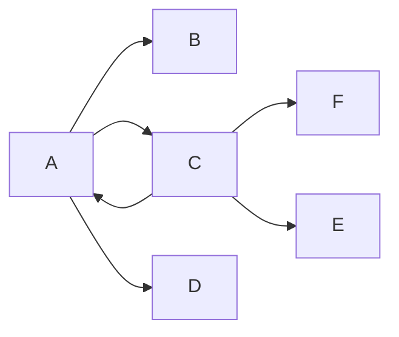

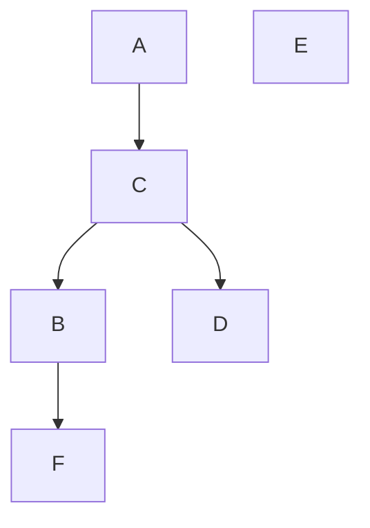

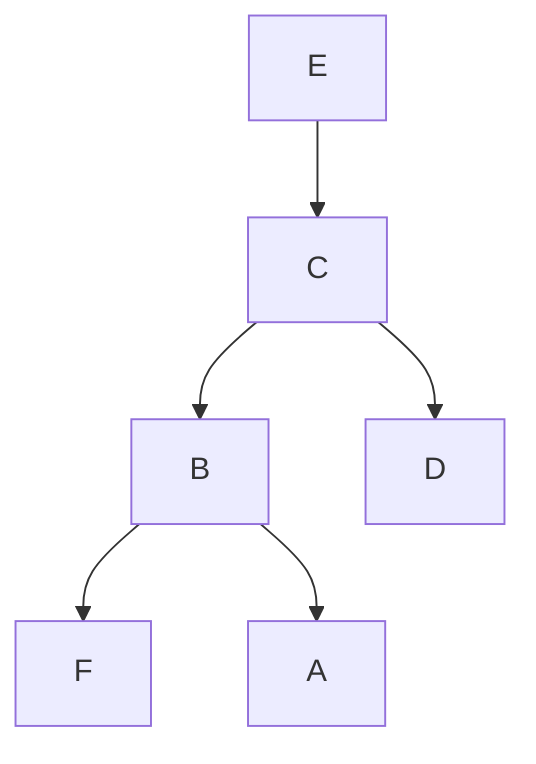

- 图可能不连通，从一个顶点开始做深度优先遍历可能只能访问到部分顶点，此时需要重新选择尚未访问的顶点，从它开始再次开始深度优先遍历。
- 一个顶点可能和其他多个顶点邻接，故以它为起始顶点做深度优先遍历前需检查是否已经访问过。如果未访问过，遍历才能进行。

我们研究递归和非递归两种实现方式，先是递归：

```cpp
template <class verType, class edgeType>
void Graph<verType, edgeType>::DFS() const
{
    bool *visited;
    int i;

    // 为visited创建动态数组空间，并设置初始访问标志为false
    visited = new bool[verts];
    if (!visited) {
        throw illegalSize();
    }
    for (i = 0; i < verts; i++) visited[i] = false;

    for (i = 0; i < verts; i++) {
        if (!visited[i]) {
            DFS(i, visited);
        }
        cout << endl;
    }
}

template <class verType, class edgeType>
void Graph<verType, edgeType>::DFS(int start, bool visited[]) const
{
    edgeNode<edgeTpe> *p;

    cout << verList[start].data << "\t";
    visited[start] = true;

    p = verList[start].adj;
    while (p) {
        if (!visited[p->dest]) {
            DFS(p->dest, visited);
        }
        p = p->link;
    }
}
```

完整代码请查看[示例程序 5-4](../src/examples/Chapter5/5-4/main.cpp)

非递归的实现方法：

```cpp
template <class verType, class edgeType>
void Graph<verType, edgeType>::DFS() const
{
    seqStack<int> s;
    edgeNode<edgeType> *p;
    bool *visited;
    int i, start;

    // 为visited创建动态数组空间，并设置初始访问标志为false
    visited = new bool[verts];
    if (!visited) {
        throw illegalSize();
    }
    for (i = 0; i < verts; i++) visited[i] = false;

    // 逐一找到未被访问过的顶点，做深度优先遍历
    for (i = 0; i < verts; i++) {
        if (visited[i]) continue;
        s.push(i);

        while (!s.isEmpty()) {
            start = s.top();
            s.pop();
            if (visited[start]) continue;

            cout << verList[start].data << "\t";
            visited[start] = true;

            p = verList[start].adj;
            while (p) {
                if (!visited[p->dest]) {
                    s.push(p->dest);
                }
                p = p->link;
            }
        }
        cout << endl;
    }
}
```

完整代码请查看[示例程序 5-5](../src/examples/Chapter5/5-5/main.cpp)

无论实现是否递归，时间复杂度都是$O(n+e)$。

这里书本上还提到如果图用邻接表存储，那么非递归的`DFS`算法如下改进：栈存储的是边结点`edgeNode<edgeType>`，减少了栈的访问次数，直接通过边节点获取邻接顶点，避免了多次查找顶点的邻接表。

```cpp
template <class verType, class edgeType>
void Graph<verType, edgeType>::DFS() const
{
    seqStack<edgeNode<edgeType> > s;  // 栈中元素为边结点类型
    edgeNode<edgeType> *p;
    bool *visited;
    int i, start;

    // 为visited创建动态数组空间，并置初始访问标志为false。
    visited = new bool[verts];
    if (!visited) throw illegalSize();
    for (i = 0; i < verts; i++) visited[i] = false;

    // 逐一找到未被访问过顶点，做深度优先遍历
    for (i = 0; i < verts; i++) {
        if (visited[i]) continue;
        visited[i] = true;
        cout << verList[i].data << '\t';
        if (verList[i].adj) s.push(verList[i].adj);
        while (!s.isEmpty()) {
            p = s.top();
            s.pop();
            if (p->link) s.push(p->link);

            if (!visited[p->dest]) {
                cout << verList[p->dest].data << '\t';
                visited[p->dest] = true;
                if (verList[p->dest].adj) s.push(verList[p->dest].adj);
            }
        }
    }
}
```

`for-while`循环使得每条边进栈一次且仅一次。

### 5.3.2 广度优先遍历

- 基本思想：类似于二叉树的[层次遍历](./Chapter4.md#431-二叉树的遍历及实现)
- 实现步骤：
  1. 访问起始顶点`v`
  2. 访问`v`的所有未访问邻接点
  3. 依次访问这些邻接点的未访问邻接点
  4. 重复直到所有顶点被访问
- 需要借助队列存储待访问顶点
- 时间复杂度：$O(n+e)$

> 注意：同一个图的广度优先遍历结果并不唯一

核心代码实现如下，完整代码请参考[示例程序 5-6](../src/examples/Chapter5/5-6/main.cpp)

```cpp
template <class verType, class edgeType>
void Graph<verType, edgeType>::BFS() const
{
    datastructures::SeqQueue<int> q;
    edgeNode<edgeType> *p;
    bool *visited;
    int i, start;

    // 为visited创建动态数组空间，并设置初始访问标志为false
    visited = new bool[verts];
    if (!visited) {
        throw illegalSize();
    }
    for (i = 0; i < verts; i++) visited[i] = false;

    // 逐一找到未被访问过的顶点，做深度优先遍历
    for (i = 0; i < verts; i++) {
        if (visited[i]) continue;
        q.enQueue(i);
        visited[i] = true;

        while (!q.isEmpty()) {
            start = q.front();
            q.deQueue();
            if (visited[start]) continue;

            cout << verList[start].data << "\t";
            visited[start] = true;

            p = verList[start].adj;
            while (p) {
                if (!visited[p->dest]) {
                    q.enQueue(p->dest);
                }
                p = p->link;
            }
        }
        cout << endl;
    }
}
```

### 5.3.3 图的连通性

#### 无向图的连通性和连通分量

如果无向图是连通的，那么选定图中任何一个顶点，从该顶点出发，通过遍历，就能到达图中其他所有顶点。换句话说，在前面实现的深度优先`DFS`、广度优先遍历`BFS`算法实现中增加一个计数器，记录外循环体中，进入内循环的次数，根据次数可以判断出该图是否连通、如果不连通有几个连通分量、每个连通分量包含哪些顶点。

- 连通分量的识别：
  1. `DFS`或`BFS`遍历可以找出一个连通分量
  2. 重复遍历直到所有顶点被访问

核心代码如下，完整代码请参考

```cpp
template <class verType, class edgeType>
bool Graph<verType, edgeType>::connected() const  // 广度优先遍历
{
    seqQueue<int> q;
    edgeNode<edgeType> *p;
    bool *visited;
    int i, start, count = 0;  // count为计数器

    // 为visited创建动态数组空间，并置初始访问标志为false。
    visited = new bool[verts];
    if (!visited) throw illegalSize();
    for (i = 0; i < verts; i++) visited[i] = false;

    // 逐一找到未被访问过顶点，
    // 做广度优先遍历
    for (i = 0; i < verts; i++) {
        if (visited[i]) continue;
        q.enQueue(i);
        visited[start] = true;
        count++;
        while (!q.isEmpty()) {
            start = q.front();
            q.deQueue();
            cout << verList[start].data << '\t';
            p = verList[start].adj;

            while (p) {
                if (!visited[p->dest]) q.enQueue(p->dest);
                visited[p->dest] = true;
                p = p->link;
            }
        }
        cout << '\n';
    }
    if (count == 1) return true;
    return false;
}
```

#### 有向图的强连通分量

有向图的连通性和其强连通分量是同一个问题：

- 当有向图的强连通分量只有一个时，说明它是强连通图。
- 当有向图的强连通分量不止一个时，说明它不是强连通图。

但和无向图相比，有向图的强连通分量问题解决起来比较复杂：对一个强连通分量来说，要求每一对顶点间都有路径可达，比如顶点`i`和`j`，不光要从`i`能到`j`，还要求从`j`能到`i`。

可以利用有向图的深度优先遍历`DFS`，通过以下算法获得：

1. 对有向图$G$进行深度优先遍历，按照遍历中回退顶点的次序给每个顶点进行编号。最先回退的顶点的编号为`1`，其它顶点的编号按回退先后逐次增大`1`。
2. 将有向图$G$的所有有向边反向，构造新的有向图$Gr$。
3. 根据步骤(1)对顶点进行的编号，选取未访问过的**最大编号顶点**。以该顶点为起始点在有向图$Gr$上进行深度优先遍历。如果没有访问到所有的顶点，则从剩余的那些未被访问过的顶点中选取编号最大的顶点，以该顶点为起始点再进行深度优先遍历，如此反复，直至所有的顶点都被访问到。

最终对$Gr$遍历得到的生成森林中生成树的个数为`m`个。如果`m=1`，说明$G$是强连通图；如果`m>1`，说明$G$不是强连通图，并且强连通分量有`m`个。

下面简单说明该算法的正确性：

在转置图$Gr$中，假设某棵生成树的树根为顶点`x`，并且该生成树包含任意两个顶点`v`和`w`，且`x`的回退编号大于`v`和`w`。在$Gr$中，由于`x`是树根，必然存在一条路径从`x`到`v`。由于$Gr$中的边是由原图$G$中的边反向得到的，因此在图$G$中必然存在一条路径从`v`到`x`。

在第一次对图$G$进行深度优先遍历时，由于顶点`x`的回退编号较大，而顶点`v`的回退编号较小，这说明遍历过程中是从顶点`v`回退到顶点`x`的。因此，在图$G$中必然存在一条从`x`到`v`的路径。

因此，在图$G$中，顶点`x`和`v`之间存在双向可达路径。同理，顶点`x`和`w` 之间也存在双向可达路径。因此，顶点`v`和`w` 之间也存在双向可达路径。

由此可知，在转置图$Gr$的生成森林中，每棵生成树的顶点集在原图$G$中构成一个**强连通分量**。

#### 欧拉回路

#### 六度空间理论

## 5.4 最小代价生成树

当一个无向图中每条边有一个权值（如：长度、时间、代价等），这个图通常称为网络。如果这个无向图是连通的，且其子图满足以下 4 个条件：

1. 包含原来网络中的所有顶点
2. 包含原来网络中的部分边
3. 该子图是连通的
4. 在同时满足(1), (2), (3)条件的所有子图中该子图所有边的权值之和最小

该子图就被称为**最小代价生成树**(Minimum Cost Spanning Tree)。

### 5.4.1 普里姆算法

- 基本思想：从单个顶点开始，逐步扩展
- 算法步骤：
  1. 选择起始顶点加入树
  2. 选择与树连接的最小权值边
  3. 将新顶点加入树
  4. 重复直到所有顶点加入
- 时间复杂度：O(|V|²)
- 适用：稠密图

### 5.4.2 克鲁斯卡尔算法

- 基本思想：按权值递增选择边
- 算法步骤：
  1. 边按权值排序
  2. 依次选择不构成环的边
  3. 直到选择 n-1 条边
- 时间复杂度：O(|E|log|E|)
- 适用：稀疏图

## 5.5 最短路径问题

### 5.5.1 单源最短路径

- Dijkstra 算法：
  1. 基本思想：贪心策略
  2. 适用条件：无负权边
  3. 时间复杂度：O(|V|²)
- Bellman-Ford 算法：
  1. 可处理负权边
  2. 可检测负权回路
  3. 时间复杂度：O(|V||E|)

### 5.5.2 所有顶点对之间的最短路径

- Floyd 算法：
  1. 动态规划思想
  2. 可处理负权边
  3. 时间复杂度：O(|V|³)
- 应用：路由选择、网络规划

## 5.6 AOV 网和 AOE 网

有向无环图的应用通常分为两种：一种是 AOV(Activity On Vertex NetWork)网，一种是 AOE(Activity on Edge Network)网。

AOV 网将活动赋予顶点之上，顶点间的有向边表示活动发生的先后顺序，表达了活动之间的前后关系。 AOV 网的一个典型应用是课程的先修关系。

AOE 网将活动赋予边之上，顶点表达了活动发生后到达的某种状态或事件。某个状态或事件既意味着前面所有的活动结束，也意味着后面的活动可以开始。AOE 网的一个典型应用是工程问题。

下面我们分别研究 AOV 网的应用：拓扑排序和 AOE 网的应用：关键路径。

### 5.6.1 拓扑排序

TODO: 似乎应该补充偏序关系，全序关系的内容。

#### 什么是拓扑排序？

想象你在规划一个学习计划，有些课程需要先修其他课程才能学习。比如：

- 在学习"数据结构"之前，你需要先学习"程序设计基础"
- 在学习"算法分析"之前，你需要先学习"数据结构"和"离散数学"

这种课程之间的先后关系可以用一个有向无环图（DAG）来表示，我们称之为 AOV 网（Activity On Vertex Network）。

#### 拓扑排序的作用

拓扑排序就是将这些有先后关系的课程（或任务）排成一个线性序列，使得：

- 如果课程 A 是课程 B 的先修课程，那么课程 A 在序列中必须排在课程 B 之前
- 这个序列可以帮助我们合理安排学习顺序或任务执行顺序

#### 拓扑排序的算法步骤

1. **找到起点**：选择当前没有先修课程（入度为 0）的课程
2. **学习课程**：将这个课程加入学习序列，并"完成"它
3. **更新状态**：移除这个课程，并更新其他课程的先修要求
4. **重复过程**：继续寻找新的没有先修课程的课程，直到所有课程都被安排

#### 实际应用场景

- 课程安排：确定大学课程的学习顺序
- 任务调度：安排软件开发任务的执行顺序
- 依赖管理：确定软件包安装的先后顺序
- 生产流程：安排制造工序的执行顺序

#### 示例

假设有以下课程及其先修关系：

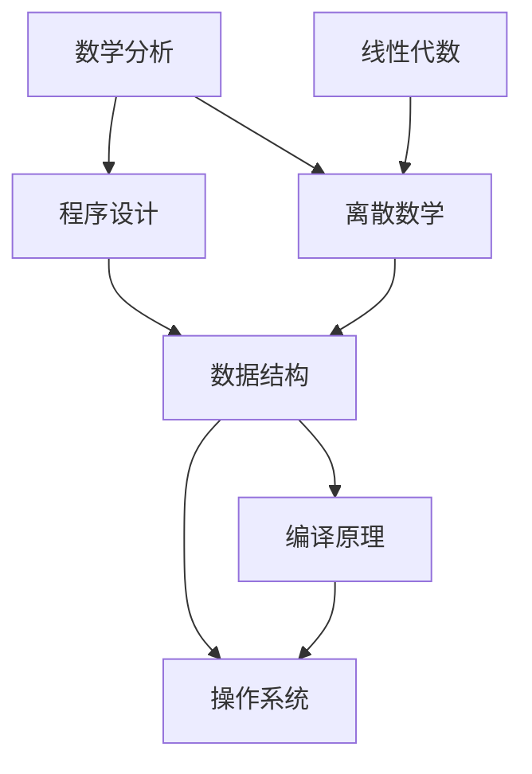

拓扑排序结果可能是：

1. 数学分析
2. 程序设计
3. 线性代数
4. 离散数学
5. 数据结构
6. 编译原理
7. 操作系统

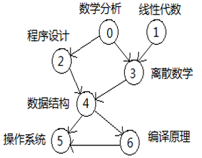

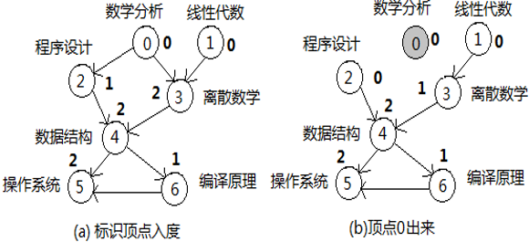

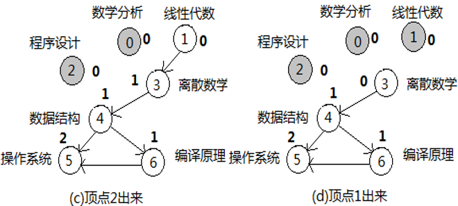

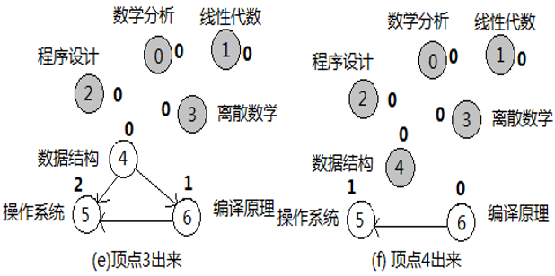

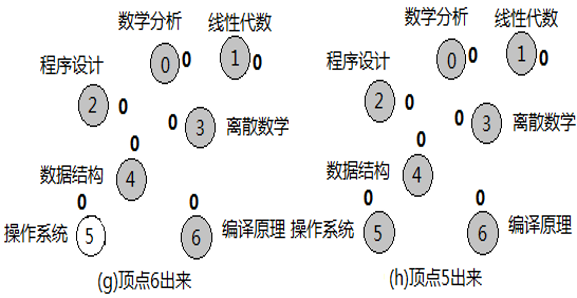

- 一个 AOV 网的拓扑序列不一定唯一。
- 利用拓扑排序算法可以判断一个有向图是否存在有环。

核心实现代码如下：

```cpp
template <class verType, class edgeType>
void Graph<verType, edgeType>::topoSort() const
{
    int *inDegree;
    seqStack<int> s;
    int i, j;

    // 创建空间并初始化计算每个顶点的入度
    // 邻接矩阵每一列元素相加，加完入度为零的压栈
    inDegree = new int[verts];
    for (j = 0; j < verts; j++) {
        inDegree[j] = 0;
        for (i = 0; i < verts; i++) {
            if ((i != j) && (edgeMatrix[i][j] != noEdge)) {
                inDegree[j]++;
            }
        }
        if (inDegree[j] == 0) s.push(j);
    }

    // 逐一处理栈中元素
    while (!s.isEmpty()) {
        i = s.top();
        s.pop();
        cout << i << " ";

        // 将i射出的边指示的邻接点入度减1
        // 将i射出的边指示的邻接点入度减1，减为0时压栈
        for (j = 0; j < verts; j++)
            if ((j != i) && (edgeMatrix[i][j] != noEdge)) {
                inDegree[j]--;
                if (inDegree[j] == 0) s.push(j);
            }
    }
    cout << endl;
}
```

完整代码请参考[拓扑排序示例程序](../src/examples/Chapter5/5-13/main.cpp)。

算法的时间代价是$O(n^2)$。如果图用邻接表来存储，时间代价为$O(n+e)$。

### 5.6.2 关键路径

一个工程通常由若干个子工程构成。
大多子工程在开始实施时既要有前期子工程完成为条件，自身也需要一定的时间来完成。
如何根据这些信息求得工程的总工期？在整个工程项目中哪些子工程是关键的子工程？所有的关键子工程必须在可以开始时马上开始，中间不得拖延工期，必须按照计划如期完成，否则将影响整个工程工期。每个不是关键子工程的工程有多少时间余量？这些问题都是工程施工前要精心计算的。
关键子工程即**关键活动**会形成一条从总体工程开始和完工之间的路径，这条路径便是**关键路径**。

求每个顶点事件的最早发生时间，即从起点到达顶点所需要的最短时间。
求每个顶点事件的最迟发生时间，即从起点到达顶点所能容忍的最长时间。
求每个活动的最早开始时间，即每个边表示的活动最早何时能开始。
求每个活动的最迟开始时间，即每个边表示的活动最晚何时必须开始。
当某活动的最早开始时间和最迟开始时间相同时，这些活动便是关键活动。

求顶点事件的最早发生时间：

如果一个顶点有若干条边射入，即说明该顶点表示的事件须当从起点到经由这些边到达该顶点的全部路径上的活动都完成才能发生，因此事件的最早发生时间是最长路径所消耗的时间。

求顶点事件的最迟发生时间：

如果一个工程终点的最早时间已知，这个最早时间就是工程需要的总的最短工期，为了达到这个工期目标，可以设定这个时间就是终点事件的最迟发生时间，然后对余下的顶点倒推回去，可以获得其余顶点事件的最迟发生时间。

- AOE 网：边表示活动的有向图
- 关键概念：
  1. 最早开始时间
  2. 最迟开始时间
  3. 时间余量
- 关键活动：时间余量为 0 的活动
- 应用：工程进度管理

## 5.7 小结

- 图是一种复杂的非线性数据结构
- 存储方式选择：
  1. 邻接矩阵：稠密图
  2. 邻接表：稀疏图
  3. 十字链表：有向图
  4. 邻接多重表：无向图
- 图的遍历是其他算法的基础
- 最小生成树算法在网络设计中应用广泛
- 最短路径算法在导航系统中重要
- AOV 网和 AOE 网在工程管理中有重要应用

## 5.8 习题

### 书本

#### 问题 1

对下图`图5-35(a)`所示的有向图

1. 指出每个顶点的出度、入度。
2. 画出邻接矩阵存储图。
3. 画出邻接表存储图。
4. 画出逆邻接表存储图。
5. 画出十字链表存储图。
6. 指出强连通分量个数并画出所有强连通分量。
7. 写出一个深度优先遍历序列和对应的生成树或者森林。
8. 写出一个广度优先遍历序列和对应的生成树或者森林。
9. 写出所有可能的拓扑排序序列。
10. 指出起点为`A`终点为`F`的工程项目图中的关键活动和关键路径。
11. 指出从顶点`A`到图中其他每个顶点的最短路径和最短路径长度。

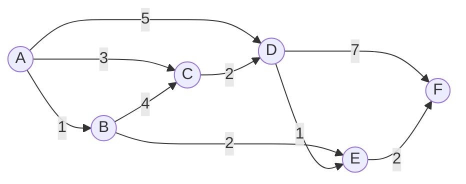

<details>
  <summary>答案</summary>

1. 见下面表格：

| 顶点符号 | 出度 | 入度 |
| -------- | ---- | ---- |
| A        | 3    | 0    |
| B        | 2    | 1    |
| C        | 1    | 2    |
| D        | 2    | 2    |
| E        | 1    | 2    |
| F        | 0    | 2    |

2.

顶点数组：

| 0   | 1   | 2   | 3   | 4   | 5   |
| --- | --- | --- | --- | --- | --- |
| A   | B   | C   | D   | E   | F   |

邻接矩阵：

| 顶点\顶点 | 0   | 1   | 2   | 3   | 4   | 5   |
| --------- | --- | --- | --- | --- | --- | --- |
| 0         | 0   | 1   | 3   | 5   | 0   | 0   |
| 1         | 0   | 0   | 4   | 0   | 2   | 0   |
| 2         | 0   | 0   | 0   | 2   | 0   | 0   |
| 3         | 0   | 0   | 0   | 0   | 1   | 7   |
| 4         | 0   | 0   | 0   | 0   | 0   | 2   |
| 5         | 0   | 0   | 0   | 0   | 0   | 0   |

6. 4 个强连通分量，分别是`{B}`,`{C}`,`{D}`,`{E}`.

7. 深度优先遍历序列：`ABEFCD`

相应的生成树：

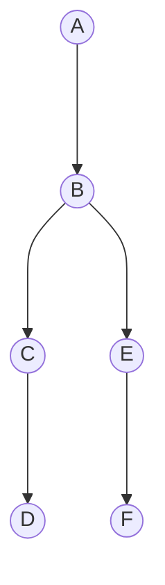

8. 广度优先遍历序列：`ABCDEF`

相应的生成树：

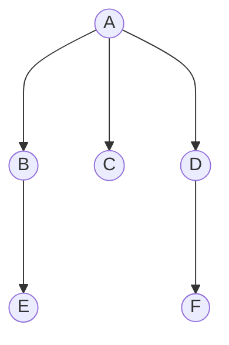

9. 所有可能的拓扑排序序列：`ABCDEF`

10. TODO
11. TODO
12. TODO
13. TODO
14. TODO
15. TODO
16. TODO

</details>

#### 问题 2

对下图`图5-35(b)`所示的无向图

1. 指出每个顶点的度。
2. 画出邻接矩阵存储图。
3. 画出邻接表存储图。
4. 画出多重邻接表存储图。
5. 指出连通分量个数并画出所有的连通分量。
6. 写出一个深度优先遍历序列和对应的生成树或者森林。
7. 写出一个广度优先遍历序列和对应的生成树或者森林。
8. 画出一个最小代价生成树。

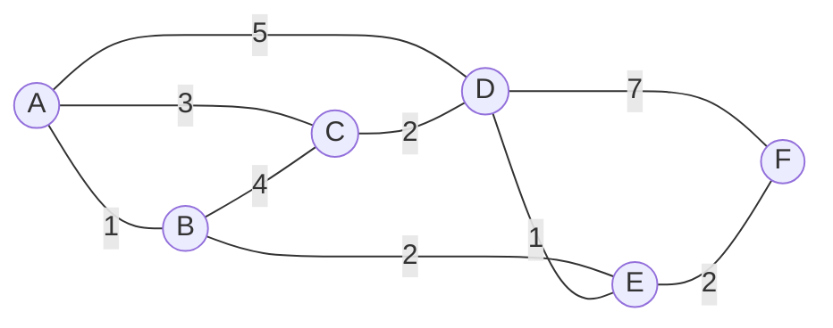

> **注意**：如果上面的图中仍然是带有箭头的，这应该是`mermaid`渲染问题。

<details>
  <summary>答案</summary>

1. 见下面表格：

| 顶点符号 | 度  |
| -------- | --- |
| A        | 3   |
| B        | 3   |
| C        | 3   |
| D        | 4   |
| E        | 3   |
| F        | 2   |

2. TODO

顶点数组：

| 0   | 1   | 2   | 3   | 4   | 5   |
| --- | --- | --- | --- | --- | --- |
| A   | B   | C   | D   | E   | F   |

邻接矩阵：

| 顶点\顶点 | 0   | 1   | 2   | 3   | 4   | 5   |
| --------- | --- | --- | --- | --- | --- | --- |
| 0         | 0   | 1   | 3   | 5   | 0   | 0   |
| 1         | 1   | 0   | 4   | 0   | 2   | 0   |
| 2         | 3   | 4   | 0   | 2   | 0   | 0   |
| 3         | 5   | 0   | 2   | 0   | 1   | 7   |
| 4         | 0   | 2   | 0   | 1   | 0   | 2   |
| 5         | 0   | 0   | 0   | 7   | 2   | 0   |

3. TODO
4. TODO
5. TODO
6. 广度优先遍历序列：`ABCDEF`

相应的生成树：


8. TODO

</details>
 
#### 问题 3

对上图`图5-35(b)`所示的无向图进行遍历，则下列选项中，不是广度优先遍历序列的是

A. `A,B,C,D,E,F`

B. `C,B,A,D,E,F`

C. `E,B,D,F,A,C`

D. `B,A,C,D,E,F`

<details>
  <summary>答案</summary>

选项(D)不是广度优先遍历序列。因为序列第一个是`B`，自然应该添加`A`,`C`,`E`这三个相邻点，也就是`B,A,C,E,D,F`

</details>

#### 问题 4

对于一个用邻接表表示的有向图，写出算法构建一个逆邻接表。

<details>
  <summary>答案</summary>

我在[邻接表](../src/examples/Chapter5/5-3/adjancency-list.cpp)的基础上添加下面这个方法：

```cpp
template <class verType, class edgeType>
Graph<verType, edgeType> Graph<verType, edgeType>::getReverseGraph() const
{
    // 创建一个新图，用于存储逆邻接表
    Graph<verType, edgeType> reverseGraph(true);  // 保证是有向图

    // 复制顶点
    for (int i = 0; i < verts; i++) {
        reverseGraph.insertVertex(verList[i].data);
    }

    // 遍历原图的邻接表，反向插入边
    for (int i = 0; i < verts; i++) {
        edgeNode<edgeType> *p = verList[i].adj;
        while (p) {
            // 在逆邻接表中添加反向边
            reverseGraph.insertEdge(verList[p->dest].data, verList[i].data, p->weight);
            p = p->link;
        }
    }

    return reverseGraph;
}
```

可以通过下面的代码测试：

```cpp
int main()
{
    Graph<char, int> g(true);  // 创建有向图

    g.insertVertex('A');
    g.insertVertex('B');
    g.insertVertex('C');
    g.insertVertex('D');

    g.insertEdge('A', 'B', 1);
    g.insertEdge('B', 'C', 1);
    g.insertEdge('C', 'D', 1);

    std::cout << "Original Graph (Adjacency List):" << std::endl;
    g.disp();

    // 构建逆邻接表
    Graph<char, int> reverseGraph = g.getReverseGraph();

    std::cout << "\nReversed Graph (Reverse Adjacency List):" << std::endl;
    reverseGraph.disp();

    return 0;
}
```

</details>

#### 问题 5

设计一个算法判断图中两点是否存在路径，其中图用邻接表的形式存储。

<details>
  <summary>答案</summary>

`DFS`根据起点和终点搜索是否存在路径，代码如下：

```cpp
template <class verType, class edgeType>
bool Graph<verType, edgeType>::hasPathDFS(int start, int end, bool *visited) const
{
    if (start == end) return true;  // 如果起点就是终点，直接返回 true

    visited[start] = true;  // 标记当前节点已访问
    edgeNode<edgeType> *p = verList[start].adj;

    while (p) {
        if (!visited[p->dest]) {
            if (hasPathDFS(p->dest, end, visited)) {
                return true;  // 如果递归中找到路径，返回 true
            }
        }
        p = p->link;  // 继续检查下一个邻接节点
    }

    return false;  // 遍历完所有邻接点，没有找到路径
}

// 外部接口函数
template <class verType, class edgeType>
bool Graph<verType, edgeType>::hasPath(verType vertex1, verType vertex2) const
{
    int start = getVertex(vertex1);
    int end = getVertex(vertex2);

    if (start == -1 || end == -1) return false;  // 顶点不存在

    bool *visited = new bool[verts]();
    bool result = hasPathDFS(start, end, visited);
    delete[] visited;

    return result;
}
```

TODO:有待补充`BFS`的实现方式。

</details>

#### 问题 6

如果有向图用邻接表表示，试写出算法判断图中是否存在回路。

<details>
  <summary>答案</summary>

Lorem Ipsum

</details>

#### 问题 7

假设无向图用邻接表表示，试写一个函数，找出每个连通分量所含的顶点集合。

<details>
  <summary>答案</summary>

这和[5.3.3 图的连通性](#533-图的连通性)中提到的判断无向图的连通性的思路很接近。同样是可以基于`BFS`或者`DFS`修改一下，每进行一次外层循环就表明我们找到了新的一个连通分量。

基于`DFS`修改的代码：

```cpp
template <class verType, class edgeType>
void Graph<verType, edgeType>::findConnectedComponents() const {
    seqStack<edgeNode<edgeType>> s;  // 栈中存储边节点
    edgeNode<edgeType>* p;
    bool* visited;
    int i, componentCount = 0;

    // 为 visited 创建动态数组空间，并设置初始访问标志为 false。
    visited = new bool[verts];
    if (!visited) throw illegalSize();
    for (i = 0; i < verts; i++) visited[i] = false;

    // 遍历所有顶点，找出所有未被访问的连通分量
    for (i = 0; i < verts; i++) {
        if (visited[i]) continue;

        // 每发现一个未访问的顶点，开始新的连通分量
        componentCount++;
        std::cout << "Component " << componentCount << ": ";

        visited[i] = true;
        std::cout << verList[i].data << " ";

        if (verList[i].adj) s.push(verList[i].adj);

        while (!s.isEmpty()) {
            p = s.top();
            s.pop();
            if (p->link) s.push(p->link);

            if (!visited[p->dest]) {
                visited[p->dest] = true;
                std::cout << verList[p->dest].data << " ";
                if (verList[p->dest].adj) s.push(verList[p->dest].adj);
            }
        }

        std::cout << std::endl; // 每个连通分量输出完成后换行
    }

    delete[] visited; // 释放动态内存
}
```

或者基于`BFS`修改的代码：

```cpp
template <class verType, class edgeType>
void Graph<verType, edgeType>::findConnectedComponents() const {
    datastructures::SeqQueue<int> q; // 队列存储顶点索引
    edgeNode<edgeType>* p;
    bool* visited;
    int i, start, componentCount = 0;

    // 为 visited 创建动态数组空间，并设置初始访问标志为 false
    visited = new bool[verts];
    if (!visited) throw illegalSize();
    for (i = 0; i < verts; i++) visited[i] = false;

    // 遍历所有顶点，找出所有未被访问的连通分量
    for (i = 0; i < verts; i++) {
        if (visited[i]) continue;

        // 每发现一个未访问的顶点，开始新的连通分量
        componentCount++;
        std::cout << "Component " << componentCount << ": ";

        q.enQueue(i);
        visited[i] = true;
        std::cout << verList[i].data << " ";

        while (!q.isEmpty()) {
            start = q.front();
            q.deQueue();

            p = verList[start].adj;
            while (p) {
                if (!visited[p->dest]) {
                    visited[p->dest] = true;
                    std::cout << verList[p->dest].data << " ";
                    q.enQueue(p->dest);
                }
                p = p->link;
            }
        }

        std::cout << std::endl; // 每个连通分量输出完成后换行
    }

    delete[] visited; // 释放动态内存
}
```

</details>

#### 问题 8

假设有向图用邻接矩阵表示，试写一个函数找出每个强连通分量所含的顶点集合。

<details>
  <summary>答案</summary>

`Kosaraju`算法。

TODO：添加具体实现代码。

</details>

#### 问题 9

设有向图$G=<V,E>$，顶点集$V=\{v_0,v_1,v_2,v_3\}$，边集$E=\{<v_0,v_1>,<v_0,v_2>,<v_0,v_3>,<v_1,v_3>,\}$。若从顶点$v_0$开始对图进行深度优先遍历，则可能得到的不同遍历序列个数是多少？

<details>
  <summary>答案</summary>

题干中的图如下：

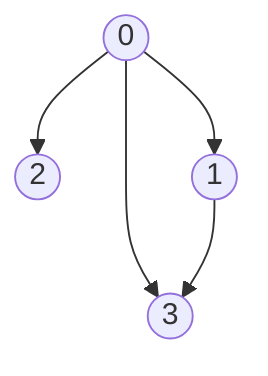

因此可能的序列有：`0132`, `0312`, `0321`, `0213`, `0231`这五种。

</details>

#### 问题 10

假设图用邻接矩阵存储，实现深度优先和广度优先遍历算法，并分析其时间复杂度。

<details>
  <summary>答案</summary>

```cpp
#include <queue>

template <class verType, class edgeType>
void Graph<verType, edgeType>::BFS() const {
    bool* visited = new bool[verts]; // 访问标记数组
    if (!visited) throw outOfBound();
    for (int i = 0; i < verts; i++) visited[i] = false; // 初始化

    int componentCount = 0; // 连通分量计数器
    std::queue<int> q; // 队列用于 BFS

    for (int i = 0; i < verts; i++) {
        if (!visited[i]) {
            componentCount++;
            std::cout << "Component " << componentCount << ": ";

            q.push(i); // 将当前顶点加入队列
            visited[i] = true;

            while (!q.empty()) {
                int v = q.front();
                q.pop();
                std::cout << verList[v] << " ";

                // 遍历所有邻接点
                for (int j = 0; j < verts; j++) {
                    if (edgeMatrix[v][j] != noEdge && !visited[j]) {
                        visited[j] = true;
                        q.push(j); // 将未访问的邻接点加入队列
                    }
                }
            }

            std::cout << std::endl;
        }
    }

    delete[] visited;
}
```

```cpp
template <class verType, class edgeType>
void Graph<verType, edgeType>::DFS() const {
    bool* visited = new bool[verts]; // 访问标记数组
    if (!visited) throw outOfBound();
    for (int i = 0; i < verts; i++) visited[i] = false; // 初始化

    int componentCount = 0; // 连通分量计数器

    for (int i = 0; i < verts; i++) {
        if (!visited[i]) {
            componentCount++;
            std::cout << "Component " << componentCount << ": ";
            DFSUtil(i, visited);
            std::cout << std::endl;
        }
    }

    delete[] visited;
}

// 辅助函数：递归深度优先遍历
template <class verType, class edgeType>
void Graph<verType, edgeType>::DFSUtil(int v, bool* visited) const {
    visited[v] = true; // 标记当前顶点为已访问
    std::cout << verList[v] << " "; // 输出当前顶点

    // 遍历所有邻接点
    for (int i = 0; i < verts; i++) {
        if (edgeMatrix[v][i] != noEdge && !visited[i]) {
            DFSUtil(i, visited); // 递归访问邻接顶点
        }
    }
}
```

</details>

#### 问题 11

对于下图`图5-36`所示的有向图，给出其一条拓扑排序序列。

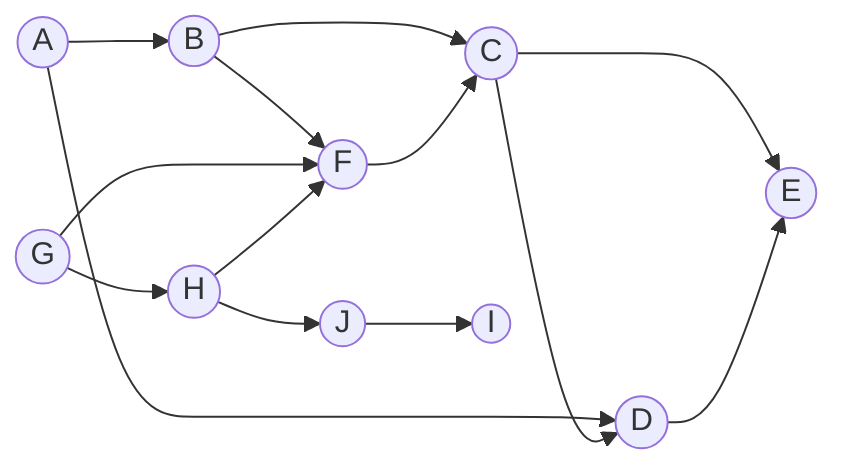

<details>
  <summary>答案</summary>

`ABGHJIFCDE`，答案不唯一。

</details>

#### 问题 12

编程实现利用克鲁斯卡尔算法找出无向连通图的最小代价生成树，要求输出最小代价生成树的各条边及最小代价。

<details>
  <summary>答案</summary>

Lorem Ipsum

</details>

#### 问题 13

设计一个算法找出一个无向图的最大代价生成树。

<details>
  <summary>答案</summary>

Lorem Ipsum

</details>

#### 问题 14

假设一个 AOE 网用邻接表存储，编程实现函数求单源最短路径。

<details>
  <summary>答案</summary>

Lorem Ipsum

</details>

#### 问题 15

假设一个 AOE 网用邻接表存储，编程实现函数求关键路径。

<details>
  <summary>答案</summary>

Lorem Ipsum

</details>

#### 问题 16 `**`

设计算法，找出所有从指定顶点出发，长度为$K$的简单路径，并以邻接表为例，实现该算法。

<details>
  <summary>答案</summary>

Lorem Ipsum

</details>

### PPT

### ACM-OJ
