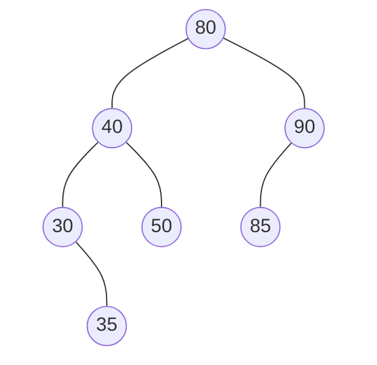
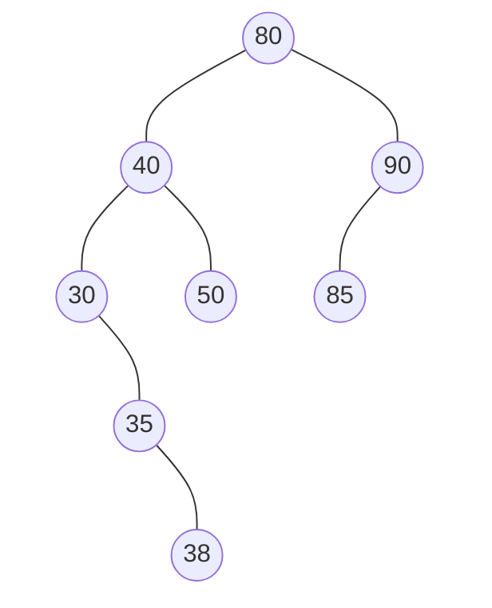
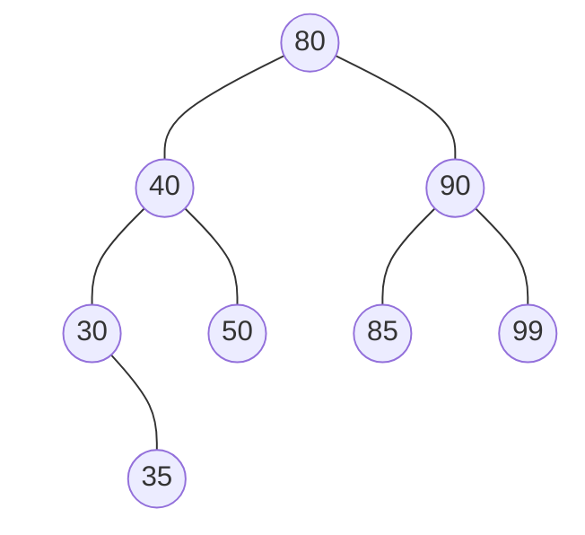
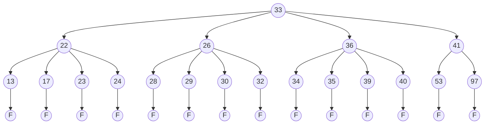

# 第 6 章 查找

下面这些概念我参考《大话数据结构》整理，书本上并没有这些内容。实际上这些概念非常直观，简单了解即可。

查找表 Search Table 是由同一类型的数据元素（或记录）构成的集合。

关键字 Key 数据元素中某个数据项的值

- 主关键字：可以唯一的标志一个记录的关键字
- 次关键字

TODO: 可以添加 manim 动画在一个模拟的表格中分别标记以上概念到底指的是哪些东西。

- [第 6 章 查找](#第-6-章-查找)
  - [6.1 静态查找技术](#61-静态查找技术)
    - [6.1.1 顺序查找](#611-顺序查找)
    - [6.1.2 折半查找](#612-折半查找)
    - [6.1.3 插值查找](#613-插值查找)
    - [6.1.4 分块查找](#614-分块查找)
  - [6.2 二叉查找树](#62-二叉查找树)
    - [6.2.1 二叉查找树的定义](#621-二叉查找树的定义)
    - [6.2.2 基本操作实现](#622-基本操作实现)
    - [6.2.3 顺序统计](#623-顺序统计)
  - [6.3 平衡二叉查找树](#63-平衡二叉查找树)
    - [6.3.0 查找操作](#630-查找操作)
    - [6.3.1 插入操作](#631-插入操作)
      - [LL](#ll)
      - [RR](#rr)
      - [LR](#lr)
      - [RL](#rl)
    - [6.3.2 删除操作](#632-删除操作)
    - [6.3.3 最大高度](#633-最大高度)
  - [6.4 红黑树](#64-红黑树)
    - [6.4.1 插入操作](#641-插入操作)
    - [6.4.2 删除操作](#642-删除操作)
  - [6.5 B 树和 B+树](#65-b-树和-b树)
    - [6.5.1 B 树](#651-b-树)
    - [6.5.2 B 树的查找](#652-b-树的查找)
    - [6.5.3 B 树的插入](#653-b-树的插入)
    - [6.5.4 B 树的删除](#654-b-树的删除)
    - [6.5.5 B+树](#655-b树)
  - [6.6 哈希方法](#66-哈希方法)
    - [6.6.1 常用的哈希函数](#661-常用的哈希函数)
    - [6.6.2 线性探测法](#662-线性探测法)
    - [6.6.3 二次探测法](#663-二次探测法)
    - [6.6.4 链地址法](#664-链地址法)
  - [6.7 小结](#67-小结)
  - [6.8 习题](#68-习题)
    - [书本](#书本)
      - [问题 1](#问题-1)
      - [问题 2](#问题-2)
      - [问题 3](#问题-3)
      - [问题 4](#问题-4)
      - [问题 5](#问题-5)
      - [问题 6](#问题-6)
      - [问题 7](#问题-7)
      - [问题 8](#问题-8)
      - [问题 9](#问题-9)
      - [问题 10](#问题-10)
      - [问题 11](#问题-11)
      - [问题 12](#问题-12)
      - [问题 13](#问题-13)
      - [问题 14 `*`](#问题-14-)
      - [问题 15](#问题-15)
      - [问题 16 `*`](#问题-16-)
      - [问题 17](#问题-17)
      - [问题 18](#问题-18)
      - [问题 19](#问题-19)
      - [问题 20](#问题-20)
      - [问题 21 `**`](#问题-21-)
      - [问题 22 `**`](#问题-22-)
      - [问题 23](#问题-23)
      - [问题 24](#问题-24)
      - [问题 25](#问题-25)
    - [PPT](#ppt)
    - [ACM-OJ](#acm-oj)
      - [11051](#11051)
      - [2218](#2218)

## 6.1 静态查找技术

静态查找表 Static Search Table：只作查找操作的查找表。主要操作：

- 查询某个"特定的"数据元素是否在查找表中
- 检索某个"特定的"数据元素和各种属性

相应的动态查找表 Dynamic Search Table：在查找过程中同时插入查找表中不存在的数据元素，或者从查找表中删除已经存在的某个数据元素。主要操作：

- 查找时插入数据元素
- 查找时删除数据元素

我们一般采用顺序存储结构存储静态查找表，而对于动态查找表使用链式存储结构。

### 6.1.1 顺序查找

顺序查找的思路很简单，要么从头/尾，向后或者向前一个方向逐一比较。这个思路在我们实现顺序存储结构的线性表就使用到了，可以看 SeqList.h 文件的具体实现。

TODO： 下面的表述有待体哦凹征。
当时我们还用到了"哨兵位"的小技巧，从数组尾部向头部查找，将弟 0 位设置为待查找的元素也就是哨兵。

TODO：顺序查找的 manim 动画

顺序查找的时间复杂度是 O(n)。

顺序查找不要求元素有序，但是接下来的折半查找等等方法都要求元素有序。

### 6.1.2 折半查找

又称为二分查找 Binary Search。

TODO：补充文字解释和 manim 动画

折半查找的时间复杂度是 O(log2n)。

### 6.1.3 插值查找

插值查找是对折半查找的改进。举个例子，当我们查英文词典的时候，字典是有序的，如果我们想要查 abandon，或者 zoo 我们并不都是从最中间开始翻词典的。

TODO: 下面的公式修改成 latex
折半查找的核心公式是 `mid = (low+high)/2 = low + 1/2 * (high- low)`

而插值查找就是对`1/2`改进：
`mid = low + (key-a[low])/(a[high] - a[low]) * (high-low)`

### 6.1.4 分块查找

- 基本思想：将查找表分成若干块，块内无序，块间有序
- 索引表：存储每块的最大关键字和起始地址
- 查找过程：
  1. 在索引表中确定待查记录所在块
  2. 在块内顺序查找
- 时间复杂度：O(√n)
- 适用场景：介于顺序查找和折半查找之间的查找方法

## 6.2 二叉查找树

### 6.2.1 二叉查找树的定义

- 定义：左子树所有节点值小于根节点，右子树所有节点值大于根节点
- 特点：中序遍历得到有序序列
- 查找效率：与树的平衡性有关，最好 O(logn)，最坏 O(n)

### 6.2.2 基本操作实现

- 查找：比较节点值，小则左子树，大则右子树
- 插入：找到合适位置插入叶节点
- 删除：
  1. 叶节点：直接删除
  2. 单子树：子树替代
  3. 双子树：找后继节点替代

### 6.2.3 顺序统计

- 定义：查找第 k 小的元素
- 实现方法：
  1. 中序遍历到第 k 个元素
  2. 在节点中维护子树大小信息
- 时间复杂度：O(h)，h 为树高

## 6.3 平衡二叉查找树

结点的平衡因子：一个结点的平衡因子等于其左子树的高度减去其右子树的高度。

如果一棵二叉树中所有结点的平衡因子的绝对值不超过 1，即为-1，0，1 这三种情况，这棵二叉树就称为平衡二叉树。

平衡二叉树的目标是限制二叉树的高度.

平衡二叉查找树并不能直接和树高最矮划等号，但平衡二叉查找树已经接近于最矮了。

这里补充三张 mermaid 图片：

1. 非平衡二叉树
2. 平衡二叉树但非最矮
3. 最矮但非平衡二叉树

```cpp
template <class elemType>
class AVL_Tree;

template <class elemType>
class Node
{
    friend class AVL_Tree<elemType>;

   private:
    elemType data;
    Node *left, *right;
    int factor;

   public:
    Node()
    {
        left = NULL;
        right = NULL;
        factor = 0;
    }
    Node(const elemType &x, Node *l = NULL, Node *r = NULL, int f = 0)
    {
        data = x;
        left = l;
        right = r;
        factor = f;
    }
};

template <class elemType>
class AVL_Tree
{
   private:
    Node<elemType> *root;

   public:
    binarySearchTree() { root = NULL; }
    bool search(const elemType &x) const;
    void insert(const elemType &x);
    void remove(const elemType &x);
    ~binarySearchTree()
}
```

### 6.3.0 查找操作

AVL 树的查找操作和普通的查找树一模一样。

### 6.3.1 插入操作

- 基本步骤：
  1. 按 BST 规则插入
  2. 自底向上检查平衡因子
  3. 旋转操作恢复平衡
- 四种旋转：
  1. LL：右旋
  2. RR：左旋
  3. LR：左右旋
  4. RL：右左旋

当元素插入到 AVL 树中时，就可能打破原有的平衡。
新结点插入，会引起哪些结点的平衡因子发生变化？

新插入结点的平衡因子为 0，一路自下而上往祖先结点传导。
如果传导来自于左子树，说明左子树高度增加了 1，父结点平衡因子加 1；
如果传导来自于右子树，说明右子树高度增加了 1，父结点平衡因子减 1。

父结点平衡因子变化后，如果结果变为 0，说明原本的左右子树一边高、一边低，现在低的长高了，变得和高的一样了，以父结点为根的子树高度没有变化，自下而上的传导行为停止，祖父包括更上层祖先结点的平衡因子保持不变；
父结点平衡因子变化后，如果结果变为非 0，依然按照传导来自左子树加 1、右子树减 1 的原则向祖父结点传导，直到某一层祖先结点的平衡因子变为 0、+2 或者-2、或者到达根结点。

TODO：下面的 mermaid 图片需要想办法添加每个结点的平衡因子



插入结点 38:



或者插入结点 99 后：



冲突结点：

二叉查找树中一旦有一个结点的平衡因子不在-1，0，1 的范围内，二叉树就不再平衡。在向上的传导过程中，平衡因子第一个超过-1，0，1 范围的结点称为冲突结点。
一旦发现冲突结点，暂停沿祖先向上的传导，先对二叉树在冲突结点附近实施调整，直到它变得平衡。

下面就开始按照冲突结点的类型分别讨论该如何解决。

冲突结点和来自插入方向的子结点、孙子结点关系分 4 种类型
（LL、RR、LR、RL 型）

#### LL

上臂右旋

TODO：添加 mermaid 演示

#### RR

上臂左旋

TODO：添加 mermaid 演示

#### LR

TODO：添加 mermaid 演示

LR 型比 LL、RR 型的情况要复杂些，根据 C 的平衡因子分，
LR 有三种形态：LR0、LR+1、LR-1。
LR0：

双旋调整：一次下臂左旋，变 LL 型，一次上臂右旋，

LR+1：

双旋调整：一次下臂的左旋，变 LL 型，一次上臂的右旋，

LR-1：

双旋调整：旋转方法如 LR+1，但调整好后结点 A 平衡因子不同。

总结：
LR0、LR+1、LR-1 处理方法相同之处：
做一次双旋，先下臂左旋，变 LL 型，再上臂右旋。

不同之处在于双旋之后，局部根的左、右子结点平衡因子不同：
LR0： 左、右子平衡因子均为 0
LR+1： 左、右子平衡因子分别为 0、-1
LR-1： 左、右子平衡因子分别为 1、0

#### RL

TODO：添加 mermaid 演示

RL 型和 LR 型类似，也有三种形态：RL0、RL+1、RL-1。

RL0、RL+1、RL-1 处理相同之处：
做一次双旋，先下臂右旋，变 RR 型，再上臂左旋。

不同之处在于双旋之后，局部根的左、右子结点平衡因子不同：
RL0： 左、右子平衡因子分别为 0、0
RL+1： 左、右子平衡因子分别为 0、-1
RL-1： 左、右子平衡因子分别为 1、0

另外一种方法：
每个结点不存平衡因子，而是存储以它为根的二叉树的高度。

存储高度的好处：
因为根结点的高度值可由左、右子的高度值直接导出。
以上 LR 和 RL 型中，C 平衡因子为+1、-1 型不同，但其高度都是一样的。
一个结点的平衡性即是否危机结点，由其左、右子高度值的差临时判断。
利于递归，算法逻辑更为简单。

于是 AVL 树的代码定义可以调整成：

```cpp
template <class elemType>
class Node
{
    friend class AVL_Tree<elemType>;

   private:
    elemType data;
    Node *left, *right;
    int height;

   public:
    Node()
    {
        left = NULL;
        right = NULL;
        height = 1;
    }
    Node(const elemType &x, Node *l = NULL, Node *r = NULL, int h = 1)
    {
        data = x;
        left = l;
        right = r;
        height = h;
    }
};
```

从高度角度看 AVL 树中冲突结点各种情况的调整方法：

LL 型： 做一次上臂右旋前后，各点高度变化

RR 型： 做一次上臂左旋前后，，各点高度变化

LR+1 型： 做一次下臂左旋，再做一次上臂右旋即转为 LL 型
LR-1 型： 做一次下臂左旋，再做一次上臂右旋即转为 LL 型

LR+1，LR-1 调整过后：C、A、B 的高度均为 h+1、h、h

RL 型和 LR 型类似，也有三种形态。且三种形态：

相同之处：做一次双旋，先下臂右旋，变 RR 型，再上臂左旋。且调整过后：RL+1、RL-1 中 C、A、B 均为 h+1、h、h

下面是书本上的代码，我补充了一些中文注释：

```cpp
TODO: 补充AVL树的插入实现代码
```

TODO：算法实现的讨论：
一次调整过后，向上影响的传导结束，为什么还要向上继续计算各祖先结点高度，如何改进？

### 6.3.2 删除操作

- 基本步骤：
  1. 按 BST 规则删除
  2. 自底向上检查平衡因子
  3. 必要时旋转恢复平衡
- 删除后平衡处理与插入类似

### 6.3.3 最大高度

- 平衡因子：左右子树高度差不超过 1
- 最小节点数：F(h) = F(h-1) + F(h-2) + 1
- 最大高度：约为 1.44log₂(n+1)

## 6.4 红黑树

### 6.4.1 插入操作

- 插入规则：
  1. 新节点着红色
  2. 自底向上调整
  3. 保持 5 条性质
- 调整情况：
  1. 叔节点红色：变色
  2. 叔节点黑色：旋转+变色

### 6.4.2 删除操作

- 删除规则：
  1. 找替代节点
  2. 调整双黑节点
  3. 保持 5 条性质
- 调整情况：
  1. 兄弟红色
  2. 兄弟黑色，子节点黑色
  3. 兄弟黑色，至少一子红色

## 6.5 B 树和 B+树

### 6.5.1 B 树

- 定义：m 阶 B 树的性质
  1. 根至少 2 个子女
  2. 非根内部节点至少⌈m/2⌉个子女
  3. 所有叶节点在同一层

### 6.5.2 B 树的查找

- 过程：
  1. 在节点内查找
  2. 确定子树区间
  3. 递归向下
- 时间复杂度：O(logₘn)

### 6.5.3 B 树的插入

- 基本步骤：
  1. 查找插入位置
  2. 插入关键字
  3. 节点分裂（如需要）
- 特点：自底向上生长

### 6.5.4 B 树的删除

- 基本步骤：
  1. 查找删除位置
  2. 删除关键字
  3. 调整节点（借或并）
- 特点：保持最小度数要求

### 6.5.5 B+树

- 特点：
  1. 叶节点包含所有关键字
  2. 叶节点链表相连
  3. 非叶节点仅索引
- 优势：
  1. 范围查询效率高
  2. 查找更稳定

## 6.6 哈希方法

### 6.6.1 常用的哈希函数

- 直接定址法：H(key) = a\*key + b
- 除留余数法：H(key) = key mod p
- 数字分析法：选取关键字特定位
- 平方取中法：平方后取中间位
- 折叠法：关键字分组求和

### 6.6.2 线性探测法

- 原理：H(key,i) = (H(key) + i) mod m
- 特点：
  1. 容易产生聚集
  2. 删除需要标记
- 时间复杂度：依赖装填因子

### 6.6.3 二次探测法

- 原理：H(key,i) = (H(key) + i²) mod m
- 特点：
  1. 减少聚集
  2. 不能探测所有位置
- 时间复杂度：优于线性探测

### 6.6.4 链地址法

- 原理：同义词用链表存储
- 特点：
  1. 不会产生聚集
  2. 空间效率高
  3. 删除简单
- 时间复杂度：O(1+α)，α 为装填因子

## 6.7 小结

- 查找是在一组具有松散关系的元素集合中进行的。
- 在很少进行插入、删除的一组数据中进行的查找称为静态查找。静态查找的数据集合最简单的存储方法是采用顺序存储。数据元素顺序存储时，如果元素无序，可采用顺序查找，时间复杂度达到 O(n)；如果元素有序，可采用折半查找，时间复杂度达到 O(log_2⁡𝑛)。
- 在频繁进行插入、删除的一组数据中进行的查找称为动态查找。动态查找合适的存储方式是二叉查找树。二叉查找树在平衡的情况下，查找时间将达 O(log_2⁡𝑛)，和有序表的折半查找时间消耗一样。红黑树是比平衡树条件更宽松的二叉查找树，平衡树中的每个结点，其向下的各条分支高度差不超过 1；红黑树中的每个结点，其向下的各条分支高度差最多为一倍。
- 对于数据量很大，数据只能存储在外存储器上的情况，可以利用多线索树：B 树、B+树，为原始数据文件建立索引文件。
- B 树上所有的关键字都在，都分布在非叶子结点中，每个关键字在所有结点中只出现一次。每个关键字对应的原始数据记录地址附着在关键字后。叶子结点为空结点。
- B+树仅其中一些关键字分别分布在非叶子结点中，很多关键字在所有结点中不只出现一次。所有含关键字的原始数据记录都分布在各个叶子结点中。相比而言，B+树索引层比 B 树规模小，且支持按照关键字大小从小到大顺序遍历。故 B+树在建立索引文件时更加常用。
- 以上方法都是基于关键字的比较，致力于怎样减少关键字的比较次数。哈希方法试图完全摆脱关键字的比较，希望通过一个函数将关键字直接映射到哈希表中的某个地址上去。
- 常见的哈希函数有将关键字进行简单线性变换获得地址的直接寻址法、有分析并抽取数据中某些位的数据分析法、有将数据自身变化如平方后再进行取某些中间位的平方取中法、有将长关键字序列进行折叠相加后再分析处理的折叠法。
- 理想的哈希函数是将不同的关键字映射到不同的地址上，但综合考虑到哈希表的负载因子，这样的函数比较难找，通常找到的哈希函数都会造成一定程度的冲突。常见的冲突解决办法有线性探测法、二次探测法和链地址法。

## 6.8 习题

### 书本

#### 问题 1

已知一个有序序列为 15、23、45、50、80、88、93、100，分别写出用二分法直找 23、
66 的过程中都比较过哪些元素。

<details>
  <summary>答案</summary>

</details>

#### 问题 2

下列选项中，不能构成折半查找中关键字比较序列的是：
A. 500, 200, 450, 180
B. 500, 450, 200, 180
C. 180, 500, 200, 450
D. 180, 200, 500, 450

<details>
  <summary>答案</summary>

</details>

#### 问题 3

设包含 4 个数据元素的集合 S=｛"do"，"for"，" repeat”，"while"｝，各元素的查找概率依次为：p1=0.35,p2=0.15,p3=0.15，P4=0.35。将 S 保存在一个长度为 4 的顺序表中，采用折半查找法，查找成功时的平均查找长度为 2.2。请回答：
（1）若采用顺序存储结构保存 S，且要求平均查找长度更短，则元素应如何排列？应使用何种查找方法？查找成功时的平均查找长度是多少？
（2） 若采用链式存储结构保存 S，且要求平均查找长度更短，则元素应如何排列？应使用何
种查找方法？查找成功时的平均查找长度是多少？

<details>
  <summary>答案</summary>

</details>

#### 问题 4

按照 15、80、100、88、23、45、93、50、20、10 的插入顺序画出建好的二叉查找树，再画出删除结点 80 后的二叉查找树。

<details>
  <summary>答案</summary>

</details>

#### 问题 5

在任意一棵非空二叉查找树$T_1$，中，删除某结点$v$后形成二叉查找树$T_2$; 再将$v$插入$T_2$形成二叉查找树$T_3$。下列关于$T_1$与$T_3$的叙述中，正确的是：

1. 若$v$是$T_1$的叶结点，则$T_1$与$T_3$不同
2. 若$v$是$T_1$的叶结点，则$T_1$与$T_3$相同
3. 若$v$不是$T_1$的叶结点，则$T_1$与$T_3$不同
4. 若$v$不是$T_1$的叶结点，则$T_1$与$T_3$相同

A. 仅 1、2
B. 仅 1、4
C. 仅 2、3
D. 仅 2、4

<details>
  <summary>答案</summary>

</details>

#### 问题 6

分别给出在题 4 得到的二又查找树中查找 45 和 44 的查找路径（即比较过哪些元素）。

<details>
  <summary>答案</summary>

</details>

#### 问题 7

按照 15、80、100、88、23、45、93、50、20、10 的 入顺序面出建好的 AVL 树，再画
出删除结点 45 后的 AVL 树。

<details>
  <summary>答案</summary>

</details>

#### 问题 8

将关键字序列｛8,10,13.3.6,7｝依序插入一棵初始为空的 AVL 树，请逐一画出各结点插入后的结果。

<details>
  <summary>答案</summary>

</details>

#### 问题 9

现有一棵无重复关键字的平衡二叉树（AVL 树），对其进行中序遍历可得到一个降序序列。下列关于该平衡二叉树的叙述中，正确的是：
A. 根节点的度一定为 2
B. 树中最小元素一定是叶节点
C. 最后插入的元素一定是叶结点
D. 树中最大元素一定无左子树

<details>
  <summary>答案</summary>

</details>

#### 问题 10

若将关键字 1，2，3，4,5，6，7 依次插入到初始为空的平衡二叉树 T 中，则 T 中平衡因子为 0 的分支结点的个数是多少？

<details>
  <summary>答案</summary>

</details>

#### 问题 11

按照 15、80、100、88、23、45、93、50、20、10 的插入顺序画出建好的红黑树，再画出删除结点 80 后的红黑树。

<details>
  <summary>答案</summary>

</details>

#### 问题 12

已知一组元素分别具有关键字 15、80、100、88、23、45、93、50、20、10、28、44、99、21、66，试按照这个顺序依次插入建立一棵 5 阶的 B 树，再画出删除 23 后的 B 树。

<details>
  <summary>答案</summary>

</details>

#### 问题 13

在一棵二叉查找树中，如何用$\log_{2}n$的时间分别找到最大和最小结点？

<details>
  <summary>答案</summary>

</details>

#### 问题 14 `*`

一棵 m 阶 n 层的 B 树最多有多少个结点？最少有多少个结点？

<details>
  <summary>答案</summary>

</details>

#### 问题 15

在一棵高度为 2 的 5 阶 B 树中，所含关键字的个数最少是:
A. 5
B. 7
C. 8
D. 14

<details>
  <summary>答案</summary>

</details>

#### 问题 16 `*`

n 个结点组成的一棵 B 树最多有多高？最矮有多矮？

<details>
  <summary>答案</summary>

</details>

#### 问题 17

画出对图 6-77 所示的 5 阶 B 树删除 40 后的 B 树。



<details>
  <summary>答案</summary>

</details>

#### 问题 18

已知一个文件中有 2560000 个记录，每个记录有 128 个字节，记录关键字为 24 个字节，数据块号为 4 个字节。试问如果构成 B+树，M 和 L 分别是多少，B+树最多和最少需要多少层？

<details>
  <summary>答案</summary>

</details>

#### 问题 19

在图 6-74 所示的 B+树中插入元素 10，试问将有几次磁盘读？几次磁盘写？

<details>
  <summary>答案</summary>

</details>

#### 问题 20

编写一个程序实现二叉查找树的判定。

<details>
  <summary>答案</summary>

</details>

#### 问题 21 `**`

编写一个程序在二叉查找树中找到第 i 大的元素。

<details>
  <summary>答案</summary>

</details>

#### 问题 22 `**`

编写一个程序在一棵二叉查找树中删除所有大于一个给定值的元素。

<details>
  <summary>答案</summary>

</details>

#### 问题 23

用哈希函数$H(key)=key\bmod 17$ 将具有关键字 15、80、100、88、23、45、93、50、20、10、28、44、99、21、66 的一组元素映射到长度为 17 的哈希表中，冲突时采用线性探测再散列的方法，试画出这组元素在哈希表中的存储情况。

<details>
  <summary>答案</summary>

</details>

#### 问题 24

假设线性表采用顺序存储结构，试实现函数 `int DelRepeat()`，用以删除所有重复元素，并返回被删除元素的个数。假设元素个数不超过 1000 个，要求算法的时间复杂度为$O(n)$。线性表的定义如下：

```cpp
template <class elemType>
class seqList:
{
  private:
    elemType *data;
    int currentLength;
  public:
    int DelRepeat(); // 删除所有重复的元素
}
```

<details>
  <summary>答案</summary>

</details>

#### 问题 25

B+树不同于 B 树的特点之一是
A. 能支持顺序查找
B. 结点中含有关键字
C. 根结点至少有两个分支
D. 所有叶结点都在同一层上

<details>
  <summary>答案</summary>

</details>

### PPT

### ACM-OJ

#### 11051

TLE 方法：

```cpp
#include <iostream>

#include "LinkList.h"

int main()
{
    int n, m, t;
    std::cin >> n;
    datastructures::LinkList<int> list;
    for (int i = 0; i < n; i++) {
        std::cin >> t;
        list.insert(i, t);
    }

    int step_cnt = 0;
    std::cin >> m;
    for (int i = 0; i < m; i++) {
        std::cin >> t;
        for (int j = 0; j < list.length(); j++) {
            step_cnt++;
            int elem = list.get(j);
            if (elem == t) {
                // 把找到的指定节点移动到链表的第一个位置
                // 删除，然后在最一开始添加
                int tmp;
                list.remove(j, tmp);
                list.insert(0, tmp);
                break;
            }
        }
        // std::cout << "Finding " << t << " costs " << step_cnt << " steps." << std::endl;
    }

    std::cout << step_cnt << std::endl;
    return 0;
}
```

#### 2218

这里需要利用一个性质，对于一个二叉搜索树，中序遍历的结果就是递增的顺序。产生递增的序列后，我们只需要遍历一次两两作差找最小值就可以了。
