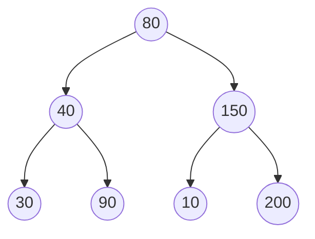
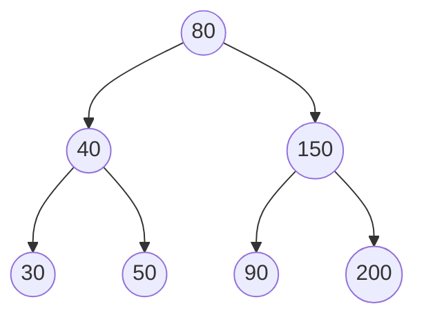
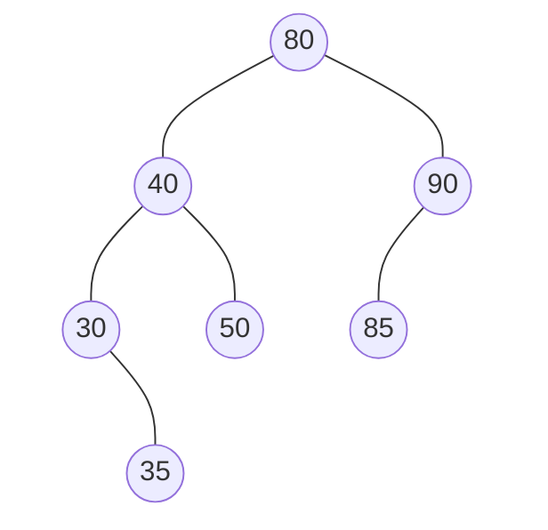
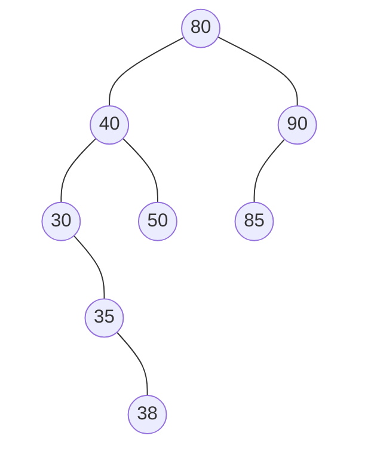
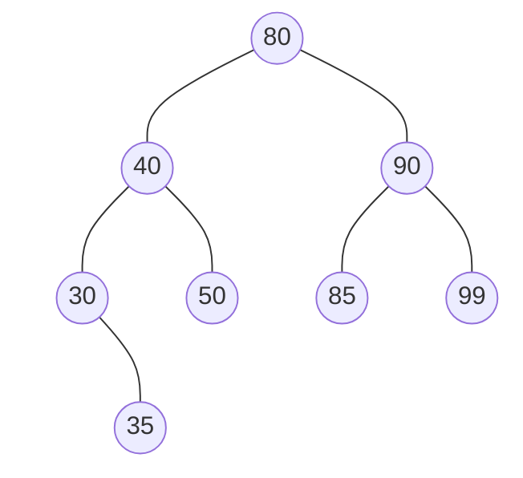
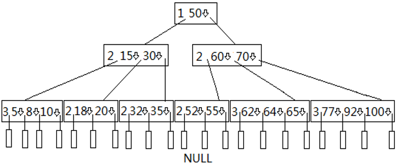
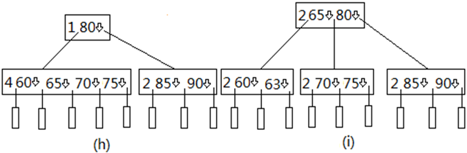
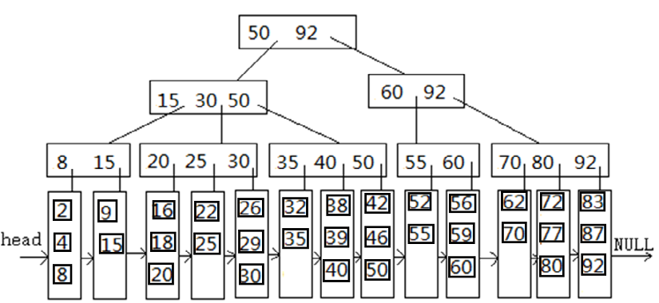
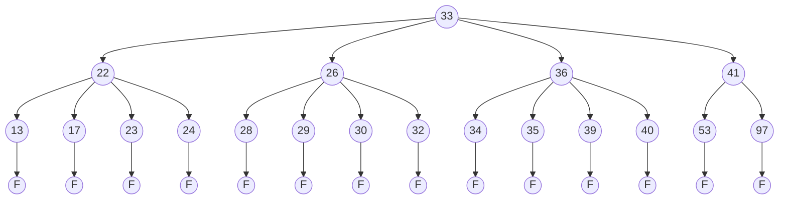

# 第 6 章 查找

下面这些概念我参考《大话数据结构》整理，书本上并没有这些内容。实际上这些概念非常直观，简单了解即可。

查找表 Search Table 是由同一类型的数据元素（或记录）构成的集合。

关键字 Key 数据元素中某个数据项的值

- 主关键字：可以唯一的标志一个记录的关键字
- 次关键字

TODO: 可以添加 manim 动画在一个模拟的表格中分别标记以上概念到底指的是哪些东西。

- [第 6 章 查找](#第-6-章-查找)
  - [6.1 静态查找技术](#61-静态查找技术)
    - [6.1.1 顺序查找](#611-顺序查找)
    - [6.1.2 折半查找](#612-折半查找)
    - [6.1.3 插值查找](#613-插值查找)
    - [6.1.4 分块查找](#614-分块查找)
  - [6.2 二叉查找树](#62-二叉查找树)
    - [6.2.1 二叉查找树的定义](#621-二叉查找树的定义)
    - [6.2.2 基本操作实现](#622-基本操作实现)
      - [查找操作](#查找操作)
      - [插入操作](#插入操作)
      - [删除操作](#删除操作)
      - [总结](#总结)
    - [6.2.3 顺序统计](#623-顺序统计)
  - [6.3 平衡二叉查找树](#63-平衡二叉查找树)
    - [6.3.0 查找操作](#630-查找操作)
    - [6.3.1 插入操作](#631-插入操作)
      - [LL](#ll)
      - [RR](#rr)
      - [LR](#lr)
      - [RL](#rl)
    - [6.3.2 删除操作](#632-删除操作)
    - [6.3.3 最大高度](#633-最大高度)
  - [6.4 红黑树](#64-红黑树)
    - [6.4.1 插入操作](#641-插入操作)
    - [6.4.2 删除操作](#642-删除操作)
  - [6.5 B 树和 B+树](#65-b-树和-b树)
    - [6.5.1 B 树](#651-b-树)
    - [6.5.2 B 树的查找](#652-b-树的查找)
    - [6.5.3 B 树的插入](#653-b-树的插入)
    - [6.5.4 B 树的删除](#654-b-树的删除)
    - [B 树总结](#b-树总结)
    - [6.5.5 B+树](#655-b树)
  - [6.6 哈希方法](#66-哈希方法)
    - [6.6.1 常用的哈希函数](#661-常用的哈希函数)
    - [6.6.2 线性探测法](#662-线性探测法)
    - [6.6.3 二次探测法](#663-二次探测法)
    - [6.6.4 链地址法](#664-链地址法)
  - [6.7 小结](#67-小结)
  - [6.8 习题](#68-习题)
    - [书本](#书本)
      - [问题 1](#问题-1)
      - [问题 2](#问题-2)
      - [问题 3](#问题-3)
      - [问题 4](#问题-4)
      - [问题 5](#问题-5)
      - [问题 6](#问题-6)
      - [问题 7](#问题-7)
      - [问题 8](#问题-8)
      - [问题 9](#问题-9)
      - [问题 10](#问题-10)
      - [问题 11](#问题-11)
      - [问题 12](#问题-12)
      - [问题 13](#问题-13)
      - [问题 14 `*`](#问题-14-)
      - [问题 15](#问题-15)
      - [问题 16 `*`](#问题-16-)
      - [问题 17](#问题-17)
      - [问题 18](#问题-18)
      - [问题 19](#问题-19)
      - [问题 20](#问题-20)
      - [问题 21 `**`](#问题-21-)
      - [问题 22 `**`](#问题-22-)
      - [问题 23](#问题-23)
      - [问题 24](#问题-24)
      - [问题 25](#问题-25)
    - [PPT](#ppt)
    - [ACM-OJ](#acm-oj)
      - [11051](#11051)
      - [2218](#2218)

## 6.1 静态查找技术

静态查找表 Static Search Table：只作查找操作的查找表。主要操作：

- 查询某个"特定的"数据元素是否在查找表中
- 检索某个"特定的"数据元素和各种属性

相应的动态查找表 Dynamic Search Table：在查找过程中同时插入查找表中不存在的数据元素，或者从查找表中删除已经存在的某个数据元素。主要操作：

- 查找时插入数据元素
- 查找时删除数据元素

我们一般采用顺序存储结构存储静态查找表，而对于动态查找表使用链式存储结构。

### 6.1.1 顺序查找

顺序查找的思路很简单，要么从头/尾，向后或者向前一个方向逐一比较。这个思路在我们实现顺序存储结构的线性表就使用到了，可以看 SeqList.h 文件的具体实现。

TODO： 下面的表述有待体哦凹征。
当时我们还用到了"哨兵位"的小技巧，从数组尾部向头部查找，将弟 0 位设置为待查找的元素也就是哨兵。

TODO：顺序查找的 manim 动画

顺序查找的时间复杂度是 O(n)。

顺序查找不要求元素有序，但是接下来的折半查找等等方法都要求元素有序。

### 6.1.2 折半查找

又称为二分查找 Binary Search。

TODO：补充文字解释和 manim 动画

折半查找的时间复杂度是 O(log2n)。

### 6.1.3 插值查找

插值查找是对折半查找的改进。举个例子，当我们查英文词典的时候，字典是有序的，如果我们想要查 abandon，或者 zoo 我们并不都是从最中间开始翻词典的。

TODO: 下面的公式修改成 latex
折半查找的核心公式是 `mid = (low+high)/2 = low + 1/2 * (high- low)`

而插值查找就是对`1/2`改进：
`mid = low + (key-a[low])/(a[high] - a[low]) * (high-low)`

### 6.1.4 分块查找

- 基本思想：将查找表分成若干块，块内无序，块间有序
- 索引表：存储每块的最大关键字和起始地址
- 查找过程：
  1. 在索引表中确定待查记录所在块
  2. 在块内顺序查找
- 时间复杂度：O(√n)
- 适用场景：介于顺序查找和折半查找之间的查找方法

## 6.2 二叉查找树

### 6.2.1 二叉查找树的定义

- 定义：左子树**所有**结点值小于根结点，右子树**所有**结点值大于根结点
- 特点：中序遍历得到有序序列
- 查找效率：与树的平衡性有关，最好$O(\log n)$，最坏$O(n)$

请注意是**所有的**结点，也就是说下面这种是错误的：


```mermaid
graph TD
  n00((80))-->n10((40))
  n00((80))-->n11((150))
  n10((40))-->n20((30))
  n10((40))-->n21((90))
  n11((150))-->n22((10))
  n11((150))-->n23((200))
```

第二层的第二个结点`90`比根结点`80`大，这是不允许的。

下面是正确的二叉查找树：


```mermaid
graph TD
  n00((80))-->n10((40))
  n00((80))-->n11((150))
  n10((40))-->n20((30))
  n10((40))-->n21((50))
  n11((150))-->n22((90))
  n11((150))-->n23((200))
```

作为一种动态的查找结构，二叉查找树的基本操作有：

- 查找：比较结点值，小则左子树，大则右子树
- 插入：找到合适位置插入叶结点
- 删除：
  1. 叶结点：直接删除
  2. 单子树：子树替代
  3. 双子树：找后继结点替代

代码上来看：

```cpp
#ifndef BINARYSEARCHTREE_H_INCLUDED
#define BINARYSEARCHTREE_H_INCLUDED

#include <iostream>

#include "seqQueue.h"

using namespace std;

template <class elemType>
class binarySearchTree;

template <class elemType>
class Node
{
    friend class binarySearchTree<elemType>;

   private:
    elemType data;
    Node *left, *right;
    int factor;  // 平衡因子
   public:
    Node()
    {
        left = NULL;
        right = NULL;
    }
    Node(const elemType &x, Node *l = NULL, Node *r = NULL)
    {
        data = x;
        left = l;
        right = r;
    }
};

template <class elemType>
class binarySearchTree
{
   private:
    Node<elemType> *root;
    bool search(const elemType &x, Node<elemType> *t) const;
    void insert(const elemType &x, Node<elemType> *&t);
    void remove(const elemType &x, Node<elemType> *&t);

   public:
    binarySearchTree() { root = NULL; }
    bool search(const elemType &x) const;
    void insert(const elemType &x);
    void remove(const elemType &x);
    void levelTravese() const;  // 层次遍历,用于验证插入、删除操作
    ~binarySearchTree();
};
#endif  // BINARYSEARCHTREE_H_INCLUDED
```

### 6.2.2 基本操作实现

#### 查找操作

**递归方法：**

1. 根为空，查找失败。
2. 和根结点值比较，相同则查找成功；
3. 和根结点值比较，不相同但比根结点值小，在以其左子为根的二叉查找树中继续查找，查找结果即整棵查找树的查找结果；
4. 和根结点值比较，不相同但比根结点值大，在以其右子为根的二叉查找树中继续查找，查找结果即整棵查找树的查找结果。

核心代码如下：

```cpp
template <class elemType>
bool binarySearchTree<elemType>::search(const elemType &x, Node<elemType> *t) const
{
    if (!t) {
        return false;
    }
    if (x == t->data) {
        return true;
    }
    if (x < t->data) {
        return search(x, t->left);
    } else {
        return search(x, t->right);
    }
}
```

**非递归方法：**

1. 以根为当前结点。
2. 如果当前结点为空，查找失败。
3. 如果当前结点不为空，待查结点和当前结点比较，如果值相等则查找成功；
4. 如果比当前结点值小，设其左子为当前结点；
5. 如果比当前结点值大，设其右子为当前结点；
6. 反复如此，直到当前结点为空。

```cpp
template <class elemType>
bool binarySearchTree<elemType>::search(const elemType &x) const
{
    Node<elemType> *p;
    p = root;
    while (p) {
        if (x == p->data) return true;
        if (x < p->data)
            p = p->left;
        else
            p = p->right;
    }
    return false;
}
```

无论递归还是非递归，查找操作的时间复杂度都是$O(h)$，`h`为树高。如果是完全二叉树，那么树高为$\log_2n$，查找操作的时间复杂度为$O(\log_2n)$。但是如果是一棵斜树，那么树高为`n`，查找操作的时间复杂度为$O(n)$。

#### 插入操作

插入就是查找失败后，将待插入结点插入到查找路径上的最后一个结点的左子或者右子。沿查找路径先查找，可以看出：插入总在叶子上。

**递归方法：**

1. 根为空，直接插入。
2. 否则和根结点值比较，相同则无需插入；
3. 不相同但比根结点值小，在以其左子为根的二叉查找树中继续插入；
4. 不相同但比根结点值大，在以其右子为根的二叉查找树中继续插入。

核心代码如下：

```cpp
template <class elemType>  // 递归算法实现
void binarySearchTree<elemType>::insert(const elemType &x, Node<elemType> *&t)
{
    if (!t) {
        t = new Node<elemType>(x);
        return;
    }
    if (x == t->data) return;  // 已存在，结束插入
    if (x < t->data)
        insert(x, t->left);
    else
        insert(x, t->right);
}
template <class elemType>
void binarySearchTree<elemType>::insert(const elemType &x)
{
    insert(x, root);
}
```

**非递归方法一：**

1. 如果根为空，创建新结点作为根结点。
2. 如果根不为空，设置当前结点为根结点。
3. 将待插入元素和当前结点比较，值相等则无需插入。
4. 若值小于当前结点，且当前结点无左子，创建新结点作为其左子，否则将其左子作为当前结点，继续比较；
5. 若值大于当前结点，且当前结点无右子，创建新结点作为其右子，否则将其右子作为当前结点，继续比较。

核心代码如下：

```cpp
template <class elemType>  // 非递归算法实现
void binarySearchTree<elemType>::insert(const elemType &x)
{
    Node<elemType> *p;
    if (!root)  // 如果查找树的根为空，直接建立一个结点并作为根结点
    {
        root = new Node<elemType>(x);
        return;
    }
    p = root;

    while (p) {
        if (x == p->data) return;  // 已经在二叉树中
        if (x < p->data) {
            if (!p->left)  // 左子为空，插入位置即此地
            {
                p->left = new Node<elemType>(x);
                return;
            }
            p = p->left;
        } else {
            if (!p->right)  // 右子为空，插入位置即此地
            {
                p->right = new Node<elemType>(x);
                return;
            }
            p = p->right;
        }  // if
    }  // while
}
```

**非递归方法二：**

设置一个父结点指针，设根为当前结点，父结点指针为空。反复进行以下操作，直到当前结点为空：

1. 待插入元素和当前结点比较，值相等则无需插入；
2. 若值小于当前结点，父结点设为当前结点，当前结点改为其左子；
3. 若值大于当前结点，父结点设为当前结点，当前结点改为其右子；

核心代码如下：

```cpp
template <class elemType>  // 非递归算法实现
void binarySearchTree<elemType>::insert(const elemType &x)
{
    Node<elemType> *p, *tmp, *parent = NULL;

    p = root;
    while (p) {
        if (x == p->data) return;  // 已存在，无需插入

        parent = p;
        if (x < p->data)
            p = p->left;  // p为其父parent的左子
        else
            p = p->right;  // p为其父parent的右子
    }

    tmp = new Node<elemType>(x);
    if (!parent) {
        root = tmp;
        return;
    }  // parent为空，表示二叉树为空
    if (x < parent->data)
        parent->left = tmp;
    else
        parent->right = tmp;
}
```

#### 删除操作

删除操作可以根据待删除结点的位置分成三种情况考虑：

1. 如果待删除结点是叶子结点，直接删除；
2. 如果待删除结点只有一个叶子结点，用叶子结点替代待删除结点；
3. 如果待删除结点有两个叶子结点，在待删除结点的左子树或右子树中找到合适的替身结点替代待删除结点，删除替身结点。

如何找到**替身结点**呢？

- 在待删除结点的左子树中找到最大的结点，或者在右子树中找到最小的结点，就是替身结点。
- 用这个替身结点替代待删除结点。
- 删除这个替身结点。

在分析代码实现之前，你可能好奇为什么替身结点是“左子树中最大结点或者有子树中最小结点”？

正如我们前面提到的，二叉查找树的中序遍历是有序的，所以左子树中最大结点或者右子树中最小结点分别是待删除的根节点的直接前驱和直接后继。

下面结合代码具体分析递归与非递归的代码该怎么写。

**递归方法：**

1. 根为空，删除结束。
2. 否则和根结点值比较，相同则实施三种删除(具体删除操作看下面)；
3. 不相同但比根结点值小，在以其左子为根的二叉查找树中继续删除；
4. 不相同但比根结点值大，在以其右子为根的二叉查找树中继续删除。

三种删除：

- 第一种：待删除结点为叶子。释放待删除结点空间，父子链置为空。
- 第二种：待删除结点有唯一孩子。用唯一孩子替代待删除结点位置，释放待删除结点空间。
- 第三种：待删除结点有两个孩子。在右子树中找到最左侧结点，即右子树中的最小结点，作为替身。用替身的元素替换待删除结点的元素，将问题转为在其右子树中删除替身结点（无左子）。

核心代码如下：

```cpp
template <class elemType>  // 递归算法实现
void binarySearchTree<elemType>::remove(const elemType &x, Node<elemType> *&t)
{
    if (!t) return;
    if (x < t->data)
        remove(x, t->left);
    else if (x > t->data)
        remove(x, t->right);
    else {
        if (!t->left && !t->right)  // 待删除结点是叶子结点
        {
            delete t;  // 释放待删除结点
            t = NULL;  // 父结点和叶子结点的链接为空
            return;
        }

        if (!t->left || !t->right)  // 待删除结点只有一个孩子
        {
            Node<elemType> *tmp;
            tmp = t;
            t = (t->left) ? t->left : t->right;  // 父结点链接其唯一孩子结点
            delete tmp;                          // 释放待删除结点
            return;
        }
        // 待删除结点有两个孩子的情况
        Node<elemType> *p, *substitute;
        p = t->right;
        while (p->left) p = p->left;
        substitute = p;
        t->data = substitute->data;
        remove(substitute->data, t->right);
    }
}
```

**非递归方法：**

1. 由根向下查找，每层有一个结点参与。
2. 用`p`指向当前结点，`parent`指向其父结点。父一路跟随其子下行。
3. 根据`parent`完成对父结点孩子字段的修改任务。

核心代码如下：

```cpp
template <class elemtype>
void binarySearchTree<elemType>::remove(const elemType &x)
{
    if (!root) return;

    Node<elemtype> *p, *parent;
    p = root;
    parent = NULL;

    while (p) {
        if (x < p->data) {
            parent = p;
            p = p->left;
            continue;
        }
        if (x > p->data) {
            parent = p;
            p = p->right;
            continue;
        }

        // 删除开始
        if (!p->left && !p->right)  // 叶子结点
        {
            delete p;

            // 待删除结点为根，且根为叶子结点
            if (!parent) {
                root = NULL;
                return;
            }

            // 待删除结点为父结点的左子
            if (parent->left == p)
                parent->left = NULL;
            else
                parent->right = NULL;
        }

        if (!p->left || !p->right)  // 待删除结点仅有一个孩子结点
        {
            Node<elemtype> *tmp;
            tmp = p;

            if (!parent)  // 待删除结点为根

                root = (p->left) ? p->left : p->right;
            else {
                if (x < parent->data)
                    parent->left = (p->left) ? p->left : p->right;
                else
                    parent->right = (p->left) ? p->left : p->right;
            }

            delete tmp;
            return;
        }

        // 待删除结点有两个孩子结点
        Node<elemType> *q, *substitute;
        parent = p;
        q = p->left;
        while (q->right) {
            parent = q;
            q = q->right;
        }
        substitute = q;

        // 交换待删除的结点和替身的元素值
        p->data = substitute->data;
        substitue->data = x;

        p = substitute;  // 待删除的结点指针变成替身，继续回到循环
    }
}
```

#### 总结

至此，我们完成了二叉查找树的基本操作，包括查找、插入、删除。这三个操作的时间复杂度都是$O(h)$，`h`为树高。如果是完全二叉树，那么树高为$\log_2n$，查找操作的时间复杂度为$O(\log_2n)$。但是如果是一棵斜树，那么树高为`n`，查找操作的时间复杂度为$O(n)$。

完整的示例代码请参考[示例代码 6-10](../src/examples/Chapter6/6-10/main.cpp)。

至于碰到斜树会导致时间复杂度为$O(n)$的问题，我们可以通过[平衡二叉查找树(AVL 树)](#63-平衡二叉查找树)来解决。

### 6.2.3 顺序统计

顺序统计是指在包含 $n$ 个元素的集合中查找第 $i$ 个顺序统计量，也就是查找第 $i$ 小（或第 $i$ 大）的元素。为了方便理解，以下我们都以查找第 $i$ 小元素为例进行讨论。

在静态查找表中（通常使用顺序存储结构），有以下几种常见的解决思路：

1. **排序后查找**：最直接的方法是将 $n$ 个元素进行排序（例如使用插入排序或冒泡排序），排序后第 $i-1$ 个位置的元素即为所求。这种方法的时间复杂度取决于排序算法，通常为 $O(n^2)$。
2. **部分排序**：维护一个包含前 $i$ 个元素的有序列表。遍历剩余元素，如果当前元素比第 $i$ 个元素小，则将其插入到前 $i$ 个元素的合适位置，并移除原来第 $i$ 个元素。遍历完成后，列表的最后一个元素即为第 $i$ 小元素。
3. **冒泡排序思想**：利用冒泡排序的思想，进行 $i$ 趟冒泡。每趟冒泡会将当前未排序部分的最小元素“冒”到最前端。进行 $i$ 趟后，第 $i$ 个位置的元素即为第 $i$ 小元素。这种方法比较次数为 $(n-1) + (n-2) + \dots + (n-i) = in - \frac{i(i+1)}{2}$。当 $i$ 远小于 $n$ 时，时间复杂度近似为 $O(in)$。

对于动态查找表（通常使用**二叉查找树**存储），我们可以利用其特性来高效地查找顺序统计量：

- **查找最小值（第 1 小元素）**：从根结点出发，沿着左子树一直向下遍历，直到到达最左侧的结点，该结点即为最小值。时间复杂度为二叉查找树的高度。
- **查找最大值（第 $n$ 小元素）**：从根结点出发，沿着右子树一直向下遍历，直到到达最右侧的结点，该结点即为最大值。时间复杂度同样为二叉查找树的高度。
- **查找第 $i$ 小元素（通用方法）**：
  为了更方便地查找任意第 $i$ 小元素，我们可以在二叉查找树的每个结点中增加一个 `size` 字段，用于记录以该结点为根的子树中结点的总数。查找过程如下：

  1. 从根结点开始，比较 $i$ 与根结点左子树的大小。
  2. 如果根结点的左子树大小小于 $i$，则说明第 $i$ 小元素在根结点或右子树中。
     - 如果 $i - \text{左子树大小} = 1$，则根结点即为第 $i$ 小元素。
     - 否则，在根结点的右子树中查找第 $i - \text{左子树大小} - 1$ 小的元素。
  3. 如果根结点的左子树大小大于或等于 $i$，则在根结点的左子树中递归查找第 $i$ 小元素。

  这种方法在每一层最多检查两个结点，因此查找的时间复杂度最大为树高的两倍，即 $O(h)$，其中 $h$ 为二叉查找树的高度。

## 6.3 平衡二叉查找树

插入和删除和二叉查找树是一样的，但是区别在于引入了平衡因子的概念，因此需要在插入和删除操作后进行平衡操作。平衡操作就是左旋和右旋。冲突的左孩变右孩，冲突的右孩变左孩。

左旋就是逆时针，右旋就是顺时针。

所有平衡操作的核心就是保持中序遍历不变的情况下，降低树的高度。

LL 型特征：失衡结点的平衡因子是 2，其左孩的平衡因子是 1。对失衡结点右旋，使其左孩成为新的根结点。

RR 型特征：失衡结点的平衡因子是 -2，其右孩的平衡因子是 -1。对失衡结点左旋，使其右孩成为新的根结点。

LR 型特征：失衡结点的平衡因子是 2，其左孩的平衡因子是 -1。先对失衡结点的左孩左旋，再对失衡结点右旋。

RL 型特征：失衡结点的平衡因子是 -2，其右孩的平衡因子是 1。先对失衡结点的右孩右旋，再对失衡结点左旋。

如何快速判断失衡类型呢？

总共四种类型，第一个是 L 还是 R 取决于失衡结点的平衡因子是 2 还是-2。第二个是 L 还是 R 取决于失衡结点的（左/右，这里左右和第一位相同）孩子的平衡因子是 1 还是-1。

插入同时导致多个祖先结点失衡，只需要对最近的失衡结点进行平衡操作即可。但是删除操作可能导致多个祖先结点失衡，需要逐级向上检查并调整。

删除是先调整最近的，然后逐级向上调整。也就是说删除结点后需要依次对每个祖先检查并调整。

---

平衡二叉查找树因为发现者的名字也叫 AVL 树，是一种特殊的二叉查找树。其特殊之处在于，它要求在插入或删除结点后，能够通过旋转操作来保持树的平衡。

结点的**平衡因子**：一个结点的平衡因子等于其左子树的高度减去其右子树的高度。

如果一棵二叉树中所有结点的平衡因子的绝对值不超过 1，即为-1，0，1 这三种情况，这棵二叉树就称为**平衡二叉树**。

平衡二叉树的目标是限制二叉树的高度，这样就可以解决我们上一节二叉查找树中提到的因为斜树导致的时间复杂度为$O(n)$的问题。

但是平衡二叉查找树并不能直接和树高最矮划等号(可以看下面第二种情况)，但平衡二叉查找树已经接近于最矮了。

TODO:这里补充三段 plaintext 演示下面三种情况：

1. 非平衡二叉树

```plaintext

```

2. 平衡二叉树但非最矮

```plaintext

```

3. 最矮但非平衡二叉树

```plaintext

```

结合上一节二叉查找树类的定义和平衡二叉查找树需要的**平衡因子**，我们可以像下面这样很直观地定义一个平衡二叉查找树类。但是这个不是我们最后会用的类定义，当我们研究插入以及如何调整插入操作带来的不平衡性以后，我们会发现在`Node`类中存储`factor`不如存储`height`。

```cpp
template <class elemType>
class AVL_Tree;

template <class elemType>
class Node
{
    friend class AVL_Tree<elemType>;

   private:
    elemType data;
    Node *left, *right;
    int factor; // 平衡因子

   public:
    Node()
    {
        left = NULL;
        right = NULL;
        factor = 0;
    }
    Node(const elemType &x, Node *l = NULL, Node *r = NULL, int f = 0)
    {
        data = x;
        left = l;
        right = r;
        factor = f;
    }
};

template <class elemType>
class AVL_Tree
{
   private:
    Node<elemType> *root;

   public:
    binarySearchTree() { root = NULL; }
    bool search(const elemType &x) const;
    void insert(const elemType &x);
    void remove(const elemType &x);
    ~binarySearchTree()
}
```

下面我们来看看平衡二叉查找树的基本操作到底是怎样的过程以及如何实现相应的代码。

### 6.3.0 查找操作

AVL 树的查找操作和普通的查找树一模一样。

### 6.3.1 插入操作

- 基本步骤：
  1. 按 BST 规则插入
  2. 自底向上检查平衡因子
  3. 旋转操作恢复平衡
- 四种旋转：
  1. LL：右旋
  2. RR：左旋
  3. LR：左右旋
  4. RL：右左旋

当元素插入到 AVL 树中时，就可能打破原有的平衡。
新结点插入，会引起哪些结点的平衡因子发生变化？

新插入结点的平衡因子为 0，一路自下而上往祖先结点传导。
如果传导来自于左子树，说明左子树高度增加了 1，父结点平衡因子加 1；
如果传导来自于右子树，说明右子树高度增加了 1，父结点平衡因子减 1。

父结点平衡因子变化后，如果结果变为 0，说明原本的左右子树一边高、一边低，现在低的长高了，变得和高的一样了，以父结点为根的子树高度没有变化，自下而上的传导行为停止，祖父包括更上层祖先结点的平衡因子保持不变；
父结点平衡因子变化后，如果结果变为非 0，依然按照传导来自左子树加 1、右子树减 1 的原则向祖父结点传导，直到某一层祖先结点的平衡因子变为 0、+2 或者-2、或者到达根结点。

TODO：下面的 mermaid 图片需要想办法添加每个结点的平衡因子


```mermaid
graph TD
  A((80)) --- B((40))
  A((80)) --- C((90))
  B((40)) --- D((30))
  B((40)) --- E((50))
  C((90)) --- F((85))
  C((90)) --- G(( ))
  style G fill:#f100,stroke-width:0px
  D((30)) --- H(( ))
  D((30)) --- I((35))
  style H fill:#f100,stroke-width:0px
  linkStyle 5 stroke:#0ff,stroke-width:0px
  linkStyle 6 stroke:#0ff,stroke-width:0px
```

插入结点 38:


```mermaid
flowchart TD
  A((80)) --- B((40))
  A((80)) --- C((90))
  B((40)) --- D((30))
  B((40)) --- E((50))
  C((90)) --- F((85))
  C((90)) --- G(( ))
  style G fill:#f100,stroke-width:0px
  D((30)) --- H(( ))
  D((30)) --- I((35))
  I((35)) --- J(( ))
  I((35)) --- K((38))
  style H fill:#f100,stroke-width:0px
  style J fill:#f100,stroke-width:0px
  linkStyle 5 stroke:#0ff,stroke-width:0px
  linkStyle 6 stroke:#0ff,stroke-width:0px
  linkStyle 8 stroke:#0ff,stroke-width:0px
```

或者插入结点 99 后：


```mermaid
flowchart TD
  A((80)) --- B((40))
  A((80)) --- C((90))
  B((40)) --- D((30))
  B((40)) --- E((50))
  C((90)) --- F((85))
  C((90)) --- G((99))
  D((30)) --- H(( ))
  D((30)) --- I((35))
  style H fill:#f100,stroke-width:0px
  linkStyle 6 stroke:#0ff,stroke-width:0px
```

冲突结点：

二叉查找树中一旦有一个结点的平衡因子不在-1，0，1 的范围内，二叉树就不再平衡。在向上的传导过程中，平衡因子第一个超过-1，0，1 范围的结点称为冲突结点。
一旦发现冲突结点，暂停沿祖先向上的传导，先对二叉树在冲突结点附近实施调整，直到它变得平衡。

下面就开始按照冲突结点的类型分别讨论该如何解决。

冲突结点和来自插入方向的子结点、孙子结点关系分 4 种类型
（LL、RR、LR、RL 型）

#### LL

上臂右旋

TODO：添加 mermaid 演示

#### RR

上臂左旋

TODO：添加 mermaid 演示

#### LR

TODO：添加 mermaid 演示

LR 型比 LL、RR 型的情况要复杂些，根据 C 的平衡因子分，
LR 有三种形态：LR0、LR+1、LR-1。
LR0：

双旋调整：一次下臂左旋，变 LL 型，一次上臂右旋，

LR+1：

双旋调整：一次下臂的左旋，变 LL 型，一次上臂的右旋，

LR-1：

双旋调整：旋转方法如 LR+1，但调整好后结点 A 平衡因子不同。

总结：
LR0、LR+1、LR-1 处理方法相同之处：
做一次双旋，先下臂左旋，变 LL 型，再上臂右旋。

不同之处在于双旋之后，局部根的左、右子结点平衡因子不同：
LR0： 左、右子平衡因子均为 0
LR+1： 左、右子平衡因子分别为 0、-1
LR-1： 左、右子平衡因子分别为 1、0

#### RL

TODO：添加 mermaid 演示

RL 型和 LR 型类似，也有三种形态：RL0、RL+1、RL-1。

RL0、RL+1、RL-1 处理相同之处：
做一次双旋，先下臂右旋，变 RR 型，再上臂左旋。

不同之处在于双旋之后，局部根的左、右子结点平衡因子不同：
RL0： 左、右子平衡因子分别为 0、0
RL+1： 左、右子平衡因子分别为 0、-1
RL-1： 左、右子平衡因子分别为 1、0

另外一种方法：
每个结点不存平衡因子，而是存储以它为根的二叉树的高度。

存储高度的好处：
因为根结点的高度值可由左、右子的高度值直接导出。
以上 LR 和 RL 型中，C 平衡因子为+1、-1 型不同，但其高度都是一样的。
一个结点的平衡性即是否危机结点，由其左、右子高度值的差临时判断。
利于递归，算法逻辑更为简单。

于是 AVL 树的结点类定义可以调整成下面这个样子，完整的 AVL 树和相应地结点类定义请参考[AVL 树的定义](../src/examples/Chapter6/6-11/avltree.h)。

```cpp
template <class elemType>
class Node
{
    friend class AVL_Tree<elemType>;

   private:
    elemType data;
    Node *left, *right;
    // int factor; // 后序代码不再采用平衡因子
    int height;  // 记录以该结点为根的二叉树的高度

   public:
    Node()
    {
        left = NULL;
        right = NULL;
        height = 1;
    }
    Node(const elemType &x, Node *l = NULL, Node *r = NULL, int h = 1)
    {
        data = x;
        left = l;
        right = r;
        height = h;
    }
};
```

从高度角度看 AVL 树中冲突结点各种情况的调整方法：

LL 型： 做一次上臂右旋前后，各点高度变化

RR 型： 做一次上臂左旋前后，，各点高度变化

LR+1 型： 做一次下臂左旋，再做一次上臂右旋即转为 LL 型
LR-1 型： 做一次下臂左旋，再做一次上臂右旋即转为 LL 型

LR+1，LR-1 调整过后：C、A、B 的高度均为 h+1、h、h

RL 型和 LR 型类似，也有三种形态。且三种形态：

相同之处：做一次双旋，先下臂右旋，变 RR 型，再上臂左旋。且调整过后：RL+1、RL-1 中 C、A、B 均为 h+1、h、h

依照上面我们对于`LL`、`RR`、`LR`、`RL`四种情况的分析，我们可以得到下面的代码，完整代码请参考[AVL 树的实现](../src/examples/Chapter6/6-11/avltree.h)。

```cpp
template <class elemType>
void binaryAVLSearchTree<elemType>::LL(AVLNode<elemType> *&t)
{
    AVLNode<elemType> *newRoot = t->left;  // 旋转后的新根结点
    t->left = newRoot->right;
    newRoot->right = t;
    t->height = max(height(t->left), height(t->right)) + 1;
    newRoot->height = max(height(newRoot->left), t->height) + 1;
    t = newRoot;  // 新的父子关联
}

template <class elemType>
void binaryAVLSearchTree<elemType>::RR(AVLNode<elemType> *&t)
{
    AVLNode<elemType> *newRoot = t->right;  // 旋转后的新根结点
    t->right = newRoot->left;
    newRoot->left = t;
    t->height = max(height(t->left), height(t->right)) + 1;
    newRoot->height = max(height(newRoot->right), t->height) + 1;
    t = newRoot;  // 新的父子关联
}

template <class elemType>
void binaryAVLSearchTree<elemType>::LR(AVLNode<elemType> *&t)
{
    RR(t->left);
    LL(t);
}

template <class elemType>
void binaryAVLSearchTree<elemType>::RL(AVLNode<elemType> *&t)
{
    LL(t->right);
    RR(t);
}
```

下面就是插入代码的实现，完整代码请参考[AVL 树插入操作的实现](../src/examples/Chapter6/6-12/recursive-insert.cpp)。

```cpp
template <class elemType>
void binaryAVLSearchTree<elemType>::insertAVL(const elemType &x, AVLNode<elemType> *&t)
{
    if (!t)
        t = new AVLNode<elemType>(x);
    else if (x == t->data)
        return;
    else if (x < t->data) {
        // 在左子树上插入
        insert(x, t->left);
        if (height(t->left) - height(t->right) == 2) {
            // t为冲突结点
            if (x < t->left->data)
                LL(t);
            else
                LR(t);
        }
    } else {
        // 在右子树上插入
        insert(x, t->right);
        if (height(t->right) - height(t->left) == 2) {
            // t为冲突结点
            if (x > t->right->data)
                RR(t);
            else
                RL(t);
        }
    }

    // 重新计算t的高度
    t->height = max(height(t->left), height(t->right)) + 1;
}
```

TODO：算法实现的讨论：一次调整过后，向上影响的传导结束，为什么还要向上继续计算各祖先结点高度，如何改进？

### 6.3.2 删除操作

在一个平衡二叉树中删除结点，也可能造成冲突结点的出现。

删除分为叶子结点、只有一个孩子的结点、有两个孩子的结点。

有两个孩子的结点在删除时，可以通过找替身结点，最终转化为删除叶子或只有一个孩子结点的情况。

无论是删除叶子还是只有一个孩子的结点，删除都可能引起其所属子树高度降低，自下而上各级祖先结点的平衡因子就可能发生变化。

平衡二叉树删除时，影响会沿删除结点的祖先由下而上传导。如果变化来自于左子树，平衡因子减 1；如果变化来自于右子树时，平衡因子加 1。

一个祖先结点的平衡因子由 0 变为非 0，传导结束；由非 0 变为 0 时，继续向上传导；由非 0 变为+2 或者-2 时，冲突结点确定。根据 LL、RR、LR、RL 四种形态分别做和插入时一样的旋转调整、做同样的平衡因子修正，调整后继续向上传导。

调整的分支不是自冲突结点向下到删除结点的分支，而是自冲突结点向下到不含删除结点的分支。

主要代码如下，完整代码请参考[AVL 树删除操作的实现](../src/examples/Chapter6/6-12/recursive-remove.cpp)。

```cpp
template <class elemType>
void binaryAVLSearchTree<elemType>::remove(const elemType &x, AVLNode<elemType> *&t)
{
    if (!t)
        return;  // 未找到
    else if (x < t->data) {
        // 在左子树中删除
        remove(x, t->left);

        // t为冲突节点
        if (height(t->right) - height(t->left) == 2) {
            if (height(t->right->right) > height(t->right->left))
                RR(t);
            else
                RL(t);
        } else  // 重新计算t的高度
            t->height = max(height(t->left), height(t->right)) + 1;
    } else if (x > t->data) {
        // 在右子树中删除
        remove(x, t->right);

        // t为冲突节点
        if (height(t->left) - height(t->right) == 2) {
            if (height(t->left->left) > height(t->left->right))
                LL(t);
            else
                LR(t);
        } else {
            t->height = max(height(t->left), height(t->right)) + 1;
        }
    }
    // 删除开始
    else {
        // 删除x
        if (!t->left || !t->right) {  // t为叶子或者只有一个孩子
            AVLNode<elemType> *tmp;
            tmp = t;
            t = (t->left) ? t->left : t->right;  // 父结点链接其唯一的孩子结点
            delete tmp;
            return;
        }

        // 删除有两个孩子的结点
        AVLNode<elemType> *p, *substitute;
        p = t->right;
        while (p->left) p = p->left;

        substitute = p;

        t->data = substitute->data;
        remove(substitute->data, t->right);
    }
}
```

### 6.3.3 最大高度

具有`n`个结点的二叉平衡查找树的最大高度记为`H`，则有：
$$F(H+2)-1\leq n \leq F(H+3)-1$$

## 6.4 红黑树

### 6.4.1 插入操作

- 插入规则：
  1. 新结点着红色
  2. 自底向上调整
  3. 保持 5 条性质
- 调整情况：
  1. 叔结点红色：变色
  2. 叔结点黑色：旋转+变色

### 6.4.2 删除操作

- 删除规则：
  1. 找替代结点
  2. 调整双黑结点
  3. 保持 5 条性质
- 调整情况：
  1. 兄弟红色
  2. 兄弟黑色，子结点黑色
  3. 兄弟黑色，至少一子红色

## 6.5 B 树和 B+树

在前面几节，我们学习了很多种查找方法，但是它们都需要元素能够全部载入内存中。如果数据量很大，无法全部载入内存，就需要借助外存储器实现外部查找。

在外部查找的过程中，为了加快数据的查找速度，可以**建立索引文件**。而下面我们将要学习的 B 树和 B+树就是建立索引文件的两种方法。

### 6.5.1 B 树

B 树是一棵可以用来建立索引的**多路查找树**，也称多路搜索树。

$M$阶的 B 树须满足如下定义：

1. 或者为空、或者只有一个根结点、或者除了根还有多个结点。
2. 根结点如果有子，则至少有两个儿子、至多有$M$个儿子。
3. 除了根结点外，每个非叶子结点至少有$\left \lceil M/2 \right \rceil$(向上取整)个儿子，至多有$M$个儿子。
4. 叶子结点都在同一层上，且不带任何信息，可以视做空结点、表示查找失败。

非叶子结点结构如下：
(𝑛,𝐴*0,𝐾_1,𝑅_1,𝐴_1,𝐾_2,𝑅_2,𝐴_2,⋯,𝐾*𝑛,𝑅*𝑛,𝐴*𝑛 )
其中：n 为结点中关键字的个数，𝐾*𝑖 为关键字，𝑅*𝑖 为关键字为 𝐾*𝑖 的数据在原始文件中的地址，𝐴*(𝑖−1)为在树中关键字值小于 𝐾*𝑖 的结点的地址，𝐴*𝑖 为在树中关键字值大于 𝐾_𝑖 的结点的地址。n 个关键字就意味着该结点有 n+1 个孩子

平衡、有序、多路

- 定义：m 阶 B 树的性质
  1. 根至少 2 个子女
  2. 非根内部结点至少⌈m/2⌉个子女
  3. 所有叶结点在同一层



```mermaid
flowchart TB
    R((根节点<br>[20 | 40 | 60]))
    C0((子节点0<br>[5 | 10 | 15]))
    C1((子节点1<br>[25 | 30 | 35]))
    C2((子节点2<br>[45 | 50 | 55]))
    C3((子节点3<br>[65 | 70 | 75 | 80]))

    R -- "指向关键字<20" --> C0
    R -- "20<关键字<40" --> C1
    R -- "40<关键字<60" --> C2
    R -- "关键字>60" --> C3
```

### 6.5.2 B 树的查找

找 30

首先从 B 树的根结点入手，关键字 30 不在根结点中，值小于 50，因此顺 50 左侧指针走向第二层的第一个结点；30 为该孩子结点的第二个关键字。
关键字 30 找到后，其右侧空心箭头即标识其数据在原始数据文件中的具体地址。

B 树每层只查找一个结点，如果 B 树作为原始数据文件的索引文件驻留在外存储器上，走向下一层时，只需根据指向的地址将 B 树中的一个结点读入内存，即对应着一次磁盘的访问，因此 B 树中一个结点的大小通常也取一次磁盘读取的数据量（称一个数据块）。
外存储器访问速度比内存访问速度要慢得多，降低 B 树的层次就能减少读取外存储器的次数。B 树因为是多路搜索树，孩子的数量大于 2，所以它比二叉查找树高度要少。一棵 m 阶 n 层的 B 树最多有多少结点？最少有多少结点？或者说 n 个结点组成的一棵 B 树最多有多高？最少有多高？这几个问题留待课后思考。

- 过程：
  1. 在结点内查找
  2. 确定子树区间
  3. 递归向下
- 时间复杂度：O(logₘn)

### 6.5.3 B 树的插入

在 B 树中插入关键字 90，按照上节查找方法，找到最后一层的最后一个结点，将 90 插入到 77 和 92 之间，该结点关键字个数由 3 变为 4。

插入 105，因插入后所在结点的关键字个数大于 4（孩子个数大于 5），须将将结点一分为二分裂。分裂时，将中间关键字 92 上升到父结点。如果父结点关键字个数超量，父结点也要分裂、上升。

- 基本步骤：
  1. 查找插入位置
  2. 插入关键字
  3. 结点分裂（如需要）
- 特点：自底向上生长

新建一棵 B 树：是一个结点逐一插入的过程

首先有一棵空树；逐一插入 60、70、80、90、85、65、75、63。



从新建 B 树的过程可以看出：
B 树定义中，为什么 B 树可以为空；为什么 B 树中根最少有 2 个孩子（1 个关键字），而不是⌈𝑀/2⌉即 3 个；为什么 B 树中非根的中间结点，孩子个数最少为⌈𝑀/2⌉个。
插入操作总结如下：
首先找到最后一层空结点位置，在其父结点处插入一个关键字，如果父结点中关键字个数在插入前已达上限（M-1），就需逐级向上进行结点分裂，直到某层结点中关键字个数少于上限。树的高度，就是在所有结点逐个插入的过程中分裂结点并向上建立新结点形成的。

首先从根结点逐层向下移动查找，需要比较的次数最差为 B 树的高度。插入后如果引起结点分裂，最差情况是每一层都分裂、上移，直到根结点。所以总的时间消耗是 B 树高度的两倍。

### 6.5.4 B 树的删除

在原始数据文件中删除数据，只需要在其 B 树索引文件中删除该数据关键字。

原始文件中数据可以暂时不做处理，留在后面做定期批量数据维护时清理。

删除首先也要进行查找，查找待删数据关键字在 B 树中的哪个结点上。然后根据结点的情况，将删除按照以下几种情况分别处理：
待删关键字在最下非叶子结点层，再下层就是空结点了。
待删的关键字在中间层，下层仍为非叶子结点层。

- 基本步骤：
  1. 查找删除位置
  2. 删除关键字
  3. 调整结点（借或并）
- 特点：保持最小度数要求

### B 树总结

B 树是一棵多线索查找树，所有的数据关键字都挂在了树的非叶子结点中，每个关键字右侧字段（空心箭头）标明了其对应数据记录在原始数据文件中的具体地址，因此根据关键字和作为索引的 B 树的帮助，就能非常方便地在数据文件中找到它。
B 树的缺点也是明显的，因每个关键字都在 B 树上，造成 B 树过于庞大；另外如果要按关键字大小顺序访问所有数据，B 树没有任何优势。为了解决这个问题，引入了 B+树的概念。

### 6.5.5 B+树

非叶子结点结构如下：
(𝑛,𝐾*1,𝐴_1,𝐾_2,𝐴_2,⋯,𝐾*𝑛,𝐴*𝑛 )
n 为关键字个数，𝐴*𝑖 为关键字小于等于 𝐾_𝑖 的孩子结点地址。
显然，有 k 个孩子的结点有 k 个关键字，非叶子结点并不包含所有数据的关键字。
叶子结点和中间结点不同，叶子结点存储了包含关键字在内的整个数据记录且包含了全部关键字信息，它的关键字个数最少⌈L/2⌉个，最多 L 个。



找到情况，如找 30，第一层从根结点找，30 小于等于 50，顺 50 右侧指针向下；第二层最左结点中，30 小于等于 30，顺 30 右侧指针向下；第三层第 2 个结点中，30 小于等于 30，顺 30 右侧指针向下，找到第 5 个叶子结点，在该叶子中找到 30，查找成功。
找不到情况，如找 33，同样顺以上过程找到第 5 个叶子结点，在该叶子中找不到 33，查找失败。

B+树的插入和删除关键字的操作和 B 树类似：
先查找，后进行插入、删除。
插入总在叶子结点上进行，在插入过程中也面临着结点分裂的可能。
在删除的过程中也面临着借用、合并的可能，各种情况的处理方式和 B 树类似。

- 特点：
  1. 叶结点包含所有关键字
  2. 叶结点链表相连
  3. 非叶结点仅索引
- 优势：
  1. 范围查询效率高
  2. 查找更稳定

B 树关键字和对应数据记录地址信息可能分布在非叶子结点的任何结点中，所以查找可能停止在任何一层，时间消耗小于等于树的高度，最差为树的高度。而 B+树查找必须从根到达叶子结点，时间消耗一定是树的高度。

B+树插入和删除操作的时间消耗，因 B 树和 B+树中的查找时间不同而不同，但 B 树和 B+树的插入、删除，最差时间消耗都是树高度的 2 倍。

B+树非叶子结点为索引层，叶子结点为数据层，索引层只包含关键字，不包含其对应数据在原始数据文件中的地址，因此可容纳更多的关键字。

B+树叶子结点层因包含了含关键字在内的整个数据记录，能容纳的数据记录最大个数 L 远小于非叶子结点层中关键字的个数 M（B+树阶数）。

实际上利用 B 树和 B+树建立索引的手段不仅仅用于外部查找，也可用于内部查找。

用一个指针变量（头指针）保存第一个叶子结点的地址，每个叶子结点尾部增加一个指针，指向右边相邻叶子结点的地址，最右一个叶子结点中的该指针指向空，这样便形成了一个单链表。当需要按照关键字大小顺序遍历原始数据文件中的所有数据时，顺着头指针访问单链表，便能实现原始数据的顺序遍历任务。

计算机读写磁盘通常一次为一个磁盘块。为了提高磁盘访问效率，B+树中一个结点可以设计为一个磁盘块大小。
假设一个磁盘块大小为 4KB（4*1024）字节，每个数据记录中关键字的大小为 16 个字节、每个原始数据 200 个字节、磁盘块号为 4 个字节、一个整数 4 个字节、原始数据文件中每个数据记录的地址也是 4 个字节。
如果用一个 M 阶的 B+树来表示其索引信息，则每个中间结点最多 M 个关键字、M 个分支、关键字个数，故有 16M+4M+4≤4*1024，M= 204，即叶子结点，可以有[102,204]个关键字。

如果用一个 M 阶的 B+树来表示其索引信息，则每个叶子即数据结点最多 L 个数据记录、加上一个记录数和指向下一个数据结点的指针，故有 200L+4+4≤4\*1024，L= 20，即叶子结点上可以有[10,20]个数据记录。

可以看出通常情况下 L 远小于 M。

## 6.6 哈希方法

静态、动态查找都是通过比较元素关键字值完成，折半和二叉查找致力于减少比较次数，从$O(n)$降到$O(log_2n)$。

哈希方法希望抛弃比较，具体做法是对数据关键字 key，通过一个函数映射`H(key)`计算出数据在内存中的存储地址，这种方法称为**哈希查找**。

以一个可以存储 m 个数据的连续存储空间（数组）为基础，对数据关键字 𝑘*1,𝑘_2,⋯,𝑘*𝑛 中的任意一个关键字 𝑘*𝑖，函数 H(𝑘*𝑖 )的值为 0 到 m-1 之间的整数，且 m≥n。
这段连续的存储空间称为哈希表，m 为哈希表的大小。
函数 H 称为哈希函数或散列函数。
实际存储的元素和哈希表大小的比值 𝜕=𝑚∕𝑛 称为哈希表的负载因子或者负载系数。

理想的哈希函数是将不同的数据分别映射到不同的地址，查找会达到最理想的时间复杂度 O(1)。
负载因子越大，空间利用率越高，哈希函数就越难找。
负载因子越小，冲突的可能性越小，但空间利用率越低。

好的哈希函数，须满足：

计算速度快；哈希到的地址均匀、冲突少；哈希表的负载因子高，尽量减少空间的浪费。但这些要求常常互相矛盾。

### 6.6.1 常用的哈希函数

哈希函数的选择没有一个统一的方法，通常和实际应用中数据元素值的具体特点和分布有关。
以下是一些常见的散列函数选取方法：

- 直接定址法：H(key) = a\*key + b
- 除留余数法：H(key) = key mod p
- 数字分析法：选取关键字特定位
- 平方取中法：平方后取中间位
- 折叠法：关键字分组求和

直接寻址法： 哈希函数为 H(key) = a\*key+b。
如元素关键字序列{100，200，330，520，600，815}， 通过函数 H(key) = key/100-1，将以上序列映射到{0，1，2，4，5，7}下标分量中。哈希表的大小可以取 m=8，负载因子为 𝜕=6/8=0.75。

除留余数法：哈希函数为 H(key) = key mod p。
通过对关键字除以 p 取余数计算出地址。如元素关键字序列{35，192，64，5，76，653}， 通过函数 H(key) = key mod 7，将以上序列映射到{0，3，1，5，6，2}下标分量中。此例哈希表的大小可以取 m=7，负载因子为 𝜕=6/7=0.86。函数中 p 通常取大于元素个数 n 的最小的素数，因 p 大于 n，能保障元素全部入表，p 取素数是为了尽量减少规律性的空间浪费。如当 p 和数据元素的关键字都是 5 的倍数时，映射出来的地址就会是 0、5、10、15、20 等等，这样会有 4/5 的空间浪费。

数据分析法:
数据的关键字中如果有一些位上数据分布比较均匀，能区分出不同的数据元素，就可以将这些位取出来作为数据元素的存储地址用。如右侧这组元素关键字，这组元素前面 4 位不能区分出不同元素，单用第 5 位就能区分出不同元素，再加上数据元素的个数不超过 10，故取第 5 位作为哈希函数值就可以了，它们被映射到{4，5，3，2，0，7}下标分量上。

平方取中法:
如果关键字分布不均匀，也可以将关键字首先平方，有时平方后的结果中的几位就会变得均匀，这时再用直接定址或者数据分析法获得合适的哈希地址。如关键字 136，平方后为 18496，取其中的第 2、3 位得 49，49 便为关键字 136 的数据元素的哈希地址。

折叠法:
当关键字位数相比于数据元素的个数大得多，也可以将其按照哈希表大小分割成若干段，并将这些段相加，得到的和作为哈希地址。

**冲突解决**:

在考虑到空间负载因子的情况下，很难找到一个函数能将所有数据都映射不同的地址上去，势必会存在两个关键字值不同的数据却得到了相同的哈希地址，这就叫冲突。一旦发生了冲突，就要采取一定的措施解决冲突了。映射到同一地址上的不同关键字称同义词。
常见的解决冲突的办法有线性探测法、二次探测法、链地址法等。其中前两种方法，冲突时重新计算哈希地址，再计算出的地址仍然在原来的哈希表中，因此称为闭哈希表。相反，如果冲突时在原来的哈希表外寻找一个存储地址，则称为开哈希表，链地址法就是这种。

### 6.6.2 线性探测法

- 原理：H(key,i) = (H(key) + i) mod m
- 特点：
  1. 容易产生聚集
  2. 删除需要标记
- 时间复杂度：依赖装填因子

### 6.6.3 二次探测法

- 原理：H(key,i) = (H(key) + i²) mod m
- 特点：
  1. 减少聚集
  2. 不能探测所有位置
- 时间复杂度：优于线性探测

### 6.6.4 链地址法

- 原理：同义词用链表存储
- 特点：
  1. 不会产生聚集
  2. 空间效率高
  3. 删除简单
- 时间复杂度：O(1+α)，α 为装填因子

## 6.7 小结

- 查找是在一组具有松散关系的元素集合中进行的。
- 在很少进行插入、删除的一组数据中进行的查找称为静态查找。静态查找的数据集合最简单的存储方法是采用顺序存储。数据元素顺序存储时，如果元素无序，可采用顺序查找，时间复杂度达到 O(n)；如果元素有序，可采用折半查找，时间复杂度达到 O(log_2⁡𝑛)。
- 在频繁进行插入、删除的一组数据中进行的查找称为动态查找。动态查找合适的存储方式是二叉查找树。二叉查找树在平衡的情况下，查找时间将达 O(log_2⁡𝑛)，和有序表的折半查找时间消耗一样。红黑树是比平衡树条件更宽松的二叉查找树，平衡树中的每个结点，其向下的各条分支高度差不超过 1；红黑树中的每个结点，其向下的各条分支高度差最多为一倍。
- 对于数据量很大，数据只能存储在外存储器上的情况，可以利用多线索树：B 树、B+树，为原始数据文件建立索引文件。
- B 树上所有的关键字都在，都分布在非叶子结点中，每个关键字在所有结点中只出现一次。每个关键字对应的原始数据记录地址附着在关键字后。叶子结点为空结点。
- B+树仅其中一些关键字分别分布在非叶子结点中，很多关键字在所有结点中不只出现一次。所有含关键字的原始数据记录都分布在各个叶子结点中。相比而言，B+树索引层比 B 树规模小，且支持按照关键字大小从小到大顺序遍历。故 B+树在建立索引文件时更加常用。
- 以上方法都是基于关键字的比较，致力于怎样减少关键字的比较次数。哈希方法试图完全摆脱关键字的比较，希望通过一个函数将关键字直接映射到哈希表中的某个地址上去。
- 常见的哈希函数有将关键字进行简单线性变换获得地址的直接寻址法、有分析并抽取数据中某些位的数据分析法、有将数据自身变化如平方后再进行取某些中间位的平方取中法、有将长关键字序列进行折叠相加后再分析处理的折叠法。
- 理想的哈希函数是将不同的关键字映射到不同的地址上，但综合考虑到哈希表的负载因子，这样的函数比较难找，通常找到的哈希函数都会造成一定程度的冲突。常见的冲突解决办法有线性探测法、二次探测法和链地址法。

## 6.8 习题

### 书本

#### 问题 1

已知一个有序序列为`15、23、45、50、80、88、93、100`，分别写出用二分法直找`23`、`66`的过程中都比较过哪些元素。

<details>
  <summary>答案</summary>

查找`23`的过程：

0. `low=0`，`high=7`
1. `mid=3`，`a[mid]=50`，`23<50`，`high=mid-1=2`
2. `mid=1`，`a[mid]=23`，`23=23`，查找成功

查找`66`的过程：

0. `low=0`，`high=7`
1. `mid=3`，`a[mid]=50`，`66>50`，`low=mid+1=4`
2. `mid=5`，`a[mid]=88`，`66<88`，`high=mid-1=4`
3. `low=4`，`high=4`，查找失败

</details>

#### 问题 2

下列选项中，不能构成折半查找中关键字比较序列的是：

A. 500, 200, 450, 180

B. 500, 450, 200, 180

C. 180, 500, 200, 450

D. 180, 200, 500, 450

<details>
  <summary>答案</summary>

答案是`A`。第一次比较 500，然后第二次去比较 200，说明元素小于 500.第三次去比较 450，说明元素大于 200。考虑到第二次已经和 200 进行过比较了，下一次不可能和比 200 小的元素(180)比较，所以不能构成折半查找中关键字比较序列的。

要进行折半查找的前提是原序列是有序的。

</details>

#### 问题 3

设包含 4 个数据元素的集合 S=｛"do","for"," repeat"," while"｝，各元素的查找概率依次为：`p1=0.35`,`p2=0.15`,`p3=0.15`,`p4=0.35`。将`S`保存在一个长度为 4 的顺序表中，采用折半查找法，查找成功时的平均查找长度为`2.2`。请回答：

（1）若采用顺序存储结构保存 S，且要求平均查找长度更短，则元素应如何排列？应使用何种查找方法？查找成功时的平均查找长度是多少？
（2） 若采用链式存储结构保存 S，且要求平均查找长度更短，则元素应如何排列？应使用何
种查找方法？查找成功时的平均查找长度是多少？

<details>
  <summary>答案</summary>

</details>

#### 问题 4

按照 15、80、100、88、23、45、93、50、20、10 的插入顺序画出建好的二叉查找树，再画出删除结点 80 后的二叉查找树。

<details>
  <summary>答案</summary>

最终的二叉查找树如下：

```plaintext
  15
 /  \
10   80
    /  \
   23   100
  / \    /
 20  45  88
     \   \
     50   93
```

具体操作步骤以及中间结果如下：

**1. 插入 `15`**

- 树为空，`15` 直接作为根节点。

```plaintext
15
```

**2. 插入 `80`**

- `80` 比根节点 `15` 大，进入右子树。
- 右子树为空，将 `80` 作为 `15` 的右子节点。

```plaintext
15
  \
   80
```

**3. 插入 `100`**

- `100` 比根节点 `15` 大，进入右子树。
- `100` 比 `80` 大，进入 `80` 的右子树。
- 右子树为空，将 `100` 作为 `80` 的右子节点。

```plaintext
15
  \
   80
     \
      100
```

**4. 插入 `88`**

- `88` 比根节点 `15` 大，进入右子树。
- `88` 比 `80` 大，进入 `80` 的右子树。
- `88` 比 `100` 小，进入 `100` 的左子树。
- 左子树为空，将 `88` 作为 `100` 的左子节点。

```plaintext
15
  \
   80
     \
      100
       /
      88
```

**5. 插入 `23`**

- `23` 比根节点 `15` 大，进入右子树。
- `23` 比 `80` 小，进入 `80` 的左子树。
- 左子树为空，将 `23` 作为 `80` 的左子节点。

```plaintext
15
  \
   80
  /  \
 23   100
       /
      88
```

**6. 插入 `45`**

- `45` 比根节点 `15` 大，进入右子树。
- `45` 比 `80` 小，进入 `80` 的左子树。
- `45` 比 `23` 大，进入 `23` 的右子树。
- 右子树为空，将 `45` 作为 `23` 的右子节点。

```plaintext
15
  \
   80
  /  \
 23   100
  \    /
  45  88
```

**7. 插入 `93`**

- `93` 比根节点 `15` 大，进入右子树。
- `93` 比 `80` 大，进入 `80` 的右子树。
- `93` 比 `100` 小，进入 `100` 的左子树。
- `93` 比 `88` 大，进入 `88` 的右子树。
- 右子树为空，将 `93` 作为 `88` 的右子节点。

```plaintext
15
  \
   80
  /  \
 23   100
  \    /
  45  88
       \
        93
```

**8. 插入 `50`**

- `50` 比根节点 `15` 大，进入右子树。
- `50` 比 `80` 小，进入 `80` 的左子树。
- `50` 比 `23` 大，进入 `23` 的右子树。
- `50` 比 `45` 大，进入 `45` 的右子树。
- 右子树为空，将 `50` 作为 `45` 的右子节点。

```plaintext
15
  \
   80
  /  \
 23   100
  \    /
  45  88
   \   \
   50   93
```

**9. 插入 `20`**

- `20` 比根节点 `15` 大，进入右子树。
- `20` 比 `80` 小，进入 `80` 的左子树。
- `20` 比 `23` 小，进入 `23` 的左子树。
- 左子树为空，将 `20` 作为 `23` 的左子节点。

```plaintext
  15
    \
     80
    /  \
   23   100
  / \    /
 20  45  88
     \   \
     50   93
```

**10. 插入 `10`**

- `10` 比根节点 `15` 小，进入左子树。
- 左子树为空，将 `10` 作为 `15` 的左子节点。

```plaintext
  15
 /  \
10   80
    /  \
   23   100
  / \    /
 20  45  88
     \   \
     50   93
```

**10. 删除 `80`**

- 可以找左子树最大值(`50`)作为替代结点，然后删除
- 因为 `50` 是叶子结点，所以替换后直接删除。

```plaintext
  15
 /  \
10   50
    /  \
   23   100
  / \    /
 20  45  88
         \
          93
```

- 也可以找右子树最小值(`88`)作为替代结点，然后删除
- 因为 `88` 有右子树，替换后删除`80`也就是原本`88`所在的位置需要调整成`88`的孩子，这里就是它的右子结点(`93`)。

```plaintext
  15
 /  \
10   88
    /  \
   23   100
  / \    /
 20  45  93
     \
     50
```

</details>

#### 问题 5

在任意一棵非空二叉查找树$T_1$，中，删除某结点$v$后形成二叉查找树$T_2$; 再将$v$插入$T_2$形成二叉查找树$T_3$。下列关于$T_1$与$T_3$的叙述中，正确的是：

1. 若$v$是$T_1$的叶结点，则$T_1$与$T_3$不同
2. 若$v$是$T_1$的叶结点，则$T_1$与$T_3$相同
3. 若$v$不是$T_1$的叶结点，则$T_1$与$T_3$不同
4. 若$v$不是$T_1$的叶结点，则$T_1$与$T_3$相同

A. 仅 1、2
B. 仅 1、4
C. 仅 2、3
D. 仅 2、4

<details>
  <summary>答案</summary>

正确答案 C。

</details>

#### 问题 6

分别给出在[题 4](#问题-4)得到的二叉查找树中查找`45`和`44`的查找路径（即比较过哪些元素）。

<details>
  <summary>答案</summary>

查找`45`的查找路径：`15->88->23->45`，找到元素

查找`44`的查找路径：`15->88->23->45->NULL`，未找到元素

</details>

#### 问题 7

按照 15、80、100、88、23、45、93、50、20、10 的 插入顺序画出建好的 AVL 树，再画出删除结点 45 后的 AVL 树。

<details>
  <summary>答案</summary>

最终的 AVL 树如下：

```plaintext
          80
         /   \
        /     \
       /       \
      /         \
     23         93
   /   \       /  \
  15    45    88  100
 /  \    \
10  20   50
```

删除结点`45`后的 AVL 树如下：

```plaintext
          80
         /   \
        /     \
       /       \
      /         \
     23         93
   /   \       /  \
  15    50    88  100
 /  \
10  20
```

</details>

#### 问题 8

将关键字序列｛8,10,13,3,6,7｝依序插入一棵初始为空的 AVL 树，请逐一画出各结点插入后的结果。

<details>
  <summary>答案</summary>

AVL 树，也就是平衡二叉搜索树，仍然是一种二叉搜索树，只是在插入和删除结点时，会对树进行一些旋转操作，使得树保持平衡。

1. 插入`8`

```plaintext
  8
```

2. 插入`10`

```plaintext
  8
   \
    10
```

3. 插入`13`

```plaintext
  8
   \
    10
     \
      13
```

此时，结点`8`的平衡因子是`-2`，是`R*`型；进一步观察失衡结点(`8`)的**右**孩子`10`，发现其平衡因子是`-1`，是`RR`型，所以需要进行**左旋**来调整。

```plaintext
  10
 /  \
8    13
```

4. 插入`3`

```plaintext
    10
   /  \
  8    13
 /
3
```

5. 插入`6`

```plaintext
    10
   /  \
  8    13
 /
3
 \
  6
```

此时，结点`8`的平衡因子是`2`，是`L*`型；进一步观察失衡结点(`8`)的**左**孩子`3`，发现其平衡因子是`-1`，是`LR`型，所以先对失衡结点的**左孩`3`左旋**，再对失衡结点`8`**右旋**。

对失衡结点的**左孩`3`左旋**之后：

```plaintext
      10
     /  \
    8    13
   /
  6
 /
3
```

> 注意：这里就可以看到对失衡结点的左孩左旋后，变成了`LL`型，因此右旋即可。

对失衡结点`8`**右旋**：

```plaintext
    8
   / \
  6   10
 /     \
3       13
```

6. 插入`7`

```plaintext
    8
   / \
  6   10
 / \    \
3   7   13
```

至此调整完毕，得到最终的 AVL 树如下：

```plaintext
    8
   / \
  6   10
 / \    \
3   7   13
```

</details>

#### 问题 9

现有一棵无重复关键字的平衡二叉树（AVL 树），对其进行中序遍历可得到一个降序序列。下列关于该平衡二叉树的叙述中，正确的是：

A. 根结点的度一定为 2

B. 树中最小元素一定是叶结点

C. 最后插入的元素一定是叶结点

D. 树中最大元素一定无左子树

<details>
  <summary>答案</summary>

正确的是 D。

选项 A：如果整个 AVL 树只有一个结点，那么它就是根结点，根结点的度为 0，A 选项显然错误。当然，你也可以两个结点构造 AVL 树，此时根结点的度为 1。

选项 B：“最小元素”一定在整棵树的“最左分支”上，但它是否就是叶结点，要看它有没有右孩子。反例如下，最小元素是 8，但它不是叶结点：

```plaintext
      10
     /   \
    8     15
     \
      9
```

选项 C：对于普通的二叉查找树而言，新插入的结点一定是叶子结点，但是平衡二叉查找树在插入新结点后会依据平衡因子进行调整操作，因此新插入的结点不一定是叶子结点。例如：

```plaintext
插入 3 -> root=3
插入 1 -> root=3, left=1
插入 2 -> 使得结点 3 失衡(左子树高2)，触发 LR 旋转

旋转后：
       2 (成为新的根)
      / \
     1   3
```

选项 D：最大元素一定是“最右分支”上最底下的节点。如果它还有右孩子，那右孩子的值就更大，就违反了“它是最大元素”的定义。因此正确。

</details>

#### 问题 10

若将关键字 `1,2,3,4,5,6,7` 依次插入到初始为空的平衡二叉树$T$中，则$T$中平衡因子为`0`的分支结点的个数是多少？

<details>
  <summary>答案</summary>

最终有 3 个平衡因子为`0`的分支结点。

具体插入过程如下：

1. 插入`1`，树为：

```plaintext
1
```

2. 插入`2`，树为：

```plaintext
  1
   \
    2
```

3. 插入`3`，树为：

```plaintext
  1
   \
    2
     \
      3
```

结点`1`发生 RR 型失衡，左旋调整：

```plaintext
 旋转前：
     1
      \
       2
        \
         3

 旋转后：
     2
    / \
   1   3
```

4. 插入`4`，树为：

```plaintext
     2
    / \
   1   3
        \
         4
```

5. 插入`5`，树为：

```plaintext
    2
   / \
  1   3
       \
        4
         \
          5
```

结点`3`发生 RR 型失衡，左旋调整：

```plaintext
 旋转前：
     2
    / \
   1   3
        \
         4
          \
           5

 旋转后：
     2
    / \
   1   4
      / \
     3   5
```

6. 插入`6`，树为：

```plaintext
     2
    / \
   1   4
      / \
     3   5
          \
           6
```

结点`2`发生 RR 型失衡，左旋调整：

```plaintext
 旋转前：
     2
    / \
   1   4
      / \
     3   5
          \
           6

 旋转后：
     4
    / \
   2   5
  / \   \
 1   3   6
```

7. 插入`7`，树为：

```plaintext
     4
    / \
   2   5
  / \   \
 1   3   6
          \
           7
```

结点`5`发生 RR 型失衡，左旋调整

```plaintext
 旋转前：
     4
    / \
   2   5
  / \   \
 1   3   6
          \
           7

 旋转后：
      4
     / \
    2   6
   / \ / \
  1  3 5  7
```

至此，树为：

```plaintext
      4
     / \
    2   6
   / \ / \
  1  3 5  7
```

可以看到`4`,`2`,`6`这三个非叶子结点（中间结点）的平衡因子为`0`.

</details>

#### 问题 11

按照 15、80、100、88、23、45、93、50、20、10 的插入顺序画出建好的红黑树，再画出删除结点 80 后的红黑树。

<details>
  <summary>答案</summary>

</details>

#### 问题 12

已知一组元素分别具有关键字 15、80、100、88、23、45、93、50、20、10、28、44、99、21、66，试按照这个顺序依次插入建立一棵 5 阶的 B 树，再画出删除 23 后的 B 树。

<details>
  <summary>答案</summary>

</details>

#### 问题 13

在一棵二叉查找树中，如何用$\log_{2}n$的时间分别找到最大和最小结点？

<details>
  <summary>答案</summary>

</details>

#### 问题 14 `*`

一棵 m 阶 n 层的 B 树最多有多少个结点？最少有多少个结点？

<details>
  <summary>答案</summary>

</details>

#### 问题 15

在一株高度为 `2` 的 `5` 阶 `B` 树中，所含关键字的个数最少是:

A. 5

B. 7

C. 8

D. 14

<details>
  <summary>答案</summary>

</details>

#### 问题 16 `*`

n 个结点组成的一棵 B 树最多有多高？最矮有多矮？

<details>
  <summary>答案</summary>

</details>

#### 问题 17

画出对图 6-77 所示的 5 阶 B 树删除 40 后的 B 树。


```mermaid
flowchart TB
    A((33)) --> B((22))
    A((33)) --> C((26))
    A((33)) --> D((36))
    A((33)) --> E((41))

    B --> F((13))
    B --> G((17))
    B --> H((23))
    B --> I((24))

    C --> J((28))
    C --> K((29))
    C --> L((30))
    C --> M((32))

    D --> N((34))
    D --> O((35))
    D --> P((39))
    D --> Q((40))

    E --> R((53))
    E --> S((97))

    F --> F1((F))
    G --> G1((F))
    H --> H1((F))
    I --> I1((F))
    J --> J1((F))
    K --> K1((F))
    L --> L1((F))
    M --> M1((F))
    N --> N1((F))
    O --> O1((F))
    P --> P1((F))
    Q --> Q1((F))
    R --> R1((F))
    S --> S1((F))
```

<details>
  <summary>答案</summary>

</details>

#### 问题 18

已知一个文件中有 2560000 个记录，每个记录有 128 个字节，记录关键字为 24 个字节，数据块号为 4 个字节。试问如果构成 B+树，M 和 L 分别是多少，B+树最多和最少需要多少层？

<details>
  <summary>答案</summary>

</details>

#### 问题 19

在图 6-74 所示的 B+树中插入元素 10，试问将有几次磁盘读？几次磁盘写？

<details>
  <summary>答案</summary>

</details>

#### 问题 20

编写一个程序实现二叉查找树的判定。

<details>
  <summary>答案</summary>

</details>

#### 问题 21 `**`

编写一个程序在二叉查找树中找到第 i 大的元素。

<details>
  <summary>答案</summary>

</details>

#### 问题 22 `**`

编写一个程序在一棵二叉查找树中删除所有大于一个给定值的元素。

<details>
  <summary>答案</summary>

</details>

#### 问题 23

用哈希函数$H(key)=key\bmod 17$ 将具有关键字 15、80、100、88、23、45、93、50、20、10、28、44、99、21、66 的一组元素映射到长度为 17 的哈希表中，冲突时采用线性探测再散列的方法，试画出这组元素在哈希表中的存储情况。

<details>
  <summary>答案</summary>

</details>

#### 问题 24

假设线性表采用顺序存储结构，试实现函数 `int DelRepeat()`，用以删除所有重复元素，并返回被删除元素的个数。假设元素个数不超过 1000 个，要求算法的时间复杂度为$O(n)$。线性表的定义如下：

```cpp
template <class elemType>
class seqList:
{
  private:
    elemType *data;
    int currentLength;
  public:
    int DelRepeat(); // 删除所有重复的元素
}
```

<details>
  <summary>答案</summary>

</details>

#### 问题 25

B+树不同于 B 树的特点之一是

A. 能支持顺序查找

B. 结点中含有关键字

C. 根结点至少有两个分支

D. 所有叶结点都在同一层上

<details>
  <summary>答案</summary>

A？

</details>

### PPT

### ACM-OJ

#### 11051

TLE 方法：

```cpp
#include <iostream>

#include "LinkList.h"

int main()
{
    int n, m, t;
    std::cin >> n;
    datastructures::LinkList<int> list;
    for (int i = 0; i < n; i++) {
        std::cin >> t;
        list.insert(i, t);
    }

    int step_cnt = 0;
    std::cin >> m;
    for (int i = 0; i < m; i++) {
        std::cin >> t;
        for (int j = 0; j < list.length(); j++) {
            step_cnt++;
            int elem = list.get(j);
            if (elem == t) {
                // 把找到的指定结点移动到链表的第一个位置
                // 删除，然后在最一开始添加
                int tmp;
                list.remove(j, tmp);
                list.insert(0, tmp);
                break;
            }
        }
        // std::cout << "Finding " << t << " costs " << step_cnt << " steps." << std::endl;
    }

    std::cout << step_cnt << std::endl;
    return 0;
}
```

#### 2218

这里需要利用一个性质，对于一个二叉搜索树，中序遍历的结果就是递增的顺序。产生递增的序列后，我们只需要遍历一次两两作差找最小值就可以了。
