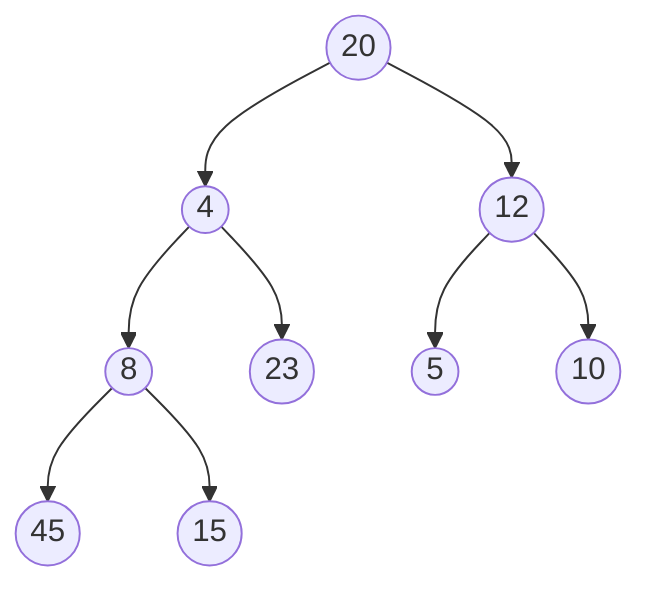
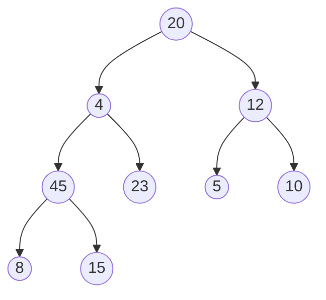
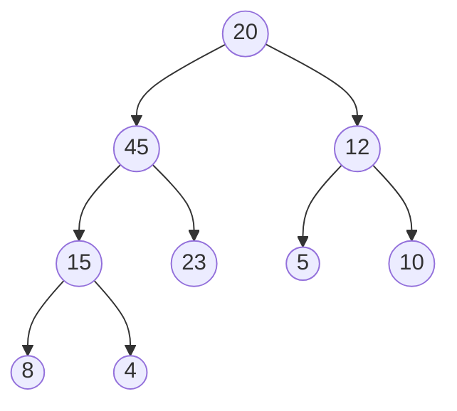
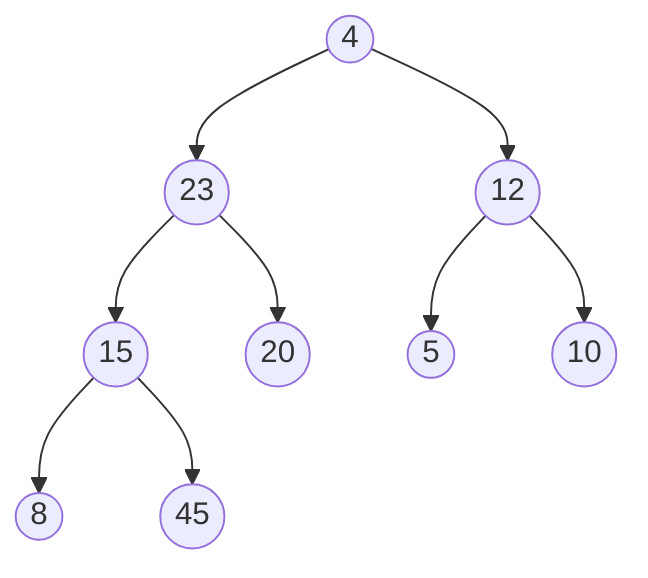
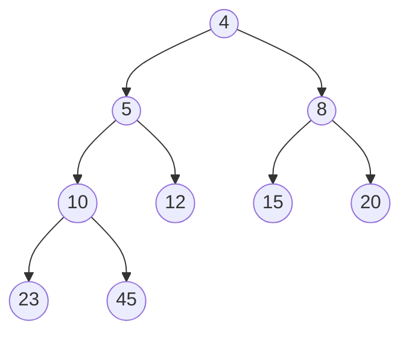

# 第 7 章 排序

- [第 7 章 排序](#第-7-章-排序)
  - [7.1 引言](#71-引言)
  - [7.2 冒泡排序](#72-冒泡排序)
  - [7.3 插入排序](#73-插入排序)
    - [7.3.1 简单插入排序](#731-简单插入排序)
    - [7.3.2 折半插入排序](#732-折半插入排序)
    - [7.3.3 希尔排序](#733-希尔排序)
  - [7.4 归并排序](#74-归并排序)
  - [7.5 快速排序](#75-快速排序)
  - [7.6 选择排序和堆排序](#76-选择排序和堆排序)
    - [7.6.1 选择排序](#761-选择排序)
    - [7.6.2 堆排序](#762-堆排序)
    - [7.6.3 堆和优先队列](#763-堆和优先队列)
  - [7.7 基数排序](#77-基数排序)
    - [7.7.1 多关键字排序](#771-多关键字排序)
    - [7.7.2 基数排序法](#772-基数排序法)
  - [7.8 内部排序算法的比较](#78-内部排序算法的比较)
  - [7.9 外部排序](#79-外部排序)
    - [7.9.1 外部排序的处理过程](#791-外部排序的处理过程)
    - [7.9.2 K 路归并](#792-k-路归并)
    - [7.9.3 初始归并段](#793-初始归并段)
    - [7.9.4 最佳归并树](#794-最佳归并树)
  - [7.10 小结](#710-小结)
  - [7.11 习题](#711-习题)
    - [书本](#书本)
      - [问题 1](#问题-1)
      - [问题 2](#问题-2)
        - [冒泡排序](#冒泡排序)
        - [（简单）插入排序](#简单插入排序)
        - [选择排序](#选择排序)
        - [归并排序](#归并排序)
        - [快速排序](#快速排序)
        - [堆排序](#堆排序)
        - [基数排序](#基数排序)
      - [问题 3](#问题-3)
      - [问题 4](#问题-4)
      - [问题 5](#问题-5)
      - [问题 6`**`](#问题-6)
      - [问题 7](#问题-7)
      - [问题 8](#问题-8)
      - [问题 9](#问题-9)
      - [问题 10](#问题-10)
      - [问题 11](#问题-11)
      - [问题 12](#问题-12)
      - [问题 13](#问题-13)
    - [PPT](#ppt)
    - [ACM-OJ](#acm-oj)

## 7.1 引言

- 排序的定义：将一组记录按关键字值的大小重新排列成有序序列
- 排序的稳定性：相同关键字的记录在排序前后的相对位置不变
- 内部排序：待排序记录全部存放在内存中进行排序
- 外部排序：待排序记录的数量很大，部分存放在外存中

> 注意：在本章中如无特殊说明，都按照非递减序列进行排序。

我们先讨论内排序的算法，包括[冒泡排序](#72-冒泡排序)，[插入排序](#73-插入排序)，[归并排序](#74-归并排序)，[快速排序](#75-快速排序)，[选择排序](#761-选择排序)，[堆排序](#762-堆排序)和[基数排序](#77-基数排序)。然后再讨论[外排序](#79-外部排序)。

## 7.2 冒泡排序

- 基本思想：相邻元素两两比较，逆序则交换
- 时间复杂度：$O(n^2)$
- 稳定性：稳定
- 优化方案：设置标志位，某趟排序没有发生交换则提前结束

核心代码如下，完整代码请参考[7-1 示例程序](../src/examples/Chapter7/7-1/main.cpp)。

```cpp
template <class elemType>
void bubbleSort(elemType a[], int n)
{
    int i, j;
    bool changeFlag = true;
    elemType tmp;

    for (j = n - 1; j > 0; j--) {
        if (!changeFlag) {
            break;
        }

        changeFlag = false;
        for (i = 0; i < n - 1; i++) {
            if (a[i] > a[i + 1]) {
                // swap
                tmp = a[i];
                a[i] = a[i + 1];
                a[i + 1] = tmp;
                changeFlag = true;
            }
        }
    }
}
```

当然也可以用**递归**的方法实现[冒泡排序](../src/examples/Chapter7/7-1/recursive-bubblesort.cpp)。

## 7.3 插入排序

### 7.3.1 简单插入排序

- 基本思想：将待排序记录插入到已排好序的有序表中
- 时间复杂度：$O(n^2)$
- 稳定性：稳定

核心代码如下，完整的程序请参考[7-2 和 7-3 合并示例程序](../src/examples/Chapter7/7-2/main.cpp)。

```cpp
template <class elemType>
void insert(elemType a[], int n, const elemType &x)
// n 为有序表a中当前元素的个数，x为待插入的新元素（也就是待排序的元素）
{
    int i;

    for (i = n - 1; i >= 0; i--) {
        if (a[i] <= x) {
            break;
        } else {
            a[i + 1] = a[i];
        }
    }

    a[i + 1] = x;
}

template <class elemType>
void insertSort(elemType a[], int n)
{
    int i, j;
    elemType tmp;

    // 将第i个元素插入到前i-1个元素的有序序列中
    for (i = 1; i < n; i++) {
        tmp = a[i];
        insert(a, i, tmp);
    }
}
```

### 7.3.2 折半插入排序

- 改进：在查找插入位置时采用折半查找
- 时间复杂度：O(n²)（比较次数减少，但移动次数不变）
- 稳定性：稳定
- 注意：如果原始数据已经为正序，折半插入则会从原本的*一次*比较增加为$\log_{2}{n}$

折半插入排序的实现代码可以参考书本后[第五题](#问题-5)。

### 7.3.3 希尔排序

如果仔细分析[直接插入排序](#731-简单插入排序)，

- 基本思想：通过预处理使序列比较有序，然后再进行插入排序
- 时间复杂度：$O(n^1.3)$（最好情况）
- 稳定性：不稳定
- 特点：对大规模乱序数组效率较高

核心代码如下，完整示例程序请参考[7-4 示例程序](../src/examples/Chapter7/7-4/main.cpp)。

```cpp
template <class elemType>
void shellSort(elemType a[], int n)
{
    int step, i, j;
    elemType tmp;

    // 步长从 n/2 开始，每次减半，直到步长为 1
    for (step = n / 2; step > 0; step /= 2) {
        // 从当前步长位置开始，遍历数组元素
        for (i = step; i < n; i++) {
            tmp = a[i];  // 将当前元素保存到 tmp 中
            j = i;       // j 用来查找合适的位置

            // 将当前元素与前面步长间隔的元素比较，如果当前元素较小，则交换位置
            while ((j - step >= 0) && (tmp <= a[j - step])) {
                a[j] = a[j - step];  // 将较大的元素移动到后面
                j -= step;           // 移动步长位置
            }

            a[j] = tmp;  // 将 tmp 放入找到的位置
        }
    }
}
```

## 7.4 归并排序

- 基本思想：分治法，将两个有序表合并成一个有序表
- 时间复杂度：$O(n\log_{2}{n})$
- 稳定性：稳定
- 特点：适合外部排序

假设数组`a`在`low-mid`和`mid-high`这两段上面分别有序，那么我们可以通过下面的`merge`函数把数组`a`归并成从`low-high`都有序的一个数组，完整示例程序请参考[示例程序 7-5](../src/examples/Chapter7/7-5/main.cpp).

```cpp
template <class elemType>
void merge(elemType a[], int low, int mid, int high)
{
    int i = low, j = mid + 1, k = 0;
    elemType *c = new elemType[high - low + 1];  // 创建实际空间存储合并后的结果

    // 两个有序序列中元素的比较合并
    while ((i <= mid) && (j <= high)) {
        if (a[i] <= a[j]) {
            c[k] = a[i];
            i++;
        } else {
            c[k] = a[j];
            j++;
        }
        k++;
    }

    // copy剩余的元素
    while (i <= mid) {
        c[k] = a[i];
        i++;
        k++;
    }

    while (j <= high) {
        c[k] = a[j];
        j++;
        k++;
    }

    for (i = 0; i < high - low + 1; i++) {
        a[i + low] = c[i];
    }

    delete[] c;
}
```

而我们需要排序的数组原本是乱序的，我们用分治的思想，不断把序列二分成两个子序列，直到就剩下一个元素，这个子序列自然就有序了。核心代码如下，完整示例代码请参考[示例程序 7-6](../src/examples/Chapter7/7-6/main.cpp).

```cpp
template <class elemType>
void mergeSort(elemType a[], int low, int high)
{
    if (low >= high) {
        return;
    }

    int mid = (low + high) / 2;

    mergeSort(a, low, mid);
    mergeSort(a, mid + 1, high);
    merge(a, low, mid, high);
}

template <class elemType>
void mergeSort(elemType a[], int n)
{
    mergeSort(a, 0, n - 1);
}
```

## 7.5 快速排序

快速排序的基本思想是：

1. 选择一个元素作为标杆。
2. 所有小于它的元素移到它的前面，大于等于它的元素移到它的后面。
3. 对标杆前后两个子序列分别排序后，整个序列就有序了。

- 时间复杂度：平均$O(n\log_{2}{n})$，最坏$O(n^2)$
- 稳定性：不稳定
- 优化：三数取中法选择基准，小区间使用插入排序

核心代码如下，完整示例程序请参考[示例程序 7-7](../src/examples/Chapter7/7-7/main.cpp)。

```cpp
template <class elemType>
void quickSort(elemType a[], int start, int end)
{
    int i, j, hole;
    elemType tmp;

    // 序列中没有元素或只有一个元素，递归结束
    if (end <= start) {
        return;
    }

    tmp = a[start];
    hole = start;
    i = start;  // 从左到右搜索的指针
    j = end;    // 从右到左搜索的指针

    while (i < j) {
        // 从j位置开始从后往前找第一个小于tmp的值
        while ((j > i) && (a[j] >= tmp)) {
            j--;
        }

        // 从上面while循环退出只有两种可能：
        // 1. j和i聚头，退出外层while循环并将本轮待排序元素tmp放到hole位置处
        // 2, 找到了第一个小于tmp的值
        if (j == i) {
            break;
        }

        a[hole] = a[j];
        hole = j;

        // 从i位置开始从后往前找第一个小于tmp的值
        while ((i < j) && (a[i] < tmp)) {
            i++;
        }

        // 从上面while循环退出只有两种可能：
        // 1. j和i聚头，退出外层while循环并将本轮待排序元素tmp放到hole位置处
        // 2. 找到了第一个大于tmp的值
        if (j == i) {
            break;
        }

        a[hole] = a[i];
        hole = i;
    }
    a[hole] = tmp;

    quickSort(a, start, hole - 1);
    quickSort(a, hole + 1, end);
}

template <class elemType>
void quickSort(elemType a[], int n)
{
    quickSort(a, 0, n - 1);
}
```

最差的情况就是每次标杆落定后，其左边或者右边序列都有一个序列元素个数为`0`，如原本待处理数据为完全逆序或正序时，时间复杂度为$O(n^2)$。最好的情况是每次标杆落定后，左右两边序列元素个数相等，时间复杂度为$O(n\log_{2}{n})$。可以通过“在首、尾、中间三个位置的值中找到中间值，将其作为标杆”的方法来优化。

## 7.6 选择排序和堆排序

### 7.6.1 选择排序

- 基本思想：以两两比较为基础，每次从待排序序列中选择最小元素并交换到对应的正确位置上
- 时间复杂度：$O(n^2)$
- 稳定性：不稳定

具体来说：

- 从左到右，为有序序列中每个位置选择合适的元素。
- 在下标`0~n-1`范围找出最小值，换到`0`下标位置；
- 在下标`1~n-1`范围找出最小值，换到`1`下标位置；
- ...
- 在下标`n-2~n-1`范围找出最小值，换到`n-2`下标位置.

核心代码如下，完整示例程序请参考[7-8 示例程序](../src/examples/Chapter7/7-8/main.cpp)。

```cpp
template <class elemType>
void selectSort(elemType a[], int n)
{
    int i, j, minIndex;
    elemType tmp;

    // 为每个位置找合适的数据
    for (i = 0; i < n; i++) {
        // 为第i个位置找合适的数据
        minIndex = i;
        for (j = i + 1; j < n; j++) {
            if (a[j] < a[minIndex]) {
                minIndex = j;
            }
        }

        // 将minIndex位置上的数据和位置i上数据交换
        if (minIndex == i) {
            continue;

        } else {
            tmp = a[i];
            a[i] = a[minIndex];
            a[minIndex] = tmp;
        }
    }
}
```

当找到最小值后，不直接交换，最小元素前的元素全部逐一后移后，最小元素再放到前面。此算法是稳定排序算法。时间复杂度仍然保持$O(n^2)$。

### 7.6.2 堆排序

首先看什么是**堆**。

- 一个**完全二叉树**中，任意一个结点的值比其左右子结点值都大，称为**大顶堆**。
- 一个**完全二叉树**中，任意一个结点的值比其左右子结点值都小，
  称为**小顶堆**。

大顶堆和小顶堆都称为**堆**。

而**堆排序**的过程就是：

- 将存于数组中的序列看作是一棵完全二叉树的顺序存储。
- 按照堆的概念调整之，使之成为一个大顶堆。
- 摘取大顶，换到待处理元素最后位置。
- 继续调整新的根使之满足大顶堆概念，得到次大元素，
- 继续后移，直到序列中元素全部有序。

核心代码如下，完整示例程序请参考[7-9 示例程序](../src/examples/Chapter7/7-9/main.cpp)。

```cpp
template <class elemType>
void adjust(elemType a[], int n, int i)
{
    // 对尺寸为n的数组a，假设根为0下标元素，
    // 调整下标为i的元素，使得以i为根的二叉树为一个大顶堆
    int maxChild;
    elemType tmp;

    while (true) {
        maxChild = 2 * i + 1;  // i的左子下标

        if (maxChild > n - 1) {
            return;
        }

        // i还有右子
        if (maxChild + 1 <= n - 1) {
            // 右子大于等于左子
            if (a[maxChild + 1] >= a[maxChild]) {
                maxChild++;
            }
        }

        // 最大孩子小于父结点
        if (a[i] > a[maxChild]) {
            return;
        }

        // 最大孩子大于等于父结点，父结点向下调整
        tmp = a[i];
        a[i] = a[maxChild];
        a[maxChild] = tmp;

        i = maxChild;  // 继续向下调整
    }
}

template <class elemType>
void heapSort(elemType a[], int n)
{
    int i, j;
    elemType tmp;

    // 从倒数第一个非叶子结点开始调整，首次建立大顶堆
    for (i = (n - 2) / 2; i >= 0; i--) {
        adjust(a, n, i);
    }

    // 换大顶，主次减少参与的元素，重新调整为大顶堆
    for (j = n - 1; j >= 1; j--) {
        // 大顶和第i个位置元素交换
        tmp = a[0];
        a[0] = a[j];
        a[j] = tmp;

        // 调整第0个元素
        adjust(a, n, 0);
    }
}
```

- 时间复杂度：$O(n\log{n})$
- 稳定性：不稳定

实际上，堆排序时间消耗由两部分组成：

- 初次建堆的时间消耗
- `n-1`次取大顶的时间消耗。

前者从形式上看时间复杂度是$O(n\log_{2}{n})$,但实际可达$O(n)$。后者时间复杂度也是$O(n\log_{2}{n})$。思考：为什么不可以是$O(n)$?

### 7.6.3 堆和优先队列

- 堆的定义：完全二叉树，满足堆序性
- 优先队列：用堆实现的队列，每次出队为最值元素
- 应用：任务调度、事件模拟

## 7.7 基数排序

### 7.7.1 多关键字排序

排序可以按照单一关键字或多个关键字进行：

- 单一关键字排序：如按学号排序
- 多关键字排序：如先按年龄排序，年龄相同再按身高排序
  - 主关键字：优先排序的关键字（如年龄）
  - 次关键字：次优先的关键字（如身高）

基数排序正是基于多关键字排序的思想，通过将单一关键字的各个位数视为多个关键字来排序。

### 7.7.2 基数排序法

基数排序有两种实现方式：

1. **最高位优先(MSD)**

- 从最高位开始，逐位向右排序
- 对每个子序列再进行递归排序
- 实现较复杂，需要额外存储空间

2. **最低位优先(LSD)**

- 从最低位开始，逐位向左排序
- 每一位的排序采用"分配-收集"法
- 实现简单，效率更高

以序列`18,26,31,72,8,15,88,72,35,20`为例：

1. 先按个位数字分配到 10 个桶
2. 按序收集形成新序列
3. 再按十位数字重复上述过程

- 稳定性：稳定排序
- 适用场景：适合数据位数较少、取值范围集中的整数排序

## 7.8 内部排序算法的比较

PPT 上这么写：
冒泡排序、插入排序、选择排序、快速排序的最坏情况下时间复杂度都是 O(𝑛^2)，特别地在数据原本正序的基础上冒泡排序和插入排序时间复杂度可以达到 O(n)。基数排序在一般情况下时间复杂度就能达到 O(n)。归并排序、堆排序、快速排序最好情况时间复杂度能达到 O(n log_2⁡𝑛 )。
冒泡排序、插入排序、归并排序、快速排序、基数排序都是稳定排序。希尔排序、选择排序、堆排序都是不稳定排序。

- 时间效率比较：

  - $O(n^2)$：冒泡、选择、插入
  - $O(n\log_{2}{n})$：快速、归并、堆
  - $O(n)$：基数（特定条件下）

- 稳定性比较：

  - 稳定：冒泡、插入、归并、基数
  - 不稳定：选择、快速、堆、希尔

## 7.9 外部排序

### 7.9.1 外部排序的处理过程

- 预处理：内部排序形成初始归并段
- 归并排序：多路归并
- 内存管理：缓冲区管理

### 7.9.2 K 路归并

- 基本思想：同时归并 K 个有序段
- 选择方法：败者树、最小堆
- 时间复杂度：O(nlogk)

### 7.9.3 初始归并段

- 生成方法：内部排序
- 置换选择排序：生成长度大于内存的初始归并段

### 7.9.4 最佳归并树

- 哈夫曼树思想：构造最优归并方案
- 目标：最小化总的归并代价

## 7.10 小结

- 排序算法的选择依据：
  1. 数据规模
  2. 数据分布特征
  3. 空间限制
  4. 稳定性要求
- 实际应用中的建议：
  1. 小规模数据：插入排序
  2. 大规模随机数据：快速排序
  3. 外部排序：归并排序
  4. 空间紧张：堆排序
  5. 整数排序：基数排序

## 7.11 习题

### 书本

#### 问题 1

简述什么是内排序、外排序、稳定排序、不稳定排序？

<details>
  <summary>答案</summary>

如果待排序的全部数据可以一次性加载到内存上就是**内排序**，反之是**外排序**。

如果一组元素的关键字值相同，且它们的相对位置在排序前后保持不变则是**稳定排序**，反之为**不稳定排序**。

</details>

#### 问题 2

已知内存中的一个数据序列为`20、4、12、8、23、5、10、45、15`，试用冒泡排序、插入排序、选择排序、归并排序、快速排序、堆排序、基数排序算法对其排序，需要给出排序的每一步过程。

<details>
  <summary>答案</summary>

> 注：下面用反引号`backticks`标记已经排序好的元素。

##### 冒泡排序

- 20, 4, 12, 8, 23, 5, 10, 45, 15
- 4, 12, 8, 20, 5, 10, 23, 15, `45`
- 4, 8, 12, 5, 19, 20, 15, `23, 45`
- 4, 8, 5, 12, 19, 15, `20, 23, 45`
- 4, 5, 8, 12, 15, `19, 20, 23, 45`
- `4, 5, 8, 12, 15, 19, 20, 23, 45`

> 在 19 被排序好后，再循环一次发现不再需要排序，也就是[示例程序 7-1 ](../src/examples/Chapter7/7-1/main.cpp)中`changeFlag==false`那么可以直接判断排序完成。

##### （简单）插入排序

- 20, 4, 12, 8, 23, 5, 10, 45, 15
- `4, 20`, 12, 8, 23, 5, 10, 45, 15
- `4, 12, 20`, 8, 23, 5, 10, 45, 15
- `4, 8, 12, 20`, 23, 5, 10, 45, 15
- `4, 8, 12, 20, 23`, 5, 10, 45, 15
- `4, 5, 8, 12, 20, 23`, 10, 45, 15
- `4, 5, 8, 10, 12, 20, 23`, 45, 15
- `4, 5, 8, 10, 12, 15, 20, 23`, 45
- `4, 5, 8, 10, 12, 15, 20, 23, 45`

##### 选择排序

- 20, 4, 12, 8, 23, 5, 10, 45, 15
- `4`, 20, 12, 8, 23, 5, 10, 45, 15
- `4, 5`, 12, 8, 23, 20, 10, 45, 15
- `4, 5, 8`, 12, 23, 20, 10, 45, 15
- `4, 5, 8, 10`, 12, 23, 20, 45, 15
- `4, 5, 8, 10, 12`, 23, 20, 45, 15
- `4, 5, 8, 10, 12, 15`, 23, 20, 45
- `4, 5, 8, 10, 12, 15, 20`, 23, 45
- `4, 5, 8, 10, 12, 15, 20, 23`, 45
- `4, 5, 8, 10, 12, 15, 20, 23, 45`

##### 归并排序

- 20, 4, 12, 8, 23, 5, 10, 45, 15
- <ins>20, 4, 12, 8, 23</ins>, <ins>5, 10, 45, 15</ins>
- <ins>20, 4, 12</ins>, <ins>8, 23</ins>, <ins>5, 10</ins>, <ins>45, 15</ins>
- <ins>20, 4</ins>, <ins>12</ins>, <ins>8</ins>, <ins>23</ins>, <ins>5</ins>, <ins>10</ins>, <ins>45</ins>, <ins>15</ins>
- <ins>20</ins>, <ins>4</ins>, <ins>12</ins>, <ins>8</ins>, <ins>23</ins>, <ins>5</ins>, <ins>10</ins>, <ins>45</ins>, <ins>15</ins>
- `4, 20`, `12`, `8`, `23`, `5`, `10`, `45`, `15`
- `4, 12, 20`, `8, 23`, `5, 10`, `15, 45`
- `4, 8, 12, 20, 23`, `5, 10, 15, 45`
- `4, 5, 8, 10, 12, 15, 20, 23, 45`

> 归并排序先分割后合并。

##### 快速排序

- 20, 4, 12, 8, 23, 5, 10, 45, 15
- 5, 4, 12, 8, 23, 20, 10, 45, 15
- 5, 4, 12, 8, 20, 23, 10, 45, 15
- 5, 4, 12, 8, 15, 23, 10, 45, 20
- 5, 4, 12, 8, 15, 20, 10, 45, 23
- 5, 4, 12, 8, 15, 10, `20`, 45, 23
- 4, `5`, 12, 8, 15, 10, `20`, 45, 23
- `4`, `5`, 12, 8, 15, 10, `20`, 45, 23
- `4`, `5`, 12, 8, 15, 10, `20`, 45, 23
- `4`, `5`, 10, 8, 15, 12, `20`, 45, 23
- `4`, `5`, 10, 8, `12`, 15, `20`, 45, 23
- `4`, `5`, `8`, 10, `12`, 15, `20`, 45, 23
- `4`, `5`, `8`, `10`, `12`, 15, `20`, 45, 23
- `4`, `5`, `8`, `10`, `12`, `15`, `20`, 45, 23
- `4`, `5`, `8`, `10`, `12`, `15`, `20`, 23, `45`
- `4`, `5`, `8`, `10`, `12`, `15`, `20`, `23`, `45`

##### 堆排序

原始序列对应的二叉树：



先建立大顶堆。

1. 调整第一个非叶子结点`8`



2. 调整第二个非叶子结点`12`(不需要调整)


3. 调整第三个非叶子结点`4`



4. 调整第四个非叶子结点`20`


至此，第一次调整为大顶堆，交换根结点与最后一个叶子结点，并固定`45`这个叶子结点：



下面重复以上调整完全二叉树为大顶堆，然后将根结点数值和最后一个未固定的叶子结点交换，最终得到的大顶堆如下：



因此，层次遍历的结果就是非递减排序结果：`4,5,8,10,12,15,20,23,45`

##### 基数排序

LSD 方法：

1. 第一趟分配，按照个位数分配：

- 口袋 0: 20, 10
- 口袋 2: 12
- 口袋 3: 23
- 口袋 4: 4
- 口袋 5: 5, 45, 15
- 口袋 8: 8

然后收集起来得到序列：

- 20, 10, 12, 23, 4, 5, 45, 15, 8

2. 第二趟分配，按照十位数分配：

- 口袋 0: 4, 5, 8
- 口袋 1: 10, 12, 15
- 口袋 2: 20, 23
- 口袋 4: 45

再次收集就得到排序好的序列：`4, 5, 8, 10, 12, 15, 20, 23, 45`

</details>

#### 问题 3

如果外存上的原始数据序列为`20、4、12、8、23、5、10、45、15`，内存一次只能存储 3 个元素，利用置换选择法给出所有的初始归并段。

<details>
  <summary>答案</summary>

如果一组元素的关键字值相同，且它们的相对位置在排序前后保持不变则是稳定排序，反之为不稳定排序。

</details>

#### 问题 4

假设在排序中有 3 条磁带可用，试对上题获得的初始归并段进行 2 路归并。要求写出归并的过程。

#### 问题 5

写出实现折半插入排序算法的程序。

<details>
  <summary>答案</summary>

```cpp
template <class elemType>
void insert(elemType a[], int n, const elemType &x)
// n 为有序表 a 中当前元素的个数，x 为待插入的新元素（即待排序的元素）
{
    int low = 0, high = n - 1, mid;

    // 使用二分查找法查找插入位置
    while (low <= high) {
        mid = (low + high) / 2;
        if (a[mid] < x) {
            low = mid + 1;  // x 应该插入到 mid 右侧
        } else {
            high = mid - 1;  // x 应该插入到 mid 左侧
        }
    }

    // 从 high + 1 开始，将元素往后移动，腾出位置给新元素
    for (int i = n - 1; i > high; i--) {
        a[i + 1] = a[i];
    }

    // 将 x 插入到找到的位置
    a[high + 1] = x;
}
```

</details>

#### 问题 6`**`

设计两个算法实现在一组`n`个元素组成的无序序列中，找到第`k`大的元素。要求时间复杂度分别为$O(n+k\log_{2}{n})$和$O(n\log_{2}{n})$.

#### 问题 7

对图 7-25 进行改造，使内存中存储的数据成为一个最小化堆结构。

#### 问题 8

请给出一组元素`18,23,47,13,5,27,54`通过逐一插入法建立大顶堆的执行过程，即写出注意插入过程中堆的层次遍历序列。

#### 问题 9

对给定的关键字序列`110,119,007,911,114,120,122`进行基数排序，则第 2 趟分配收集后得到的关键字序列是：

1. `007, 110, 119, 114, 911, 120,122`
2. `007, 110, 119, 114, 911, 122, 120`
3. `007, 110, 911, 114, 119, 120, 122`
4. `110, 120, 911, 122, 114, 007, 119`

<details>
  <summary>答案</summary>

第 1 趟分配收集得到序列：`110, 120, 911, 122, 114, 007, 119`

第 2 趟分配收集得到序列：`007, 110, 911, 114, 119, 120, 122`。

选择 C。

</details>

#### 问题 10

对 10TB 的数据文件进行排序，应使用的方法是：

1. 希尔排序
2. 堆排序
3. 快速排序
4. 归并排序

#### 问题 11

下列排序算法中，元素的移动次数与关键字的初始排序次序无关的是：

1. 直接插入排序
2. 冒泡排序
3. 基数排序
4. 快速排序

<details>
  <summary>答案</summary>

基数排序与关键字的初始排序次序无关的是。

</details>

#### 问题 12

已知小顶堆为`8,15,10,21,34,16,12`删除关键字`8`之后需要重建堆，在此过程中，关键字之间的比较次数是：

1. 1
2. 2
3. 3
4. 4

#### 问题 13

希尔排序的组内排序采用的是：

1. 直接插入排序
2. 折半插入排序
3. 快速排序
4. 归并排序

<details>
  <summary>答案</summary>

希尔排序的组内排序采用**直接插入排序**。

</details>

### PPT

### ACM-OJ
