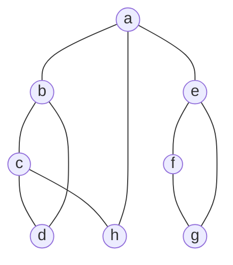
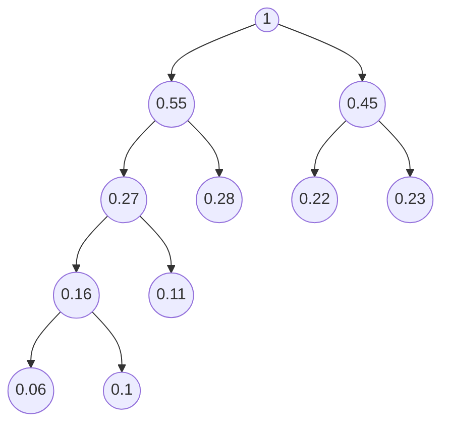
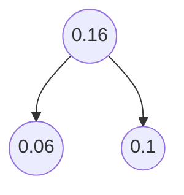
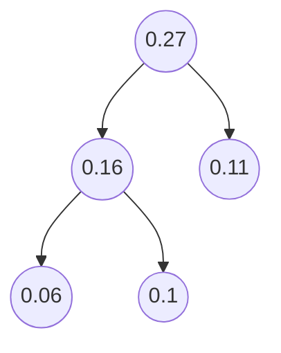
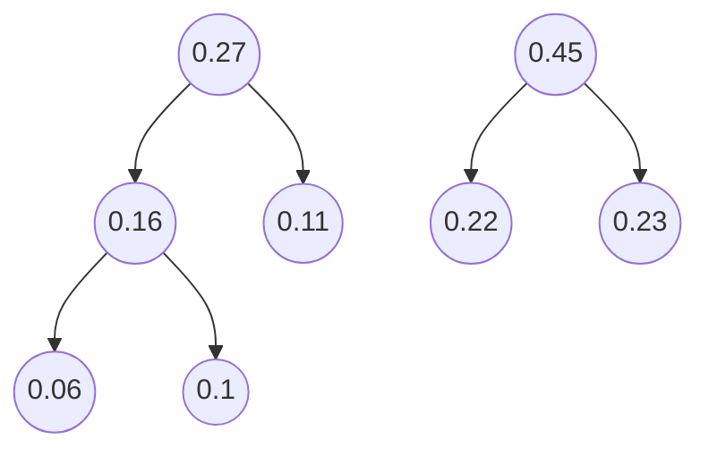
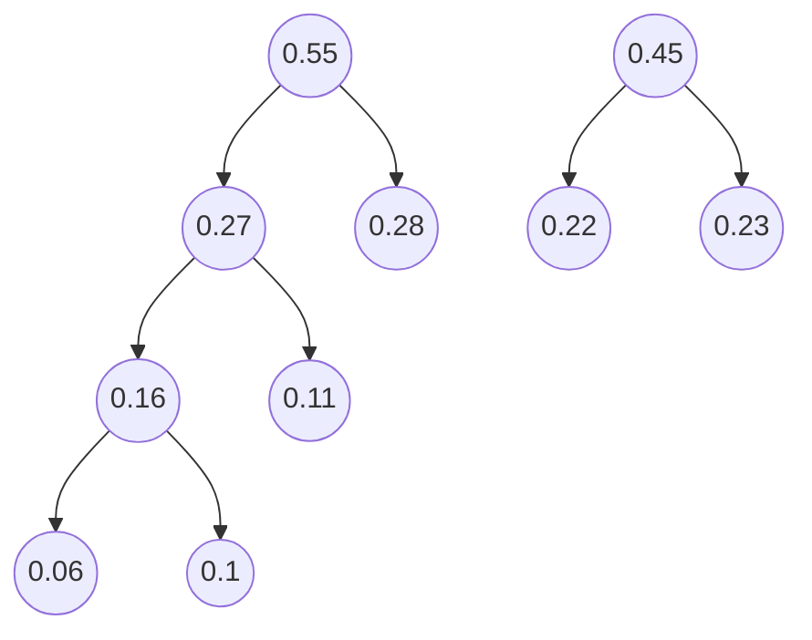

以下是 2019-2020 学年第二学期试卷的题目，答案以及解析。

- [选择题](#选择题)
  - [题目 1](#题目-1)
    - [答案与解析](#答案与解析)
  - [题目 2](#题目-2)
    - [答案与解析](#答案与解析-1)
  - [题目 3](#题目-3)
    - [答案与解析](#答案与解析-2)
  - [题目 4](#题目-4)
    - [答案与解析](#答案与解析-3)
  - [题目 5](#题目-5)
    - [答案与解析](#答案与解析-4)
  - [题目 6](#题目-6)
    - [答案与解析](#答案与解析-5)
  - [题目 7](#题目-7)
    - [答案与解析](#答案与解析-6)
  - [题目 8](#题目-8)
    - [答案与解析](#答案与解析-7)
  - [题目 9](#题目-9)
    - [答案与解析](#答案与解析-8)
  - [题目 10](#题目-10)
    - [答案与解析](#答案与解析-9)
  - [题目 11](#题目-11)
    - [答案与解析](#答案与解析-10)
  - [题目 12](#题目-12)
    - [答案与解析](#答案与解析-11)
  - [题目 13](#题目-13)
    - [答案与解析](#答案与解析-12)
  - [题目 14](#题目-14)
    - [答案与解析](#答案与解析-13)
  - [题目 15](#题目-15)
    - [答案与解析](#答案与解析-14)
  - [题目 16](#题目-16)
    - [答案与解析](#答案与解析-15)
  - [题目 17](#题目-17)
    - [答案与解析](#答案与解析-16)
  - [题目 18](#题目-18)
    - [答案与解析](#答案与解析-17)
  - [题目 19](#题目-19)
    - [答案与解析](#答案与解析-18)
  - [题目 20](#题目-20)
    - [答案与解析](#答案与解析-19)
- [简答题](#简答题)
  - [问题 1](#问题-1)
    - [答案与解析](#答案与解析-20)
  - [问题 2](#问题-2)
    - [答案与解析](#答案与解析-21)
  - [问题 3](#问题-3)
    - [答案与解析](#答案与解析-22)
  - [问题 4](#问题-4)
    - [答案与解析](#答案与解析-23)
- [程序题](#程序题)
  - [问题 1](#问题-1-1)
    - [答案与解析](#答案与解析-24)
  - [问题 2](#问题-2-1)
    - [答案与解析](#答案与解析-25)
  - [问题 3](#问题-3-1)
    - [答案与解析](#答案与解析-26)

# 选择题

## 题目 1

**tag:** 第三章

一个栈的入栈序列为 `1,2,3,...,n`，其出栈序列是 `p1, p2, p3,…, pn`。若 `p2 = 3`，则 `p3` 可能取值的个数是

A. `n-3`
B. `n-2`
C. `n-1`
D. 无法确定

### 答案与解析

<details>  
  <summary>答案</summary>

C

</details>

<details>  
  <summary>解析</summary>

除了`3`以外都可能取到。题目来自[第三章书本第三题](../Chapter3.md#问题-3)

</details>

---

## 题目 2

**tag:** 第六章

若将关键字 `1,2,3,4,5,6,7` 依次插入到初始为空的平衡二叉树 `T` 中，则 `T` 中平衡因子为 `0` 的非叶子结点的个数是

A. 0

B. 1

C. 2

D. 3

### 答案与解析

<details>  
  <summary>答案</summary>

D

</details>

<details>  
  <summary>解析</summary>

最终构成的平衡二叉树如下：

```plaintext
      4
     / \
    2   6
   / \ / \
  1  3 5  7
```

类似书本后原题：[第六章问题 10](../Chapter6.md#问题-10)。

</details>

---

## 题目 3

**tag:** 第六章

在任意一棵非空二叉查找树$T_1$，中，删除某结点$v$后形成二叉查找树$T_2$; 再将$v$插入$T_2$形成二叉查找树$T_3$。下列关于$T_1$与$T_3$的叙述中，正确的是：

1. 若$v$是$T_1$的叶结点，则$T_1$与$T_3$不同
2. 若$v$是$T_1$的叶结点，则$T_1$与$T_3$相同
3. 若$v$不是$T_1$的叶结点，则$T_1$与$T_3$不同
4. 若$v$不是$T_1$的叶结点，则$T_1$与$T_3$相同

A. 仅 1、2
B. 仅 1、4
C. 仅 2、3
D. 仅 2、4

### 答案与解析

<details>  
  <summary>答案</summary>

C

</details>

<details>  
  <summary>解析</summary>

书本后原题[第六章问题 5](../Chapter6.md#问题-5)。

</details>

---

## 题目 4

**tag:** 第七章

对给定的关键字序列`110,119,007,911,114,120,122`进行基数排序，则第 2 趟分配收集后得到的关键字序列是：

A. `007, 110, 119, 114, 911, 120,122`
B. `007, 110, 119, 114, 911, 122, 120`
C. `007, 110, 911, 114, 119, 120, 122`
D. `110, 120, 911, 122, 114, 007, 119`

### 答案与解析

<details>  
  <summary>答案</summary>

C

</details>

<details>  
  <summary>解析</summary>

书本后原题，请看原题[解析](../Chapter7.md#问题-9)。

</details>

---

## 题目 5

**tag:** 第五章

若对如下无向图进行遍历，则下列选项中，不是广度优先遍历序列的是？


```mermaid
graph TD

  A((a))---B((b))
  A((a))---E((e))
  B((b))---C((c))
  C((c))---D((d))
  B((b))---D((d))
  C((c))---H((h))
  E((e))---F((f))
  F((f))---G((g))
  A((a))---H((h))
  G((g))---E((e))
```

A. `h，c，a，b，d，e，g，f`

B. `e，a，f，g，b，h，c，d`

C. `d，b，c，a，h，e，f，g`

D. `a，b，c，d，h，e，f，g`

### 答案与解析

<details>  
  <summary>答案</summary>

D

</details>

<details>  
  <summary>解析</summary>

选项 D 是深度优先搜索(`BFS`)产生的一种遍历序列。

</details>

---

## 题目 6

**tag:** 第六章

在一株高度为 `2` 的 `5` 阶 `B` 树中，根结点所含关键字的个数最少是

A. 5

B. 7

C. 8

D. 1

### 答案与解析

<details>  
  <summary>答案</summary>

D

</details>

<details>  
  <summary>解析</summary>

类似书本后原题, 请看原题[第六章第十五题](../Chapter6.md#问题-15)。

</details>

---

## 题目 7

**tag:** 第二章

已知表头元素为 `c` 的单链表在内存中的存储状态如下表所示。现将 `f` 存放于 `1014H` 处并插入到单链表中，若 `f` 在逻辑上位于 `a` 和 `e` 之间，则 `a, e, f` 的“链接地址”依次是

A．1010H，1014H，1004H

B．1010H，1004H，1014H

C．1014H，1010H，1004H

D．1014H，1004H，1010H

### 答案与解析

<details>  
  <summary>答案</summary>
    
D

| 结点编号 | 链接地址 |
| -------- | -------- |
| a        | 1014H    |
| e        | 1004H    |
| f        | 1010H    |

</details>

<details>  
  <summary>解析</summary>

本题目为第二章书本习题[第 5 题](../Chapter2.md#问题-5)

</details>

---

## 题目 8

**tag:** 第二章

已知一个带有表头结点的双向循环链表，结点结构为 `prev|data|next`。现要删除指针 `p` 所指的结点，正确的语句序列是?

A. `p->next->prev=p->prev;` `p->prev->next=p->prev;` `delete p;`

B. `p->next->prev=p->next;` `p->prev->next=p->next;` `delete p;`

C. `p->next->prev=p->next;` `p->prev->next=p->prev;` `delete p;`

D. `p->next->prev=p->prev;` `p->prev->next=p->next;` `delete p;`

### 答案与解析

<details>  
  <summary>答案</summary>

D

</details>

<details>  
  <summary>解析</summary>

初始状态：双向循环链表，节点分别为..., A, P(要删除的节点), B, ...

```plaintext
   +-----+       +-----+       +-----+
-->|  A  |<----->|  P  |<----->|  B  |<--
   +-----+       +-----+       +-----+
```

执行`p->next->prev=p->prev;`，即`B`的`prev`指向`A`:

```plaintext
   +-----+       +-----+       +-----+
-->|  A  |<----->|  P  |<--X-->|  B  |<--
   +-----+       +-----+       +-----+
      ^                           |
      |---------------------------|
```

执行`p->prev->next=p->next;`，即`A`的`next`指向`B`:

```plaintext
      |---------------------------|
      |                           v
   +-----+       +-----+       +-----+
-->|  A  |<--X-->|  P  |       |  B  |<--
   +-----+       +-----+       +-----+
      ^                           |
      |---------------------------|
```

此时，`p`结点已经完全从链表结构中移除，不要忘记是放对应的内存`delete p;`

```plaintext
      |---------------------------|
      |                           v
   +-----+       XXXXXXX       +-----+
-->|  A  |       X (P) X       |  B  |<--
   +-----+       XXXXXXX       +-----+
      ^                           |
      |---------------------------|
```

</details>

---

## 题目 9

**tag:** 第三章

设有如下图所示的火车车轨，入口到出口之间有 `n` 条轨道，列车的行进方向均为从左至右。若期望驶出的次序依次为 `1～9`，则 `n` 至少是


### 答案与解析

<details>  
  <summary>答案</summary>

C

</details>

<details>  
  <summary>解析</summary>

题目与[第三章书本后第五题](../Chapter3.md#问题-5)基本类似。

</details>

---

## 题目 10

**tag:** 第四章

若森林 `F` 有 `15` 条边、`25` 个结点，则 `F` 包含树的个数是

A．8

B．9

C．10

D．11

### 答案与解析

<details>  
  <summary>答案</summary>

C

</details>

<details>  
  <summary>解析</summary>

`n`个结点的树有`n-1`条边，换句话说，森林中每有一棵树，边数就会减少一个。所以，森林中树的个数等于边数减去结点数。

</details>

---

## 题目 11

**tag:** 第五章

若将 n 个顶点 e 条弧的有向图采用邻接表存储，则拓扑排序算法的时间复杂度是

A．$O(n)$

B．$O(n+e)$

C．$O(n^2)$

D．$O(n\times e)$

### 答案与解析

<details>  
  <summary>答案</summary>

B

</details>

<details>  
  <summary>解析</summary>

这个就是书本上的结论。邻接矩阵的时间复杂度是$O(n^2)$，邻接表是$O(n+e)$。

</details>

---

## 题目 12

**tag:** 第六章

在有 n(n>1000)个元素的升序数组 A 中查找关键字 x。查找算法的伪代码如下所示。

```cpp
k=0;
while(k<n 且 A[k]<x) k=k+3；
if(k<n 且 A[k]==x) 查找成功；
else if(k-1<n 且 A[k-1]==x) 查找成功；
  else if(k-2<n 且 A[k-2]==x) 查找成功；
    else 查找失败；
```

本算法与折半查找算法相比，有可能具有更少比较次数的情形是

A．当 x 不在数组中

B．当 x 接近数组开头处

C．当 x 接近数组结尾处

D．当 x 位于数组中间位置

### 答案与解析

<details>  
  <summary>答案</summary>

B

</details>

<details>  
  <summary>解析</summary>

只有当 x 位于数组开头附近时，该算法的比较次数可能只需要 1-2 次比较就可以找到元素。

</details>

---

## 题目 13

**tag:** 第六章

B+树不同于 B 树的特点之一是

A．能支持顺序查找

B．结点中含有关键字

C．根结点至少有两个分支

D．不适合外部文件建立索引用

### 答案与解析

<details>  
  <summary>答案</summary>

A

</details>

<details>  
  <summary>解析</summary>

书本后原题，请看原题[第六章第 25 题](../Chapter6.md#问题-25)。

</details>

---

## 题目 14

**tag:** 第七章

对 10 TB 的数据文件进行排序，应使用的方法是

A．希尔排序

B．堆排序

C．快速排序

D．归并排序

### 答案与解析

<details>  
  <summary>答案</summary>

D

</details>

<details>  
  <summary>解析</summary>  
  
书本后原题，请看原题[解析](../Chapter7.md#问题-10)。

</details>

---

## 题目 15

**tag:** 第三章

已知程序如下：

```cpp
int S(int n)
{ return (n <= 0) ? 0 : S(n - 1) + n; }
void main()
{ cout << S(1); }
```

程序运行时使用栈来保存调用过程的信息，自栈底到栈顶保存的信息依次对应的是?

A．`main( )`->`S(1)`->`S(0)` B. `S(0)`->`S(1)`->`main()`
C．`main( )`->`S(0)`->`S(1)` D．`S(1)`->`S(0)`->`main( )`

### 答案与解析

<details>  
  <summary>答案</summary>

A

</details>

<details>  
  <summary>解析</summary>

题目与[第三章书本后第六题](../Chapter3.md#问题-6)基本类似。

</details>

---

## 题目 16

**tag:** 第四章

先序序列为 a，b，c 的不同二叉树的个数是

A．3

B．5

C．4

D．6

### 答案与解析

<details>  
  <summary>答案</summary>

B

</details>

<details>  
  <summary>解析</summary>

先序遍历：中左右

```plaintext
  a
 / \
b   c
```

或者

```plaintext
    a
   /
  b
 /
c
```

或者

```plaintext
    a
   /
  b
   \
    c
```

或者

```plaintext
  a
   \
    b
     \
      c
```

或者

```plaintext
  a
   \
    b
   /
  c
```

总共 5 种。

</details>

---

## 题目 17

**tag:** 第四章

下列选项给出的是从根分别到达两个叶结点路径上的权值序列，能属于同一棵哈夫曼树的是？

A．24，10，5 和 24，10，7

B．24，10，5 和 24，12，7

C．24，10，10 和 24，14，11

D．24，10，5 和 24，14，6

### 答案与解析

<details>  
  <summary>答案</summary>

D

</details>

<details>  
  <summary>解析</summary>

根据哈夫曼树的构造原理，一个非叶子结点的权值等于它左右孩子结点的权值之和。

书本后原题，详细解析请看原题[第四章第 15 题](../Chapter4.md#问题-15)。

</details>

---

## 题目 18

**tag:** 第四章

现有一棵无重复关键字的平衡二叉树(AVL 树)，对其进行中序遍历可得到一个升序序列。下列关于该平衡二叉树的叙述中，正确的是？

A．根结点的度一定为 2

B．树中最小元素一定是叶结点

C．最后插入的元素一定是叶结点

D．树中最大元素一定无右子树

### 答案与解析

<details>  
  <summary>答案</summary>

D

</details>

<details>  
  <summary>解析</summary>

书本后原题，详细解析请看原题[第六章第 9 题](../Chapter6.md#问题-9)。

</details>

---

## 题目 19

**tag:** 第六章

下列选项中，不能构成折半查找中关键字比较序列的是

A．500，200，450，180

B．500，450，200，180

C．180，500，200，450

D．180，200，500，450

### 答案与解析

<details>  
  <summary>答案</summary>

A

</details>

<details>  
  <summary>解析</summary>

折半查找的关键字序列应该是逐渐靠近的，区间范围变窄才对。

书本后原题，详细解析请看原题[第六章第 2 题](../Chapter6.md#问题-2)。

</details>

---

## 题目 20

**tag:** 第七章

下列排序算法中，元素的移动次数与关键字的初始排列次序无关的是
A．直接插入排序

B．冒泡排序

C．基数排序

D．快速排序

### 答案与解析

<details>  
  <summary>答案</summary>

C

</details>

<details>  
  <summary>解析</summary>

书本后原题，请看原题[解析](../Chapter7.md#问题-11)。

</details>

# 简答题

## 问题 1

**tag:** 第四章

已知字符 A、B、C、D、E、F 的相对使用频率为 0.06、0.1、0.11、0.22、0.23、0.28，试根据哈夫曼算法，构造一棵以上述字符为叶结点的二叉树，并给出上述各字符的哈夫曼编码。

### 答案与解析

<details>  
  <summary>答案</summary>

构造的哈夫曼树如下：


```mermaid
graph TD
  ABCFDE((1))-->ABCF((0.55))
  ABCFDE((1))-->DE((0.45))
  ABCF((0.55))-->ABC((0.27))
  ABCF((0.55))-->F((0.28))
  ABC((0.27))-->AB((0.16))
  ABC((0.27))-->C((0.11))
  AB((0.16))-->A((0.06))
  AB((0.16))-->B((0.1))
  DE((0.45))-->D((0.22))
  DE((0.45))-->E((0.23))
```

按照左 0 右 1 的规律：

A: `0000`
B: `0001`
C: `001`
D: `10`
E: `11`
F: `01`

答案不唯一。

</details>

<details>  
  <summary>解析</summary>

0. 先给相对频率从小到大排序，得到`A-0.06, B-0.1, C-0.11, D-0.22, E-0.23, F-0.28`

1. 选取权值（频率）最小的两个结点，构造一个新的二叉树，其根结点的权值为这两个结点的权值之和。此时权值序列为`C-0.11, AB-0.16, D-0.22, E-0.23, F-0.28`.


```mermaid
graph TD
  AB((0.16))-->A((0.06))
  AB((0.16))-->B((0.1))
```

1. 重复第一步操作，合并`AB`和`C`。此时权值序列为`D-0.22, E-0.23, ABC-0.27, F-0.28`.


```mermaid
graph TD
  ABC((0.27))-->AB((0.16))
  ABC((0.27))-->C((0.11))
  AB((0.16))-->A((0.06))
  AB((0.16))-->B((0.1))
```

2. 重复第一步操作，合并`D`和`E`。此时权值序列为`ABC-0.27, F-0.28, DE-0.45`.


```mermaid
graph TD
  ABC((0.27))-->AB((0.16))
  ABC((0.27))-->C((0.11))
  AB((0.16))-->A((0.06))
  AB((0.16))-->B((0.1))
  DE((0.45))-->D((0.22))
  DE((0.45))-->E((0.23))
```

3. 重复第一步操作，`ABC`和`F`。此时权值序列为`DE-0.45, ABCF-0.55`.


```mermaid
graph TD
  ABCF((0.55))-->ABC((0.27))
  ABCF((0.55))-->F((0.28))
  ABC((0.27))-->AB((0.16))
  ABC((0.27))-->C((0.11))
  AB((0.16))-->A((0.06))
  AB((0.16))-->B((0.1))
  DE((0.45))-->D((0.22))
  DE((0.45))-->E((0.23))
```

4. 最后一步，合并`DE`和`ABCF`。此时权值序列为`ABCFDE-1`.


```mermaid
graph TD
  ABCFDE((1))-->ABCF((0.55))
  ABCFDE((1))-->DE((0.45))
  ABCF((0.55))-->ABC((0.27))
  ABCF((0.55))-->F((0.28))
  ABC((0.27))-->AB((0.16))
  ABC((0.27))-->C((0.11))
  AB((0.16))-->A((0.06))
  AB((0.16))-->B((0.1))
  DE((0.45))-->D((0.22))
  DE((0.45))-->E((0.23))
```

</details>

---

## 问题 2

**tag:** 第六章

设闭散列表的地址空间为[0,5]，依次插入元素 12，36，41，52，40，散列函数为 H(x)=x mod 6，采用线性探测再散列方式解决冲突，请给出插入后的散列表及查找 40 需要的比较次数。

### 答案与解析

<details>
  <summary>答案</summary>

Lorem Ipsum

</details>

<details>
  <summary>解析</summary>

Lorem Ipsum

</details>

---

## 问题 3

**tag:** 第五章

一项工程有 A,B,C,D 和 E 五项子工程，各子工程间的施工约束条件为：A>B, A>D, B>E, C>A,C>B, E>D，其中，“A>B”的含义是 A 子工程完成后 B 才可以开始施工，依此类推。请给出该工程可能的施工顺序，要求写明求解思路和过程。

### 答案与解析

<details>
  <summary>答案</summary>

Lorem Ipsum

</details>

<details>
  <summary>解析</summary>

Lorem Ipsum

</details>

---

## 问题 4

**tag:** 第六章

假设外存的页块大小为 4000 字节，指向外存的地址指针需要 5 字节。现有一个由`20*106`条记录构成的文件，每条记录为 200 字节，其中包括关键字 5 字节。请问如果采用 B 树索引文件存储，B 树的阶数应该是多少，要求写明计算过程。

### 答案与解析

<details>
  <summary>答案</summary>

Lorem Ipsum

</details>

<details>
  <summary>解析</summary>

Lorem Ipsum

</details>

---

# 程序题

## 问题 1

**tag:** 第六章


### 答案与解析

<details>
  <summary>答案</summary>

1. 空间换时间；
2. 需要一个长度为`n+1`的数组标记$|data|$是否在单链表中出现过；
3. 时间复杂度$O(m)$, 空间复杂度$O(n)$。

</details>

<details>
  <summary>解析</summary>

核心思想是用**空间换时间**。使用辅助数组记录链表中已出现的数值，从而只需对链表进行一趟扫描。因为$|data|\leq n$，故辅助数组`exist`的大小为`n+1`，各元素的初值均为`0`。依次扫描链表中的各结点，同时检查`exist[|data|]`的值，如果为`0`，则保留该结点，并令`exist[|data|]=1`；否则，将该结点从链表中删除。

代码实现：

```cpp
void removeDuplicates(LinkList& list, int n) {
    // 创建标记数组，初始化为false
    bool* visited = new bool[n + 1]();  // n+1是为了包含n

    Node* prev = list.head;  // 头节点
    Node* curr = list.head->next;  // 第一个数据节点

    while (curr != nullptr) {
        int absValue = abs(curr->data);  // 获取绝对值

        if (visited[absValue]) {
            // 已经出现过，删除当前节点
            prev->next = curr->next;
            delete curr;
            curr = prev->next;
        } else {
            // 第一次出现，标记并移动指针
            visited[absValue] = true;
            prev = curr;
            curr = curr->next;
        }
    }

    delete[] visited;  // 释放标记数组
}
```

最终的算法将单链表遍历一次，时间复杂度是$O(m)$。因为创建了一个长度为`n+1`的辅助数组，空间复杂度是$O(n)$。

书本后原题，也可以看原题的解析[第三章第 7 题](../Chapter3.md#问题-7)。

</details>

---

## 问题 2

**tag:** 第四章

一个用二叉链表存储的二叉树的根结点地址为`root`，结点结构类型为`node{Type data, node*left,node*right}`，请设计并实现二叉树类`binaryTree`的一个成员函数。要求该成员函数利用递归方式实现二叉树中所有结点的左右子树交换功能。

### 答案与解析

<details>
  <summary>答案</summary>

```cpp
template <class elemType>
void binaryTree<elemType>::swapSubTree(node* t) {
    // 1. 基本情况：如果节点为空，直接返回
    if (t == nullptr) return;

    // 2. 递归处理左右子树
    swapSubTree(t->left);   // 先交换左子树内部
    swapSubTree(t->right);  // 再交换右子树内部

    // 3. 交换当前节点的左右子树指针
    node* temp = t->left;
    t->left = t->right;
    t->right = temp;
}
```

</details>

<details>
  <summary>解析</summary>

无。

</details>

---

## 问题 3

**tag:** 第五章

一个有向图用邻接矩阵存储，其存储结构如下：

```cpp
template <class verType, class edgeType>
class Graph
{
   private:
    int verts, edges;       // 图的实际顶点数和实际边数
    int maxVertex;          // 图顶点的最大可能数量
    verType *verList;       // 保存顶点数据的一维数组
    edgeType **edgeMatrix;  // 保存邻接矩阵内容的二维数组
    edgeType noEdge;        // 无边的标志，一般图为 0， 网为无穷大 MAXNUM
    bool directed;          // 有向图为 1，无向图为 0
   public:
    // 初始化图结构 g，direct 为是否有向图标志，e 为无边数据
    Graph(bool direct, edgeType e);
    ~Graph();
    bool circleJudge() const;  // 图中存在回路返回 true,否则返回
                               // false。
};
```

要求实现函数`circleJudge() const`，以判断该有向图是否存在回路并分析算法的时间复杂度。

### 答案与解析

<details>  
  <summary>答案</summary>

```cpp
template <class verType, class edgeType>
bool Graph<verType, edgeType>::circleJudge() const
{
    // inDegree[i] 用于存储顶点 i 的入度
    int *inDegree = new int[verts];
    // count 用于记录在拓扑排序中弹出的顶点数
    int count = 0;

    seqStack<int> s; // 辅助栈(或用队列都可), 用于存放当前入度为 0 的顶点

    // 1. 计算所有顶点的入度，并将入度为 0 的顶点入栈
    for (int col = 0; col < verts; col++)
    {
        inDegree[col] = 0;
        for (int row = 0; row < verts; row++)
        {
            if (edgeMatrix[row][col] != noEdge)
                inDegree[col]++;
        }
        if (inDegree[col] == 0)
            s.push(col);
    }

    // 2. 不断弹栈，模拟拓扑排序过程
    while (!s.isEmpty())
    {
        int v = s.pop();
        count++;

        // v -> col
        for (int col = 0; col < verts; col++)
        {
            if (edgeMatrix[v][col] != noEdge)
            {
                // 每有一条 v->col 的边，就将 col 的入度减一
                inDegree[col]--;
                // 若入度减为 0，则再次入栈
                if (inDegree[col] == 0)
                    s.push(col);
            }
        }
    }

    delete [] inDegree;

    // 3. 根据拓扑排序中弹出顶点数与总顶点数比较
    //    如果 count == verts，表示能得到一个包含所有顶点的拓扑序列，
    //    没有回路；否则，有回路。
    if (count == verts)
        return false; // 无回路
    else
        return true;  // 有回路
}
```

</details>

<details>  
  <summary>解析</summary>

上面答案的代码中添加了注释可以参考。

先明确什么是拓扑排序：**拓扑排序**就是将图中的所有结点按照**先后顺序**排成序列。因此从定义的角度来看，拓扑排序要求图必须是**有向无环图**。

而反过来说若图中存在环，则在拓扑排序时，最终无法弹出所有顶点（因为环中的顶点永远不会出现入度为`0`的情形），故弹出的顶点数将小于总顶点数。

</details>
