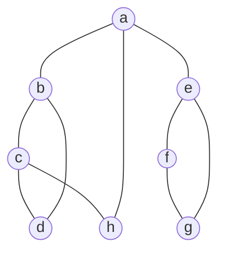

以下是 2019-2020 学年第二学期试卷的题目，答案以及解析。

- [选择题](#选择题)
  - [题目 1](#题目-1)
    - [答案与解析](#答案与解析)
  - [题目 2](#题目-2)
    - [答案与解析](#答案与解析-1)
  - [题目 3](#题目-3)
    - [答案与解析](#答案与解析-2)
  - [题目 4](#题目-4)
    - [答案与解析](#答案与解析-3)
  - [题目 5](#题目-5)
    - [答案与解析](#答案与解析-4)
  - [题目 6](#题目-6)
    - [答案与解析](#答案与解析-5)
  - [题目 7](#题目-7)
    - [答案与解析](#答案与解析-6)
  - [题目 8](#题目-8)
    - [答案与解析](#答案与解析-7)
  - [题目 9](#题目-9)
    - [答案与解析](#答案与解析-8)
  - [题目 10](#题目-10)
    - [答案与解析](#答案与解析-9)
  - [题目 11](#题目-11)
    - [答案与解析](#答案与解析-10)
  - [题目 12](#题目-12)
    - [答案与解析](#答案与解析-11)
  - [题目 13](#题目-13)
    - [答案与解析](#答案与解析-12)
  - [题目 14](#题目-14)
    - [答案与解析](#答案与解析-13)
  - [题目 15](#题目-15)
    - [答案与解析](#答案与解析-14)
  - [题目 16](#题目-16)
    - [答案与解析](#答案与解析-15)
  - [题目 17](#题目-17)
    - [答案与解析](#答案与解析-16)
  - [题目 18](#题目-18)
    - [答案与解析](#答案与解析-17)
  - [题目 19](#题目-19)
    - [答案与解析](#答案与解析-18)
  - [题目 20](#题目-20)
    - [答案与解析](#答案与解析-19)
- [简答题](#简答题)
  - [问题 1](#问题-1)
    - [答案与解析](#答案与解析-20)
  - [问题 2](#问题-2)
    - [答案与解析](#答案与解析-21)
  - [问题 3](#问题-3)
    - [答案与解析](#答案与解析-22)
  - [问题 4](#问题-4)
    - [答案与解析](#答案与解析-23)
- [程序题](#程序题)
  - [问题 1](#问题-1-1)
    - [答案与解析](#答案与解析-24)
  - [问题 2](#问题-2-1)
    - [答案与解析](#答案与解析-25)
  - [问题 3](#问题-3-1)
    - [答案与解析](#答案与解析-26)

# 选择题

## 题目 1

**tag:** 第三章

一个栈的入栈序列为 `1,2,3,...,n`，其出栈序列是 `p1, p2, p3,…, pn`。若 `p2 = 3`，则 `p3` 可能取值的个数是

A. `n-3`
B. `n-2`
C. `n-1`
D. 无法确定

### 答案与解析

<details>  
  <summary>答案</summary>

C

</details>

<details>  
  <summary>解析</summary>

除了`3`以外都可能取到。题目来自[第三章书本第三题](../Chapter3.md#问题-3)

</details>

---

## 题目 2

**tag:** 第四章

若将关键字 `1,2,3,4,5,6,7` 依次插入到初始为空的平衡二叉树 `T` 中，则 `T` 中平衡因子为 `0` 的非叶子结点的个数是

### 答案与解析

<details>  
  <summary>答案</summary>  
C  
</details>

<details>  
  <summary>解析</summary>  
根据 AVL 树的特性，非叶子节点的平衡因子取决于树的结构。  
</details>

---

## 题目 3

**tag:** 第六章

在任意一棵非空二叉查找树 `T1` 中，删除某结点 `v` 之后形成二叉查找树 `T2`，再将 `v` 插入 `T2` 形成二叉查找树 `T3`。下列关于 `T1` 与 `T3` 的叙述中，正确的是

### 答案与解析

<details>  
  <summary>答案</summary>  
A  
</details>

<details>  
  <summary>解析</summary>  
分析二叉查找树删除和插入的操作，叶子节点和非叶子节点的处理有所不同。  
</details>

---

## 题目 4

**tag:** 第七章

对给定的关键字序列`110,119,007,911,114,120,122`进行基数排序，则第 2 趟分配收集后得到的关键字序列是：

A. `007, 110, 119, 114, 911, 120,122`
B. `007, 110, 119, 114, 911, 122, 120`
C. `007, 110, 911, 114, 119, 120, 122`
D. `110, 120, 911, 122, 114, 007, 119`

### 答案与解析

<details>  
  <summary>答案</summary>

C

</details>

<details>  
  <summary>解析</summary>

书本后原题，请看原题[解析](../Chapter7.md#问题-9)。

</details>

---

## 题目 5

**tag:** 第五章

若对如下无向图进行遍历，则下列选项中，不是广度优先遍历序列的是？



A. `h，c，a，b，d，e，g，f`

B. `e，a，f，g，b，h，c，d`

C. `d，b，c，a，h，e，f，g`

D. `a，b，c，d，h，e，f，g`

### 答案与解析

<details>  
  <summary>答案</summary>

D

</details>

<details>  
  <summary>解析</summary>

选项 D 是深度优先搜索(`BFS`)产生的一种遍历序列。

</details>

---

## 题目 6

**tag:** 第六章

在一株高度为 `2` 的 `5` 阶 `B` 树中，根结点所含关键字的个数最少是

### 答案与解析

<details>  
  <summary>答案</summary>  
B  
</details>

<details>  
  <summary>解析</summary>  
`B` 树的根节点关键字个数与树的阶数和高度有关。  
</details>

---

## 题目 7

**tag:** 第二章

已知表头元素为 `c` 的单链表在内存中的存储状态如下表所示。现将 `f` 存放于 `1014H` 处并插入到单链表中，若 `f` 在逻辑上位于 `a` 和 `e` 之间，则 `a, e, f` 的“链接地址”依次是

### 答案与解析

<details>  
  <summary>答案</summary>
    
| 结点编号 | 链接地址 |
| -------- | -------- |
| a        | 1014H    |
| e        | 1004H    |
| f        | 1010H    |

</details>

<details>  
  <summary>解析</summary>

本题目为第二章书本习题[第 5 题](../Chapter2.md#问题-5)

</details>

---

## 题目 8

**tag:** 第二章

已知一个带有表头结点的双向循环链表，结点结构为 `prev|data|next`。现要删除指针 `p` 所指的结点，正确的语句序列是?

A. `p->next->prev=p->prev;` `p->prev->next=p->prev;` `delete p;`

B. `p->next->prev=p->next;` `p->prev->next=p->next;` `delete p;`

C. `p->next->prev=p->next;` `p->prev->next=p->prev;` `delete p;`

D. `p->next->prev=p->prev;` `p->prev->next=p->next;` `delete p;`

### 答案与解析

<details>  
  <summary>答案</summary>  
D  
</details>

<details>  
  <summary>解析</summary>

初始状态：双向循环链表，节点分别为..., A, P(要删除的节点), B, ...

```plaintext
   +-----+       +-----+       +-----+
-->|  A  |<----->|  P  |<----->|  B  |<--
   +-----+       +-----+       +-----+
```

执行`p->next->prev=p->prev;`，即`B`的`prev`指向`A`:

```plaintext
   +-----+       +-----+       +-----+
-->|  A  |<----->|  P  |<--X-->|  B  |<--
   +-----+       +-----+       +-----+
      ^                           |
      |---------------------------|
```

执行`p->prev->next=p->next;`，即`A`的`next`指向`B`:

```plaintext
      |---------------------------|
      |                           v
   +-----+       +-----+       +-----+
-->|  A  |<--X-->|  P  |       |  B  |<--
   +-----+       +-----+       +-----+
      ^                           |
      |---------------------------|
```

此时，`p`结点已经完全从链表结构中移除，不要忘记是放对应的内存`delete p;`

```plaintext
      |---------------------------|
      |                           v
   +-----+       XXXXXXX       +-----+
-->|  A  |       X (P) X       |  B  |<--
   +-----+       XXXXXXX       +-----+
      ^                           |
      |---------------------------|
```

</details>

---

## 题目 9

**tag:** 第三章

设有如下图所示的火车车轨，入口到出口之间有 `n` 条轨道，列车的行进方向均为从左至右。若期望驶出的次序依次为 `1～9`，则 `n` 至少是


### 答案与解析

<details>  
  <summary>答案</summary>

C

</details>

<details>  
  <summary>解析</summary>

题目与[第三章书本后第五题](../Chapter3.md#问题-5)基本类似。

</details>

---

## 题目 10

**tag:** 第四章

若森林 `F` 有 `15` 条边、`25` 个结点，则 `F` 包含树的个数是

### 答案与解析

<details>  
  <summary>答案</summary>  
C  
</details>

<details>  
  <summary>解析</summary>  
树的结构性质决定了节点数和边数之间的关系。  
</details>

---

## 题目 11

**tag:** 第五章

若将 n 个顶点 e 条弧的有向图采用邻接表存储，则拓扑排序算法的时间复杂度是

A．$O(n)$

B．$O(n+e)$

C．$O(n^2)$

D．$O(n\times e)$

### 答案与解析

<details>  
  <summary>答案</summary>

B

</details>

<details>  
  <summary>解析</summary>

这个就是书本上的结论。邻接矩阵的时间复杂度是$O(n^2)$，邻接表是$O(n+e)$。

</details>

---

## 题目 12

**tag:** 第六章

在有 n(n>1000)个元素的升序数组 A 中查找关键字 x。查找算法的伪代码如下所示。

```cpp
k=0;
while(k<n 且 A[k]<x) k=k+3；
if(k<n 且 A[k]==x) 查找成功；
else if(k-1<n 且 A[k-1]==x) 查找成功；
  else if(k-2<n 且 A[k-2]==x) 查找成功；
    else 查找失败；
```

本算法与折半查找算法相比，有可能具有更少比较次数的情形是
A．当 x 不在数组中 B．当 x 接近数组开头处
C．当 x 接近数组结尾处 D．当 x 位于数组中间位置

### 答案与解析

<details>  
  <summary>答案</summary>  
C  
</details>

<details>  
  <summary>解析</summary>  
树的结构性质决定了节点数和边数之间的关系。  
</details>

---

## 题目 13

**tag:** 第六章

B+树不同于 B 树的特点之一是
A．能支持顺序查找 B．结点中含有关键字
C．根结点至少有两个分支 D．不适合外部文件建立索引用

### 答案与解析

<details>  
  <summary>答案</summary>  
C  
</details>

<details>  
  <summary>解析</summary>  
树的结构性质决定了节点数和边数之间的关系。  
</details>

---

## 题目 14

**tag:** 第七章

对 10 TB 的数据文件进行排序，应使用的方法是
A．希尔排序 B．堆排序 C．快速排序 D．归并排序

### 答案与解析

<details>  
  <summary>答案</summary>  
C  
</details>

<details>  
  <summary>解析</summary>  
树的结构性质决定了节点数和边数之间的关系。  
</details>

---

## 题目 15

**tag:** 第三章

已知程序如下：

```cpp
int S(int n)
{ return (n <= 0) ? 0 : S(n - 1) + n; }
void main()
{ cout << S(1); }
```

程序运行时使用栈来保存调用过程的信息，自栈底到栈顶保存的信息依次对应的是?

A．`main( )`->`S(1)`->`S(0)` B. `S(0)`->`S(1)`->`main()`
C．`main( )`->`S(0)`->`S(1)` D．`S(1)`->`S(0)`->`main( )`

### 答案与解析

<details>  
  <summary>答案</summary>

B

</details>

<details>  
  <summary>解析</summary>

题目与[第三章书本后第六题](../Chapter3.md#问题-6)基本类似。

</details>

---

## 题目 16

**tag:** 第四章

先序序列为 a，b，c 的不同二叉树的个数是
A．3 B． 5 C． 4 D． 6

### 答案与解析

<details>  
  <summary>答案</summary>  
C  
</details>

<details>  
  <summary>解析</summary>  
树的结构性质决定了节点数和边数之间的关系。  
</details>

---

## 题目 17

**tag:** 第四章

下列选项给出的是从根分别到达两个叶结点路径上的权值序列，能属于同一棵哈夫曼树的是？

A．24，10，5 和 24，10，7
B．24，10，5 和 24，12，7
C．24，10，10 和 24，14，11
D．24，10，5 和 24，14，6

### 答案与解析

<details>  
  <summary>答案</summary>  
C  
</details>

<details>  
  <summary>解析</summary>  
树的结构性质决定了节点数和边数之间的关系。  
</details>

---

## 题目 18

**tag:** 第四章

现有一棵无重复关键字的平衡二叉树(AVL 树)，对其进行中序遍历可得到一个升序序列。下列关于该平衡二叉树的叙述中，正确的是？

A．根结点的度一定为 2 B．树中最小元素一定是叶结点
C．最后插入的元素一定是叶结点 D．树中最大元素一定无右子树

### 答案与解析

<details>  
  <summary>答案</summary>  
C  
</details>

<details>  
  <summary>解析</summary>  
树的结构性质决定了节点数和边数之间的关系。  
</details>

---

## 题目 19

**tag:** 第六章

下列选项中，不能构成折半查找中关键字比较序列的是
A．500，200，450，180
B．500，450，200，180
C．180，500，200，450
D．180，200，500，450

### 答案与解析

<details>  
  <summary>答案</summary>  
C  
</details>

<details>  
  <summary>解析</summary>  
树的结构性质决定了节点数和边数之间的关系。  
</details>

---

## 题目 20

**tag:** 第七章

下列排序算法中，元素的移动次数与关键字的初始排列次序无关的是
A．直接插入排序

B．冒泡排序

C．基数排序

D．快速排序

### 答案与解析

<details>  
  <summary>答案</summary>

C

</details>

<details>  
  <summary>解析</summary>

书本后原题，请看原题[解析](../Chapter7.md#问题-11)。

</details>

# 简答题

## 问题 1

**tag:** 第四章

已知字符 A、B、C、D、E、F 的相对使用频率为 0.06、0.1、0.11、0.22、0.23、0.28，试根据哈夫曼算法，构造一棵以上述字符为叶结点的二叉树，并给出上述各字符的哈夫曼编码。

### 答案与解析

<details>  
  <summary>答案</summary>

Lorem Ipsum

</details>

<details>  
  <summary>解析</summary>

Lorem Ipsum

</details>

---

## 问题 2

**tag:** 第六章

设闭散列表的地址空间为[0,5]，依次插入元素 12，36，41，52，40，散列函数为 H(x)=x mod 6，采用线性探测再散列方式解决冲突，请给出插入后的散列表及查找 40 需要的比较次数。

### 答案与解析

<details>  
  <summary>答案</summary>

Lorem Ipsum

</details>

<details>  
  <summary>解析</summary>

Lorem Ipsum

</details>

---

## 问题 3

**tag:** 第五章

一项工程有 A,B,C,D 和 E 五项子工程，各子工程间的施工约束条件为：A>B, A>D, B>E, C>A,C>B, E>D，其中，“A>B”的含义是 A 子工程完成后 B 才可以开始施工，依此类推。请给出该工程可能的施工顺序，要求写明求解思路和过程。

### 答案与解析

<details>  
  <summary>答案</summary>

Lorem Ipsum

</details>

<details>  
  <summary>解析</summary>

Lorem Ipsum

</details>

---

## 问题 4

**tag:** 第六章

假设外存的页块大小为 4000 字节，指向外存的地址指针需要 5 字节。现有一个由`20*106`条记录构成的文件，每条记录为 200 字节，其中包括关键字 5 字节。请问如果采用 B 树索引文件存储，B 树的阶数应该是多少，要求写明计算过程。

### 答案与解析

<details>  
  <summary>答案</summary>

Lorem Ipsum

</details>

<details>  
  <summary>解析</summary>

Lorem Ipsum

</details>

---

# 程序题

## 问题 1

**tag:** 第六章


### 答案与解析

<details>  
  <summary>答案</summary>

Lorem Ipsum

</details>

<details>  
  <summary>解析</summary>

Lorem Ipsum

</details>

---

## 问题 2

**tag:** 第四章

一个用二叉链表存储的二叉树的根结点地址为 root，结点结构类型为 node{Type data, node*left,node*right}，请设计并实现二叉树类 binaryTree 的一个成员函数。要求该成员函数利用递归方式实现二叉树中所有结点的左右子树交换功能。

### 答案与解析

<details>  
  <summary>答案</summary>

Lorem Ipsum

</details>

<details>  
  <summary>解析</summary>

Lorem Ipsum

</details>

---

## 问题 3

**tag:** 第五章

一个有向图用邻接矩阵存储，其存储结构如下：

```cpp
template <class verType, class edgeType>
class Graph
{
   private:
    int verts, edges;       // 图的实际顶点数和实际边数
    int maxVertex;          // 图顶点的最大可能数量
    verType *verList;       // 保存顶点数据的一维数组
    edgeType **edgeMatrix;  // 保存邻接矩阵内容的二维数组
    edgeType noEdge;        // 无边的标志，一般图为 0， 网为无穷大 MAXNUM
    bool directed;          // 有向图为 1，无向图为 0
   public:
    // 初始化图结构 g，direct 为是否有向图标志，e 为无边数据
    Graph(bool direct, edgeType e);
    ~Graph();
    bool circleJudge() const;  // 图中存在回路返回 true,否则返回
                               // false。
};
```

要求实现函数`circleJudge() const`，以判断该有向图是否存在回路并分析算法的时间复杂度。

### 答案与解析

<details>  
  <summary>答案</summary>

Lorem Ipsum

</details>

<details>  
  <summary>解析</summary>

Lorem Ipsum

</details>
