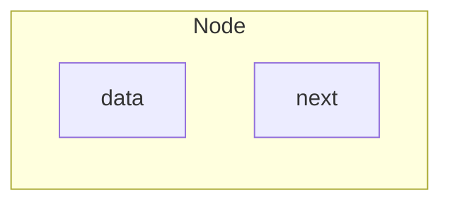

以下是 2021-2022 学年第二学期试卷的题目，答案以及解析。

<details>
  <summary>题目导航</summary>

- [选择题](#选择题)
  - [题目 1](#题目-1)
    - [答案与解析](#答案与解析)
  - [题目 2](#题目-2)
    - [答案与解析](#答案与解析-1)
  - [题目 3](#题目-3)
    - [答案与解析](#答案与解析-2)
  - [题目 4](#题目-4)
    - [答案与解析](#答案与解析-3)
  - [题目 5](#题目-5)
    - [答案与解析](#答案与解析-4)
  - [题目 6](#题目-6)
    - [答案与解析](#答案与解析-5)
  - [题目 7](#题目-7)
    - [答案与解析](#答案与解析-6)
  - [题目 8](#题目-8)
    - [答案与解析](#答案与解析-7)
  - [题目 9](#题目-9)
    - [答案与解析](#答案与解析-8)
  - [题目 10](#题目-10)
    - [答案与解析](#答案与解析-9)
  - [题目 11](#题目-11)
    - [答案与解析](#答案与解析-10)
  - [题目 12](#题目-12)
    - [答案与解析](#答案与解析-11)
  - [题目 13](#题目-13)
    - [答案与解析](#答案与解析-12)
  - [题目 14](#题目-14)
    - [答案与解析](#答案与解析-13)
  - [题目 15](#题目-15)
    - [答案与解析](#答案与解析-14)
- [简答题](#简答题)
  - [题目 1](#题目-1-1)
    - [答案与解析](#答案与解析-15)
  - [题目 2](#题目-2-1)
    - [答案与解析](#答案与解析-16)
  - [题目 3](#题目-3-1)
    - [答案与解析](#答案与解析-17)
  - [题目 4](#题目-4-1)
    - [答案与解析](#答案与解析-18)
  - [题目 5](#题目-5-1)
    - [答案与解析](#答案与解析-19)
  - [题目 6](#题目-6-1)
    - [答案与解析](#答案与解析-20)
  - [题目 7](#题目-7-1)
    - [答案与解析](#答案与解析-21)
  - [题目 8](#题目-8-1)
    - [答案与解析](#答案与解析-22)
- [程序填空](#程序填空)
  - [题目 1](#题目-1-2)
    - [答案与解析](#答案与解析-23)
  - [题目 2](#题目-2-2)
    - [答案与解析](#答案与解析-24)
  - [题目 3](#题目-3-2)
    - [答案与解析](#答案与解析-25)
  - [题目 4](#题目-4-2)
    - [答案与解析](#答案与解析-26)
- [编程题](#编程题)
  - [题目 1](#题目-1-3)
    - [答案与解析](#答案与解析-27)
  - [题目 2](#题目-2-3)
    - [答案与解析](#答案与解析-28)
  - [题目 3](#题目-3-3)
    - [答案与解析](#答案与解析-29)

</details>

---

# 选择题

## 题目 1

**tag:** 第二章

对长度为 3 的顺序表进行顺序查找（从前往后），查找第一个元素的概率是 `1/4`，查找第二个元素的概率是 `1/8`，查找第 3 个元素的概率是 `1/8`，查找不成功的概率是 `1/2`，则平均查找长度是：

A. `19/8` B.`7/8` C. `7/16` D.`19/16`

### 答案与解析

<details>
  <summary>答案</summary>

A

</details>

<details>
  <summary>解析</summary>

$$ASL = 1 * 1/4 + 2 * 1/8 + 3 * 1/8 + 3 * 1/2$$

</details>

## 题目 2

**tag:** 第六章

对包含 n 个元素的散列表进行查找，平均时间复杂度：

A. O(nlogn) B. O(n) C. O(1) D. O(n2)

### 答案与解析

<details>
  <summary>答案</summary>

Lorem Ipsum

</details>

<details>
  <summary>解析</summary>

Lorem Ipsum

</details>

---

## 题目 3

**tag:** 第七章

设一组初始记录关键字序列为(57，345，53，67，49，162，247)，则用基数排序需要进行几趟的分配和回收才能使得初始关键字序列变成有序序列？

A.5 B. 4 C.3 D. 2

### 答案与解析

<details>
  <summary>答案</summary>

Lorem Ipsum

</details>

<details>
  <summary>解析</summary>

Lorem Ipsum

</details>

---

## 题目 4

**tag:** 第六章

在 AVL 树中插入一个结点后造成了不平衡，设自下层结点往上层结点看，第一个不平衡结点为 A，并已知 A 的左孩子的平衡因子为-1，右孩子的平衡因子为 0，则应作哪种类型的调整以使其平衡？

A. RL B.RR C.LL D. LR

### 答案与解析

<details>
  <summary>答案</summary>

Lorem Ipsum

</details>

<details>
  <summary>解析</summary>

Lorem Ipsum

</details>

---

## 题目 5

**tag:** 第六章

下列关于 B 和 B+树，描述不正确的是：

A. B 和 B+树都是平衡的多叉树 B. B 和 B+树的数据记录都存储在叶结点上
C. B 树和 B+树都可以用于文件索引结构 D. B 和 B+树都能有效地支持随机检索

### 答案与解析

<details>
  <summary>答案</summary>

Lorem Ipsum

</details>

<details>
  <summary>解析</summary>

Lorem Ipsum

</details>

---

## 题目 6

**tag:** 第三章

设栈 S 和队列 Q 的初始状态均为空，元素 a,b,c,d 依次进入栈 S。若每个元素出栈后立即进入队列 Q， 且 4 个元素出队的顺序是 b,d,c,a，则栈 S 的容量至少是？

### 答案与解析

<details>
  <summary>答案</summary>

Lorem Ipsum

</details>

<details>
  <summary>解析</summary>

Lorem Ipsum

</details>

---

## 题目 7

**tag:** 第一章

设 n 是描述问题规模的非负整数，下面程序片段的时间复杂度是？

```cpp
x = 2;
while(x<n)
  x = 2 * x;
```

A．$O(\log n)$ B．$O(n)$ C．$O(n\log n)$ D．$O(n^2)$

### 答案与解析

<details>
  <summary>答案</summary>

A

</details>

<details>
  <summary>解析</summary>

`x`的取值依次为`2->4->8->16->...`。

</details>

---

## 题目 8

**tag:** 第三章

已知两个长度分别为 m 和 n 的升序链表，若将它们合并为一个长度为 m+n 的升序链表，则时间复杂度是?

A. O (n ) B. O (m\*n ) C. O (m- n ) D. O (m+n )

### 答案与解析

<details>
  <summary>答案</summary>

Lorem Ipsum

</details>

<details>
  <summary>解析</summary>

Lorem Ipsum

</details>

---

## 题目 9

**tag:** 第三章

一个栈的入栈序列为 1, 2,3,… ,n ，其出栈序列是 p1, p2, p3,… pn 。若 p1 = 3，则 p2=1 且 p3 =2 情况是否可能出现？

A. 可能 **\_\_** 。
B. 不可能 C. 无法确定

### 答案与解析

<details>
  <summary>答案</summary>

Lorem Ipsum

</details>

<details>
  <summary>解析</summary>

Lorem Ipsum

</details>

---

## 题目 10

**tag:** 第三章

循环队列放在一维数组`A[0..M-1]`中，`end1`指向队头元素，`end2`指向队尾元素的后一个位置。队列中最多能容纳`M-1`个元素，初始时队列为空。下列判断队空和队满的条件中，正确的是？

A．队空：end1 == end2； 队满：end1 == (end2+1)mod M
B．队空：end1 == end2； 队满：end2 == (end1+1)mod (M-1)
C．队空：end2 == (end1+1)mod M； 队满：end1 == (end2+1)mod M
D．队空：end1 == (end2+1)mod M； 队满：end2 == (end1+1)mod (M-1)

### 答案与解析

<details>
  <summary>答案</summary>

Lorem Ipsum

</details>

<details>
  <summary>解析</summary>

Lorem Ipsum

</details>

---

## 题目 11

**tag:** 第四章

一棵有 5 个叶结点的完全二叉树，最多有多少个结点。

A．12 B．11 C．9 D．10

### 答案与解析

<details>
  <summary>答案</summary>

Lorem Ipsum

</details>

<details>
  <summary>解析</summary>

Lorem Ipsum

</details>

---

## 题目 12

**tag:** 第四章

一棵二叉树的前序遍历结果是 ABDGCEF，中序遍历结果是 DGBAECF，则后序遍历结果是什么？

### 答案与解析

<details>
  <summary>答案</summary>

Lorem Ipsum

</details>

<details>
  <summary>解析</summary>

Lorem Ipsum

</details>

---

## 题目 13

**tag:** 第五章

下面关于 AOE 的叙述中，哪个说法是正确的。

A．AOE 网是无向图。
B．AOE 网中有且只有一条关键路径，即关键路径具有唯一性。
C．如果用 AOE 网描述项目工期的话，关键路径上的活动决定了项目的整个工期。
D． AOE 网的关键路径是从起点到终点的加权最短路径。

### 答案与解析

<details>
  <summary>答案</summary>

Lorem Ipsum

</details>

<details>
  <summary>解析</summary>

Lorem Ipsum

</details>

---

## 题目 14

**tag:** 第五章

下面关于无向图的叙述中，哪个是不正确的。

A．一个有 n 个顶点和 n 条边的无向图一定是有环的。
B．用邻接矩阵存储图时所需存储空间大小与图的结点数和边数都有关。
C．所有顶点的度之和为偶数。
D．用邻接表法存储图所用的空间大小与图的顶点数和边数有关。

### 答案与解析

<details>
  <summary>答案</summary>

Lorem Ipsum

</details>

<details>
  <summary>解析</summary>

Lorem Ipsum

</details>

---

## 题目 15

**tag:** 第五章

无向图 G 的邻接矩阵及顶点存储顺序表如下，其中，顶点在邻接矩阵中的下标顺序与其在顺序表中的存储顺序相对应。对该图从 A 点开始，按照深度优先遍历算法进行遍历，得到的顶点序列正确的是哪个。

$$
\begin{bmatrix}
 0& 1& 0& 1& 1\\
 1& 0& 0& 0& 1\\
 0& 0& 0& 1& 1\\
 1& 0& 1& 0& 1\\
 1& 1& 1& 1& 0
\end{bmatrix}
$$


A．ABCDE B．ACBDE C．ABECD D．ABDEC

### 答案与解析

<details>
  <summary>答案</summary>

Lorem Ipsum

</details>

<details>
  <summary>解析</summary>

Lorem Ipsum

</details>

---

# 简答题

## 题目 1

**tag:** 第六章

从空树开始，依次插入元素 25，16，32，13，28，8，11，22，34 和 15 后构成的 AVL 树是怎样的？

### 答案与解析

<details>
  <summary>答案</summary>

Lorem Ipsum

</details>

<details>
  <summary>解析</summary>

Lorem Ipsum

</details>

---

## 题目 2

**tag:** 第七章

设待排文件 FI={1,27,7,3,75,44,12,15,8,10}，内存工作区容量为 w=3，按置换选择法生成的所有初始归并段是什么？

### 答案与解析

<details>
  <summary>答案</summary>

Lorem Ipsum

</details>

<details>
  <summary>解析</summary>

Lorem Ipsum

</details>

---

## 题目 3

**tag:** 第七章

序列{17，15，26，37，45，66，4，14}，利用快速排序算法从小到大进行排序，以第一个关键字为基准，得到的第一趟划分结果序列是怎样的？

### 答案与解析

<details>
  <summary>答案</summary>

Lorem Ipsum

</details>

<details>
  <summary>解析</summary>

Lorem Ipsum

</details>

---

## 题目 4

**tag:** 第三章

请说明线性表、栈、队列这三种数据结构的共同点与区别。

### 答案与解析

<details>
  <summary>答案</summary>

Lorem Ipsum

</details>

<details>
  <summary>解析</summary>

Lorem Ipsum

</details>

---

## 题目 5

**tag:** 第六章

用单链表保存`m`个整数，结点的结构为：



且$|data|\leq n, n 为正整数$。现要求设计一个时间复杂度尽可能高效的算法，对于链表中`data`的绝对值相等的结点，仅保留第一次出现的结点而删除其余绝对值相等的结点。给出算法的基本设计思想并说明你所设计算法的时间复杂度和空间复杂度。

### 答案与解析

<details>
  <summary>答案</summary>

Lorem Ipsum

</details>

<details>
  <summary>解析</summary>

Lorem Ipsum

</details>

---

## 题目 6

**tag:** 第四章

已知字符 a、b、c、d、e、f 的权值分别为 3、11、9、20、14、23，请画出为这六个字符编码的哈夫曼树。

### 答案与解析

<details>
  <summary>答案</summary>

Lorem Ipsum

</details>

<details>
  <summary>解析</summary>

Lorem Ipsum

</details>

---

## 题目 7

**tag:** 第四章

已知关键字集合（18，81，5，13，27，16，23，6，59），则初始化的最小化二叉堆序列是什么？

### 答案与解析

<details>
  <summary>答案</summary>

Lorem Ipsum

</details>

<details>
  <summary>解析</summary>

Lorem Ipsum

</details>

---

## 题目 8

**tag:** 第四章

若用二叉树存储森林，请画出以下二叉树对应的森林。


### 答案与解析

<details>
  <summary>答案</summary>

Lorem Ipsum

</details>

<details>
  <summary>解析</summary>

Lorem Ipsum

</details>

---

# 程序填空

## 题目 1

**tag:** 第六章

以下是二叉查找树插入的非递归实现，设结点类有`3`个数据成员: `data`, `left`和`right`, 并有构造函数`Node(T x, Node *l=NULL, Node *r=NULL)`。

```cpp
template <class T>
void binarySearchTree<T>::insert(T x)
{
    if (__1__) {
        root = new Node(x);
        return;
    }
    Node *t = root;
    while (true) {
        if (x == t->data) return;
        if ((x < t->data && t->left == NULL) || __2__)
            break;
        else if (x > t->data)
            t = t->right;
        else
            t = t->left;
    }
    if (__3__)
        t->left = new Node(x);
    else
        t->right = new Node(x);
}
```

### 答案与解析

<details>
  <summary>答案</summary>

Lorem Ipsum

</details>

<details>
  <summary>解析</summary>

Lorem Ipsum

</details>

---

## 题目 2

**tag:** 第二章

已知如下代码的功能是检测字符串`str`中的圆括号是否匹配，则空白处的代码分别是？

```cpp
bool CheckMatch(const char* str)
{
    char ch;
    seqStack<char> stk;
    while(ch = *str++) {
        switch(ch) {
            case '(':
                __1__;
                break;
            case ')':
                if(__2__)
                    return false;
                stk.pop();
                break;
        }
    }

    return true;
}
```

### 答案与解析

<details>
  <summary>答案</summary>

1. `stk.push('(');`
2. `stk.isEmpty() || stk.top() != '('`

</details>

<details>
  <summary>解析</summary>

当遇到左括号`(`时，我们需要将其压入栈，以便后续匹配右括号`)`时可以进行检查。当遇到右括号`)`时，检查栈顶元素：如果栈为空，或者栈顶元素不是`(`，说明匹配失败。

> 注意这里的函数最后一行返回`true`我感觉有问题。比如说输入`(((`，仍然会返回`true`。应该是`return stk.isEmpty()`。

</details>

---

## 题目 3

**tag:** 第二章，第六章

已知如下代码的功能是在带头结点的单链表中查找第一个值在`[min, max]`间的元素位置，则空白处的代码分别是？假设首结点中元素满足条件则返回`0`。

```cpp
template <class elemType>
int sLinkList<elemType>::findInDomain(const elemType &min, const elemType &max)
{
    int i =0;
    node *p = __1__
    while(p)
    {
        if(__2__)
            return i;
        i++;
        p = p->next;
    }
    return -1;
}
```

### 答案与解析

<details>
  <summary>答案</summary>

1. `head->next`
2. `p->data>=min && p->data<=max`

</details>

<details>
  <summary>解析</summary>

在带头结点的单链表中，头结点是一个哑结点，不存储有效数据。因此，搜索应该从`head->next`开始，即从第一个有效结点开始遍历。

判断元素值在区间内**一定不能写**`min<=p->data<=max`!

</details>

---

## 题目 4

**tag:** 第五章

用邻接表存储图的顶点和边的结点类定义如下：

```cpp
struct edgeNode { // 存储边的结点类
    int end;    // 终点
    edgeNode *next;
    edgeNode(int e, edgeNode *n = NULL) { end = e; next = n};
};

struct verNode {
    TypeOfver ver; // 顶点值
    edgeNode *head; // 对应的单链表的头指针
    verNode(edgeNode *h = NULL) { head = h; }
};
```

请补充代码，完成图的拓扑排序。

```cpp
template <class TypeOfVer, class TypeOfEdge>
void adjListGraph<TypeOfVer, TypeOfEdge>::topSort() const
{
    linkQueue<int> q;
    edgeNode *p;
    int current, *inDegree = __1__
    for(int i = 0; i < vers; ++i) inDegree[i] = 0;

    for(i = 0; i < Vers; ++i)
        for(p = verList[i].head; p != NULL; p = p -> next)
            ++inDegree[p -> end];

    for(int i = 0; i < vers; ++i)
        if(inDegree[i] = 0)
            __2__

    cout << "拓扑排序为：" << endl;
    while(!q.isEmpty()) {
        current = q.deQueue();
        cout << verList[current].ver << '\t';
        for(p = verList[current].head; p != NULL; p = p->next)
            if(__3__)
                q.enQueue(p->end);
    }
    cout << endl;
}
```

### 答案与解析

<details>
  <summary>答案</summary>

Lorem Ipsum

</details>

<details>
  <summary>解析</summary>

Lorem Ipsum

</details>

---

# 编程题

## 题目 1

**tag:** 第六章

编写函数`Node* find(int value, Node* t)`，实现在二叉查找树上进行查找的递归算法。

```cpp
struct Node {
    int data;
    Node* left;
    Node* right;
};
```

### 答案与解析

<details>
  <summary>答案</summary>

Lorem Ipsum

</details>

<details>
  <summary>解析</summary>

Lorem Ipsum

</details>

---

## 题目 2

**tag:** 第四章

二叉树的结点类说明如下：

```cpp
struct Node { // 二叉树结点
    Node *left, *right;
    T data;
    Node() : left(NULL), rihgt(NULL) {}
    ~Node() {}
};
```

编写函数`int binaryTree<T>::height(binaryTree<T>::Node *t)`，求给定二叉树的高度，只包含根结点二叉树高度定义为 1.

### 答案与解析

<details>
  <summary>答案</summary>

Lorem Ipsum

</details>

<details>
  <summary>解析</summary>

Lorem Ipsum

</details>

---

## 题目 3

**tag:** 第二章

已知一个带有表头结点的单链表，结点结构为：

```cpp
struct Node {
    int data;
    Node* next;
}
```

假设该链表只给出了头指针`head`。在不改变链表的前提下，请设计一个尽可能高效的算法，查找链表中倒数第`k`个位置上的结点(`k`为正整数)。若查找成功，函数输出该结点的`data`域的值，并返回`1`；否则，返回`0`.

### 答案与解析

<details>
  <summary>答案</summary>

```cpp
#include <iostream>

struct Node {
    int data;
    Node* next;
};

// 查找倒数第 k 个结点
int findKthFromEnd(Node* head, int k, int &result) {
    Node* fast = head;
    Node* slow = head;

    // 让 fast 指针先走 k 步
    for (int i = 0; i < k; i++) {
        if (fast == nullptr) {
            return 0; // 如果 k 大于链表长度，返回失败
        }
        fast = fast->next;
    }

    // 同时移动 fast 和 slow，直到 fast 到达末尾
    while (fast != nullptr) {
        fast = fast->next;
        slow = slow->next;
    }

    // 此时 slow 指向倒数第 k 个结点
    result = slow->data;
    return 1;
}

int main() {
    Node* head = new Node{1, nullptr};
    head->next = new Node{2, nullptr};
    head->next->next = new Node{3, nullptr};
    head->next->next->next = new Node{4, nullptr};
    head->next->next->next->next = new Node{5, nullptr};

    int k = 2;
    int result;

    if (findKthFromEnd(head, k, result)) {
        std::cout << "倒数第 " << k << " 个结点的值是: " << result << std::endl;
    } else {
        std::cout << "查找失败，链表长度小于 " << k << std::endl;
    }

    return 0;
}
```

</details>

<details>
  <summary>解析</summary>

双指针法（快慢指针）

1. 使用两个指针`fast`和`slow`，都初始化指向`head`。
2. `fast`指针先向前移动`k`步。
3. 然后同时移动`fast`和`slow`指针，直到`fast`到达链表末尾。
4. 此时，`slow`指针指向的结点就是倒数第`k`个结点。

边界条件：

- 如果链表长度小于$k$，直接返回$0$。
- 如果链表为空或$k \leq 0$，直接返回$0$。

因为`fast`和`slow`只遍历链表一次，所以时间复杂度是$O(n)$。

</details>
